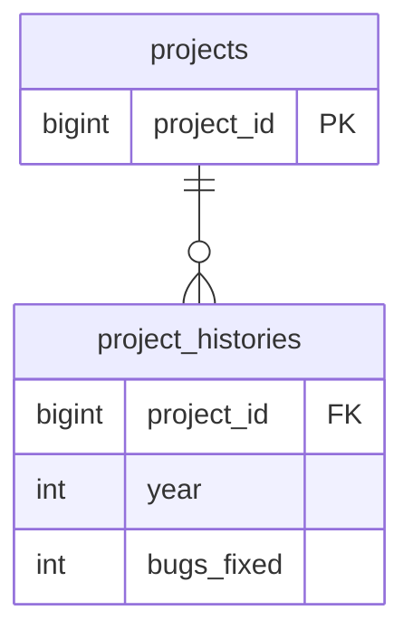

# 概要<!-- omit in toc -->

- 書籍名

  - SQL アンチパターン

# 目次<!-- omit in toc -->

- [I 部: データベース論理設計のアンチパターン](#i-部-データベース論理設計のアンチパターン)
- [Part1: ジェイウォーク(信号無視)](#part1-ジェイウォーク信号無視)
  - [目的: 複数の値を持つ属性を格納する](#目的-複数の値を持つ属性を格納する)
  - [アンチパターン: カンマ区切りフォーマットのリストを格納する](#アンチパターン-カンマ区切りフォーマットのリストを格納する)
    - [特定アカウントに関連する製品の検索](#特定アカウントに関連する製品の検索)
    - [特定製品に関連するアカウントの検索](#特定製品に関連するアカウントの検索)
    - [集約クエリの作成](#集約クエリの作成)
    - [特定の製品に関連するアカウントの更新](#特定の製品に関連するアカウントの更新)
    - [アカウント ID の妥当性検証](#アカウント-id-の妥当性検証)
    - [区切り文字の選択](#区切り文字の選択)
    - [リストの長さの制限](#リストの長さの制限)
  - [アンチパターンの見つけ方](#アンチパターンの見つけ方)
  - [アンチパターンを用いてもよい場合](#アンチパターンを用いてもよい場合)
  - [解決策: 交差テーブルを作成する](#解決策-交差テーブルを作成する)
    - [特定のアカウントに関連する製品の検索 / 特定の製品に関連するアカウントの検索](#特定のアカウントに関連する製品の検索--特定の製品に関連するアカウントの検索)
    - [集約クエリの作成](#集約クエリの作成-1)
    - [製品の連絡先の更新](#製品の連絡先の更新)
    - [アカウント ID の妥当性検証](#アカウント-id-の妥当性検証-1)
    - [区切り文字の選択](#区切り文字の選択-1)
    - [リストの長さの制限](#リストの長さの制限-1)
    - [交差テーブルの他のメリット](#交差テーブルの他のメリット)
- [Part2: ナイーブツリー(素朴な木)](#part2-ナイーブツリー素朴な木)
  - [目的: 階層構造を格納し、クエリを実行する](#目的-階層構造を格納しクエリを実行する)
  - [アンチパターン: 常に親のみに依存する](#アンチパターン-常に親のみに依存する)
    - [隣接リストへのクエリ実行](#隣接リストへのクエリ実行)
    - [隣接リストのツリーのメンテナンス](#隣接リストのツリーのメンテナンス)
  - [アンチパターンの見つけ方](#アンチパターンの見つけ方-1)
  - [アンチパターンを用いてもよい場合](#アンチパターンを用いてもよい場合-1)
  - [解決策: 代替ツリーモデルを使用する](#解決策-代替ツリーモデルを使用する)
    - [経路列挙(Path Enumeration)](#経路列挙path-enumeration)
    - [入れ子集合(Nested Set)](#入れ子集合nested-set)
    - [閉包テーブル(Closure Table)](#閉包テーブルclosure-table)
    - [どの設計を使うべきか](#どの設計を使うべきか)
- [Part3: ID リクワイアド(とりあえず ID)](#part3-id-リクワイアドとりあえず-id)
  - [目的: 主キーの規約を確立する](#目的-主キーの規約を確立する)
  - [アンチパターン: すべてのテーブルに「id」列を用いる](#アンチパターン-すべてのテーブルにid列を用いる)
    - [冗長なキーが作成されてしまう](#冗長なキーが作成されてしまう)
    - [重複行を許可してしまう](#重複行を許可してしまう)
    - [キーの意味がわかりにくくなる](#キーの意味がわかりにくくなる)
    - [USING を使用する](#using-を使用する)
    - [複合キーは使いにくい](#複合キーは使いにくい)
  - [アンチパターンの見つけ方](#アンチパターンの見つけ方-2)
  - [アンチパターンを用いてもよい場合](#アンチパターンを用いてもよい場合-2)
  - [解決策: 状況に応じて適切に調整する](#解決策-状況に応じて適切に調整する)
    - [わかりやすい列名にしよう](#わかりやすい列名にしよう)
    - [規約に縛られない](#規約に縛られない)
    - [自然キーと複合キーの活用](#自然キーと複合キーの活用)
- [Part4: キーレスエントリ(外部キー嫌い)](#part4-キーレスエントリ外部キー嫌い)
  - [目的: データベースのアーキテクチャを単純化する](#目的-データベースのアーキテクチャを単純化する)
  - [アンチパターン: 外部キー制約を使用しない](#アンチパターン-外部キー制約を使用しない)
    - [完璧なコードを前提にしている](#完璧なコードを前提にしている)
    - [ミスを調べなければならない](#ミスを調べなければならない)
    - [「私のミスではありません！」](#私のミスではありません)
    - [「キャッチ =22」な UPDATE](#キャッチ-22な-update)
  - [アンチパターンの見つけ方](#アンチパターンの見つけ方-3)
  - [アンチパターンを用いてもよい場合](#アンチパターンを用いてもよい場合-3)
  - [解決策: 外部キー制約を宣言する](#解決策-外部キー制約を宣言する)
    - [複数テーブルの変更をサポートする](#複数テーブルの変更をサポートする)
    - [オーバーヘッド、…にはならない](#オーバーヘッドにはならない)
- [Part5: EAV(エンティティ・アトリビュート・バリュー)](#part5-eavエンティティアトリビュートバリュー)
  - [目的: 可変属性をサポートする](#目的-可変属性をサポートする)
    - [属性を取得するにはどうするのか](#属性を取得するにはどうするのか)
    - [データ整合性をどう保つか](#データ整合性をどう保つか)
    - [必須属性を設定できない](#必須属性を設定できない)
    - [SQL のデータ型を使えない](#sql-のデータ型を使えない)
    - [参照整合性を矯正できない](#参照整合性を矯正できない)
    - [属性名を補わなければならない](#属性名を補わなければならない)
    - [行を再構築しなければならない](#行を再構築しなければならない)
  - [アンチパターンの見つけ方](#アンチパターンの見つけ方-4)
  - [アンチパターンを用いてもよい場合](#アンチパターンを用いてもよい場合-4)
  - [解決策: サブタイプのモデリングを行う](#解決策-サブタイプのモデリングを行う)
    - [シングルテーブル継承](#シングルテーブル継承)
    - [具象テーブル継承](#具象テーブル継承)
    - [クラステーブル継承](#クラステーブル継承)
    - [半構造化データ](#半構造化データ)
    - [後処理](#後処理)
- [Part6: ポリモーフィック関連](#part6-ポリモーフィック関連)
  - [アンチパターン: 二重目的の外部キーを使用する](#アンチパターン-二重目的の外部キーを使用する)
  - [ポリモーフィック関連を定義する](#ポリモーフィック関連を定義する)
  - [データへのメタデータ混入 が諸悪の根源](#データへのメタデータ混入-が諸悪の根源)
  - [アンチパターンの見つけ方](#アンチパターンの見つけ方-5)
  - [ポリモーフィック関連を用いてもよい場合](#ポリモーフィック関連を用いてもよい場合)
  - [解決策: 関連(リレーションシップ)を単純化する](#解決策-関連リレーションシップを単純化する)
    - [参照を逆にする](#参照を逆にする)
    - [交差テーブルの作成](#交差テーブルの作成)
    - [交差点に交通信号を設置する](#交差点に交通信号を設置する)
    - [共通の親テーブルの作成](#共通の親テーブルの作成)
- [Part7: マルチカラムアトリビュート(複数列属性)](#part7-マルチカラムアトリビュート複数列属性)
  - [アンチパターン: 複数の列を定義する](#アンチパターン-複数の列を定義する)
    - [値の検索](#値の検索)
    - [値の追加と削除](#値の追加と削除)
    - [一意性の保証](#一意性の保証)
    - [増加する値の処理](#増加する値の処理)
  - [アンチパターンの見つけ方](#アンチパターンの見つけ方-6)
  - [アンチパターンを使ってもよい場合](#アンチパターンを使ってもよい場合)
  - [解決策: 従属テーブルを作成する](#解決策-従属テーブルを作成する)
- [Part8: メタデータトリブル(メタデータ大増殖)](#part8-メタデータトリブルメタデータ大増殖)
  - [アンチパターン: テーブルや列をコピーする](#アンチパターン-テーブルや列をコピーする)
    - [メタデータへのデータの混入](#メタデータへのデータの混入)
    - [テーブルの増殖](#テーブルの増殖)
    - [データの整合性を管理する](#データの整合性を管理する)
    - [データの同期](#データの同期)
    - [テーブルをまたいだクエリ実行](#テーブルをまたいだクエリ実行)
    - [メタデータドリブル列の特定](#メタデータドリブル列の特定)
  - [アンチパターンの見つけ方](#アンチパターンの見つけ方-7)
  - [アンチパターンを用いてもよい場合](#アンチパターンを用いてもよい場合-5)
  - [解決策: パーティショニングと正規化を行う](#解決策-パーティショニングと正規化を行う)
    - [水平パーティショニングの使用](#水平パーティショニングの使用)
    - [垂直パーティショニングの使用](#垂直パーティショニングの使用)
    - [従属テーブルの導入](#従属テーブルの導入)
- [Ⅱ 部: データベース物理設計のアンチパターン](#ⅱ-部-データベース物理設計のアンチパターン)
- [Part9: ラウンディングエラー(丸め誤差)](#part9-ラウンディングエラー丸め誤差)
  - [アンチパターン: FLOAD データ型を使用する](#アンチパターン-fload-データ型を使用する)
    - [丸めが避けられない](#丸めが避けられない)
    - [SQL での FLOAT の使用](#sql-での-float-の使用)
  - [アンチパターンの見つけ方](#アンチパターンの見つけ方-8)
  - [アンチパターンを用いてもよい場合](#アンチパターンを用いてもよい場合-6)
  - [解決策: NUMERIC データ型を使用する](#解決策-numeric-データ型を使用する)
- [Part10: サーティワンフレーバー(31 のフレーバー)](#part10-サーティワンフレーバー31-のフレーバー)
  - [目的: 列を特定の値に限定する](#目的-列を特定の値に限定する)
  - [アンチパターン: 限定する値を列定義で指定する](#アンチパターン-限定する値を列定義で指定する)
    - [すべての列挙値の取得がツライ](#すべての列挙値の取得がツライ)
    - [新しいフレーバーの追加](#新しいフレーバーの追加)
    - [古いフレーバーの削除・変更](#古いフレーバーの削除変更)
    - [RDB や DB インフラの変更に弱い](#rdb-や-db-インフラの変更に弱い)
  - [アンチパターンの見つけ方](#アンチパターンの見つけ方-9)
  - [アンチパターンを用いてもよい場合](#アンチパターンを用いてもよい場合-7)
  - [解決策: 限定する値をデータで指定する](#解決策-限定する値をデータで指定する)
    - [値セットの取得](#値セットの取得)
    - [既存レコードの「更新・追加」が容易](#既存レコードの更新追加が容易)
    - [廃止された値のサポート](#廃止された値のサポート)
    - [移植が容易](#移植が容易)
- [Part11: ファントムファイル(幻のファイル)](#part11-ファントムファイル幻のファイル)
  - [アンチパターン: 物理ファイルの使用を必須と思い込む](#アンチパターン-物理ファイルの使用を必須と思い込む)
    - [トランザクション分離の問題](#トランザクション分離の問題)
    - [ロールバック時における問題](#ロールバック時における問題)
    - [バックアップ時の問題](#バックアップ時の問題)
  - [アンチパターンの見つけ方](#アンチパターンの見つけ方-10)
  - [アンチパターンを用いてもよい場合](#アンチパターンを用いてもよい場合-8)
  - [解決策: 必要に応じて BLOB 型を採用する](#解決策-必要に応じて-blob-型を採用する)
- [Part12: インデックスショットガン (闇雲インデックス)](#part12-インデックスショットガン-闇雲インデックス)
  - [目的: パフォーマンスを最適化する](#目的-パフォーマンスを最適化する)
  - [アンチパターン: 闇雲にインデックスを使用する](#アンチパターン-闇雲にインデックスを使用する)
    - [インデックスをまったく定義しない](#インデックスをまったく定義しない)
    - [インデックスを多く定義し過ぎる](#インデックスを多く定義し過ぎる)
    - [インデックスが役立たないとき](#インデックスが役立たないとき)
  - [アンチパターンの見つけ方](#アンチパターンの見つけ方-11)
  - [アンチパターンを用いてもよい場合](#アンチパターンを用いてもよい場合-9)
  - [解決策: 「MENTOR」の原則に基づいて効果的なインデックス管理を行う](#解決策-mentorの原則に基づいて効果的なインデックス管理を行う)
    - [Measure(測定)](#measure測定)
    - [Explain(解析)](#explain解析)
    - [Nominate(指名)](#nominate指名)
    - [Test(テスト)](#testテスト)
    - [Optimize(最適化)](#optimize最適化)
    - [Rebuild(再構築)](#rebuild再構築)
  - [まとめ](#まとめ)
- [Ⅲ 部: クエリのアンチパターン](#ⅲ-部-クエリのアンチパターン)
- [Part13: フィア・オブ・ジ・アンノウン(恐怖の unknown)](#part13-フィアオブジアンノウン恐怖の-unknown)
  - [目的: 欠けている値を区別する](#目的-欠けている値を区別する)
  - [アンチパターン: NULL を一般値として使う、または一般値を NULL として使う](#アンチパターン-null-を一般値として使うまたは一般値を-null-として使う)
    - [式で NULL を扱う](#式で-null-を扱う)
    - [NULL を許容する列の検索](#null-を許容する列の検索)
    - [NULL の使用を避ける](#null-の使用を避ける)
  - [アンチパターンの見つけ方](#アンチパターンの見つけ方-12)
  - [アンチパターンを用いてもよい場合](#アンチパターンを用いてもよい場合-10)
  - [解決策: NULL を一意な値として使う](#解決策-null-を一意な値として使う)
    - [スカラー式での NULL](#スカラー式での-null)
    - [論理式での NULL](#論理式での-null)
    - [NULL の検索](#null-の検索)
    - [列に NOT NULL 制約を宣言する](#列に-not-null-制約を宣言する)
    - [まとめ](#まとめ-1)
- [Part14: アンビギュアスグループ(曖昧なグループ)](#part14-アンビギュアスグループ曖昧なグループ)
  - [目的: グループ内で最大値を持つ行を取得する](#目的-グループ内で最大値を持つ行を取得する)
  - [アンチパターン: 非グループ化列を参照する](#アンチパターン-非グループ化列を参照する)
    - [単一値の原則(Single-Value Rule)](#単一値の原則single-value-rule)
  - [アンチパターンの見つけ方](#アンチパターンの見つけ方-13)
  - [アンチパターンを用いてもよい場合](#アンチパターンを用いてもよい場合-11)
  - [解決策: 曖昧でない列を使用する](#解決策-曖昧でない列を使用する)
    - [関数従属性のある列のみにクエリを実行する](#関数従属性のある列のみにクエリを実行する)
    - [相関サブクエリを使用する](#相関サブクエリを使用する)
    - [導入テーブルを使用する](#導入テーブルを使用する)
    - [JOIN を使用する](#join-を使用する)
    - [他の列に対しても集約関数を使用する](#他の列に対しても集約関数を使用する)
    - [グループごとにすべての値を連結する](#グループごとにすべての値を連結する)
  - [まとめ](#まとめ-2)
- [ランダムセレクション](#ランダムセレクション)
  - [目的: サンプル行をフェッチする](#目的-サンプル行をフェッチする)
  - [アンチパターン: データをランダムにソートする](#アンチパターン-データをランダムにソートする)
  - [アンチパターンの見つけ方](#アンチパターンの見つけ方-14)
  - [アンチパターンを用いてもよい場合](#アンチパターンを用いてもよい場合-12)
  - [解決策: 特定の順番に依存しない](#解決策-特定の順番に依存しない)
    - [1 と最大値の間のランダムなキー値を選択する](#1-と最大値の間のランダムなキー値を選択する)
    - [欠番の穴の後ろにあるキー値を選択する](#欠番の穴の後ろにあるキー値を選択する)
    - [すべてのキー値のリストを受け取り、ランダムに 1 つを選択する](#すべてのキー値のリストを受け取りランダムに-1-つを選択する)
    - [オフセットを用いてランダムに行を選択する](#オフセットを用いてランダムに行を選択する)
    - [ベンダー依存の解決策](#ベンダー依存の解決策)
- [Part16: プアマンズ・サーチエンジン(貧者のサーチエンジン)](#part16-プアマンズサーチエンジン貧者のサーチエンジン)
  - [目的: 全文検索を行う](#目的-全文検索を行う)
  - [アンチパターン: パターンマッチ述語を使用する](#アンチパターン-パターンマッチ述語を使用する)
  - [アンチパターンを用いてもよい場合](#アンチパターンを用いてもよい場合-13)
  - [解決策: 適切なツールを使用する](#解決策-適切なツールを使用する)
    - [MySQL のフルテキストインデックス](#mysql-のフルテキストインデックス)
  - [Part17: スパゲッティクエリ](#part17-スパゲッティクエリ)
  - [目的: SQL クエリの数を減らす](#目的-sql-クエリの数を減らす)
  - [アンチパターン: 複雑な問題をワンステップで解決しようとする](#アンチパターン-複雑な問題をワンステップで解決しようとする)
    - [意図に反した結果](#意図に反した結果)
    - [さらなる弊害](#さらなる弊害)
  - [アンチパターンの見つけ方](#アンチパターンの見つけ方-15)
  - [アンチパターンを用いてもよい場合](#アンチパターンを用いてもよい場合-14)
  - [解決策: 分割統治を行う](#解決策-分割統治を行う)
    - [ワンステップずつ](#ワンステップずつ)
    - [UNION を用いる](#union-を用いる)
    - [CASE 式と SUM 関数を組み合わせる](#case-式と-sum-関数を組み合わせる)
  - [Part18: インプリシットカラム(暗黙の列)](#part18-インプリシットカラム暗黙の列)
    - [目的: タイプ数を減らす](#目的-タイプ数を減らす)
  - [アンチパターン: ショートカットの罠に陥る](#アンチパターン-ショートカットの罠に陥る)
    - [リファクタリングにおける問題](#リファクタリングにおける問題)
    - [隠れた代償](#隠れた代償)
    - [求めなければ得られない](#求めなければ得られない)
  - [アンチパターンの見つけ方](#アンチパターンの見つけ方-16)
  - [アンチパターンを用いてもよい場合](#アンチパターンを用いてもよい場合-15)
  - [解決策: 列名を明示的に指定する](#解決策-列名を明示的に指定する)
    - [誤りの防止](#誤りの防止)
    - [それは多分、必要ない(YAGNI: You Ain't Gonna Need it)](#それは多分必要ないyagni-you-aint-gonna-need-it)
    - [ワイルドカードを使えない局面はいずれ訪れる](#ワイルドカードを使えない局面はいずれ訪れる)
  - [まとめ](#まとめ-3)

# I 部: データベース論理設計のアンチパターン

# Part1: ジェイウォーク(信号無視)

- 「多対多」の交差テーブルの作成をさけるため、カンマ区切りでひとつのカラムに複数の値を格納すること

## 目的: 複数の値を持つ属性を格納する

## アンチパターン: カンマ区切りフォーマットのリストを格納する

- うまくいっているように見えるが、パフォーマンス上の問題やデータ整合性の問題が発生

### 特定アカウントに関連する製品の検索

- 等価性による比較ができず、文字列パターンマッチが必要
- パターンマッチは意図しないレコードとマッチする可能性があるのと、インデックスによるメリットを得られない

### 特定製品に関連するアカウントの検索

- すべてのレコードで文字列をスキャン必要があり、インデックスを利用できない

### 集約クエリの作成

- 集約クエリはカンマ区切りのために作られておらず、クエリ作成で小細工が必要

### 特定の製品に関連するアカウントの更新

- リストのソート順を維持できない

### アカウント ID の妥当性検証

- データ型による制約がないため、想定外の値が混入し得る

### 区切り文字の選択

- 格納したい値にカンマが含まれる可能性が考えられる
- この場合、区切り文字として何を扱うのか検討しなければならない。しかも、完全に対策できない場合が多い

### リストの長さの制限

- 最大文字数をどのように決めるべきか
- 最大文字数によって格納できるリスト数が変動してしまう

## アンチパターンの見つけ方

- 「このリストでサポートしなくてはならない最大のエントリ数は？」
  - カラムの最大文字数を決めようとしているとき
- 「SQL で単語境界を一致させる方法をしってる？」
  - カラム内の文字列を正規表現で取得しようとしているとき
  - 取得しようとしている要素を別カラムなどに格納した方がいい兆候
- 「リストのエントリに絶対使われない文字ってなんだっけ？」
  - 区切り文字を探しているとき
  - いかなる値もいつか使われる可能性があることを肝に銘じるべき

## アンチパターンを用いてもよい場合

- クエリのパフォーマンス向上のため、データベース構造を非正規化することがある
- 基本は正規化

## 解決策: 交差テーブルを作成する

- テーブルが 2 つのテーブルを参照する外部キーを持つ => 交差(インターセクション: intersection)テーブルと呼ばれる
- N:N, 多対多

### 特定のアカウントに関連する製品の検索 / 特定の製品に関連するアカウントの検索

- INNER JOIN で検索可能
- インデックス利用可能

### 集約クエリの作成

- GROUP BY, COUNT などを使ったシンプルなクエリを実行可能

### 製品の連絡先の更新

### アカウント ID の妥当性検証

- データ型による制約が可能

### 区切り文字の選択

- 区切り文字が不要

### リストの長さの制限

### 交差テーブルの他のメリット

- 外部キーでインデックスを用いることでパフォーマンスが向上
- 各エンティティのカラムに属性を保持可能

# Part2: ナイーブツリー(素朴な木)

- 親子関係のあるコメント機能を実装するときに発生
- 階層構造をどのように保持するべきか

## 目的: 階層構造を格納し、クエリを実行する

- ツリー構造
  - ノード
    - 各エントリのこと
    - ひとつ以上の親、ひとつ以上の子を持つことができる
  - 根(ルート)
    - 親を持たないノードのこと
    - 最上位のノード
  - 葉(リーフ)
    - 子を持たないノードのこと
    - 最下層のノード
  - 非葉ノード
    - 親と子を持つノードのこと
    - 中間ノード
- ツリー指向のデータ構造の代表例
  - 組織図
    - 従業員の上下関係
  - スレッド形式のコメント欄(掲示板)
    - 親コメントとリプライコメントの関係

## アンチパターン: 常に親のみに依存する

- 隣接リストと呼ばれる手法
- ER

  ```mermaid
  erDiagram

  bugs ||--o{ comments: ""
  comments }o--|| comments: ""
  ```

  

- 各エントリに`parent_id`を持たせる
- `parent_id`には`comment_id`を入力

### 隣接リストへのクエリ実行

- 多段ネストしたエンティティの場合、再帰的なクエリ実行が必要
  - 子モデルの parent_id と一致するレコードを取得して, 取得したレコードの parent_id と一致する...
  - ネストの数だけ JOIN しなければならない
- 大量データの取得となるため非効率

### 隣接リストのツリーのメンテナンス

- 葉ノードの追加は簡単
- ただし、ノードの削除が非常に厄介
  - 葉ノードから削除せねばならない
  - 非葉ノードの削除が大変
  - ノードの昇格が大変
    - 非葉ノード -> 葉ノード, 根ノードなどに遷移すること
- 1 階層だけなら運用できそうだが、階層制限がない場合は致命的な問題となり得る

## アンチパターンの見つけ方

- 「このツリーでは、深さを何階層までサポートすればいい？」
  - 再帰的なクエリの実装に苦心していて、階層数に制限を設けようとしている
- 「ツリー型のデータ構造を扱うコードなんて２度と書きたくないな」
  - 最善策を選択したつもりだが、作業の進捗が芳しくない
  - 他の方法を検討するべき
- 「ツリーの中で孤児になった行を綺麗にするために、定期的にスクリプトを実行しなければ」
  - データの整合性を保つようなクエリを実行できていない

## アンチパターンを用いてもよい場合

- アンチパターンを用いても良い条件
  - ノードの直近の親と子を取得するだけであること
  - 列の挿入のみであること
  - エントリの削除をしないこと
- 「再帰クエリ構文」を使うことでクエリをシンプルにできる

## 解決策: 代替ツリーモデルを使用する

### 経路列挙(Path Enumeration)

- 資料
  
- メリット
  - 先祖ノードのパスを属性に格納することで、隣接リストの弱点(先祖ノードの取得効率が悪い)を解消
- デメリット
  - パスの構造や成形を DB の制約で保証できない
  - カラムの最大文字数による制限

### 入れ子集合(Nested Set)

- 資料
  
  
- メリット
  - サブツリーに対する迅速かつ容易なクエリ実行が得意
- デメリット
  - ノードの挿入や移動には不向き。関連ノードの左右値の再計算が必要で複雑になるため。
- 非葉ノードの削除、追加が複雑
  - 追加
    - left_id, right_id をそれぞれ再計算して更新して間を空けてからレコードを挿入
  - 削除
    - レコードを削除してから、left_id, right_id を再計算して更新

### 閉包テーブル(Closure Table)

- 資料
  
- ツリー構造の path を格納するテーブルを用意する方法
- 閉包テーブルの見方
  - 先祖 == 子孫
    - カレントノード
  - 先祖 > 子孫
    - 先祖と子孫の関係
    - 差が 1 のときは直接の親子関係となる
  - 先祖 < 子孫
    - 先祖と子孫の関係
    - 差が 1 のときは直接の親子関係となる
- ノード自体を削除せずに関連付けのみ変更することも可能

### どの設計を使うべきか

- 資料
  
- 再帰リスト
  - 最もポピュラーな選択肢であるが、階層が深いと使いづらい
- 再帰クエリ
  - WITH, CONNECT BY PRIOR 構文を用いることで、再帰リストの計算効率を高められる
- 経路列挙
  - 参照整合性を保証できない(存在しないノードを参照できてしまう)
- 入れ子集合
  - 難しい。参照整合性を保証できない
  - ツリーの修正には不向き
  - ツリーの検索には向いている
- 閉包テーブル
  - 最も用途が幅広い
  - ひとつのノードが複数のツリーに所属可能

# Part3: ID リクワイアド(とりあえず ID)

## 目的: 主キーの規約を確立する

- 用語
  - 主キー(primary key)
  - 外部キー(foreign key)
  - 擬似キー(pseudo key)
  - 代理キー(surrogate key)
- 重複排除のためにも主キーは必須

## アンチパターン: すべてのテーブルに「id」列を用いる

- 意図に反した影響が生じる可能性あり

### 冗長なキーが作成されてしまう

- 主キーとして利用できそうなカラムが存在していても、慣習を重視して id カラムを追加してしまう

### 重複行を許可してしまう

- 複合キー(compound key): 複数の列で構成されるキー
- 交差テーブルでよく用いられる
- 複合キーで重複確認すべきケースで id カラムで重複確認してしまうと重複行が発生してしまう

### キーの意味がわかりにくくなる

### USING を使用する

- USING
  - JOIN 構文の ON のシンタックスシュガー
  - 同じカラムをキーとして結合する場合に USING で簡潔に記述可能

### 複合キーは使いにくい

## アンチパターンの見つけ方

- テーブルの主キーの列名が「id」であるとき
  - ID リクワイアド(とりあえず ID)
- このテーブルでは主キーは不要だと思うとき
  - 重複行を防ぐために主キー制約は必須。主キーには自然キーや複合キーでも可

## アンチパターンを用いてもよい場合

- ORM のような設定より規約の原則に従う場合には、主キーを「id」としても良い

## 解決策: 状況に応じて適切に調整する

- 主キーは制約であり、データ型ではない

### わかりやすい列名にしよう

- Bugs テーブルの主キー: bug_id
- 複数テーブルで主キーに同じ名前を使うべきでない

### 規約に縛られない

- ActiveRecord のような ORM でも主キーの規約の上書きが可能

### 自然キーと複合キーの活用

- 自然キーを主キーとしていたが、重複が発生するようになった場合の対策
  - 代理キーを追加して、自然キー＋代理キーによる複合主キーを使う

# Part4: キーレスエントリ(外部キー嫌い)

## 目的: データベースのアーキテクチャを単純化する

- テーブル間のリレーションシップの設計が重要
- 特に、参照整合性が重要
- 外部キー制約には親テーブルのユニークキーが必須

## アンチパターン: 外部キー制約を使用しない

### 完璧なコードを前提にしている

- 参照生合成を保証するようなソースコードを書かなければならない
- 「100 万分の 1 の確率で生じることは、次の火曜日に起きる」という言葉がある

### ミスを調べなければならない

- 不整合な値を抽出するスクリプトなどを作成したりして、データの整合性を調べなければならない

### 「私のミスではありません！」

- データベースにまつわる処理が完璧であることはない
- DB の制約により整合性を守るべき

### 「キャッチ =22」な UPDATE

- 親子レコードを同時に更新する必要があるときにエラー発生

## アンチパターンの見つけ方

- 「あるテーブルには存在するけど、もう一つのテーブルには存在しない鯛を調べるクエリは、どう書けばいい？」
  - 親レコードの削除や更新により、孤児となったレコードを調べようとしている
- 「あるテーブルの値が、別のテーブルへの挿入に使われていることを簡単にチェックする方法はある？」
  - 親レコードの存在チェックをしようとしている
- 「外部キー？データベースの実行速度を遅くするから、使ってはならないと教わったのだけど」
  - 外部キー省略によるデメリットや、省略によるパフォーマンス低下の影響のほうが大きい

## アンチパターンを用いてもよい場合

- 外部キー制約を利用できない DBMS を利用しているとき

## 解決策: 外部キー制約を宣言する

- 外部キー制約によりデータ不整合を発生させない
- データ投入時点でエラーが発生するようにすることで、ミスを阻止できる

### 複数テーブルの変更をサポートする

- カスケード更新
  - ON UPDATE 句
  - ON DELETE 句
- RESTRICT
- SET DEFAULT

### オーバーヘッド、…にはならない

- 外部キー制約のメリット
  - 挿入、更新、削除の前に、SELECT クエリの実行が不要
  - 孤児レコードが生じない
- パフォーマンス向上、参照整合性の維持に役立つ

# Part5: EAV(エンティティ・アトリビュート・バリュー)

## 目的: 可変属性をサポートする

- エンティティの属性を別テーブルに切り出す設計のことを、エンティティ・アトリビュート・バリュー(EAV)と呼ぶ
- ER

  ```mermaid
  erDiagram

  issues ||--o{ issue_attributes: ""

  issues {
    bigint issue_id PK
  }

  issue_attributes {
    bigint issue_id FK
    string entity
    string value
  }
  ```

  - 備考
    - entity: 属性の名前
    - value: 属性の値
  - レコード例

    - issue_attributes

      | issue_id | entity             | value                |
      | -------- | ------------------ | -------------------- |
      | 1234     | 'status'           | 'NEW'                |
      | 1234     | 'description'      | '保存処理に失敗する' |
      | 1234     | 'reported_by'      | 'Bill'               |
      | 1234     | 'version_affected' | '1.0'                |
      | 1234     | 'severity'         | '機能の損失'         |
      | 1234     | 'priority'         | 'HIGH'               |

- EAV のメリット
  - エンティティの列数を減らせる
  - エンティティの属性を簡単に追加可能

### 属性を取得するにはどうするのか

### データ整合性をどう保つか

### 必須属性を設定できない

- SQL では、特定の値を持つレコードが存在すること、のような制約をかけることができない
- つまり、NOT NULL 制約を宣言できない

### SQL のデータ型を使えない

- VARCHAR 型で値を投入することしかできず、属性に応じたデータ型を利用できない
- アプリケーション側の実装したいで、データ型の不整合が生じてしまう

### 参照整合性を矯正できない

- 従来型のデータベースの場合だと、外部キー制約による参照整合性により、一部の属性の値に制限をかけることができた
- EAV の場合だと、全ての属性に対して外部キー制約による参照整合性が動作するため使い物にならない

### 属性名を補わなければならない

- 属性名に制約がないため、意図せず同じ用途で別名の属性名が利用される可能性がある
- EAV の場合、属性名は動的に増えていくものであり、静的に値を定義しておき制約をかけることも難しい

### 行を再構築しなければならない

- 従来型のデータベースのように１行に全ての属性を持つレコードを取得したい場合
  - 外部結合(OUTER JOIN)を属性ごとに実行しなければならない
  - 属性数が増加するたびに、指数関数的にコストが増加する

## アンチパターンの見つけ方

- 「このデータベースは、メタデータの変更なしで拡張可能だ。実行時に新しい属性を定義できる」
  - RDB には柔軟性がないため、EAV 設計を用いている可能性大
- 「クエリは、結合を最大いくつまでサポートしているんだっけ？」
  - 大量の結合を行おうとしており、EAV がよく直面する問題である

## アンチパターンを用いてもよい場合

- EAV を正当化する理由はほぼない
- RDB 以外の方法で実現するべき要件である可能性大
  - ドキュメント指向データベースなどの KVS が代替となる

## 解決策: サブタイプのモデリングを行う

- EAV の代替策を RDB で実現できるパターン
  - サブタイプの数が限られ、開発者が各サブタイプの属性をよく知っているとき
  - これ以外は不可能

### シングルテーブル継承

- すべてのサブタイプの属性を列に追加して、一つのテーブルに格納する方法

  ```mermaid
  erDiagram

  single_table {
    bigint issue_id
    bigint reported_by
    bigint producti_id
    string product_id
    string priority
    string version_resolved
    string status
    string issue_type
    string severity
    string version_affected
    string sponsor
  }
  ```

- デメリット
  - 新しいサブタイプが必要なときは、テーブル定義を更新して列を追加する必要あり
  - 列数が RDB の上限と衝突する可能性あり
- 使い所
  - サブタイプ数が少ないときに有効
  - ActiveRecord でも有効

### 具象テーブル継承

- サブタイプごとにテーブルを作成する方法

  ```mermaid
  erDiagram

  subtype_table_1 {
    bigint issue_id
    bigint reported_by
    bigint producti_id
    string product_id
    string priority
    string version_resolved
    string status
    string severity
    string version_affected
  }

  subtype_table_2 {
    bigint issue_id
    bigint reported_by
    bigint producti_id
    string product_id
    string priority
    string version_resolved
    string status
    string sponsor
  }
  ```

- メリット
  - サブタイプに存在しない属性を格納する必要がない
- デメリット
  - 共通属性とサブタイプ特有の属性との切り分けが難しい
  - 共通属性を追加するときに、全てのサブタイプのテーブル定義を修正しなければならない

### クラステーブル継承

- オブジェクト指向のクラスに見立てて、継承を模倣する方法

  ```mermaid
  erDiagram
  issues ||--|{ bugs: ""
  issues ||--|{ feature_requests: ""

  issues {
    bigint issue_id PK
    bigint reported_by
    bigint producti_id
    string product_id
    string priority
    string version_resolved
    string status
  }

  bugs {
    bigint issue_id FK
    string serverity
    string version_affected
  }

  feature_requests {
    bigint issue_id FK
    string sponsor
  }
  ```

### 半構造化データ

- LOB 列 に JSON データなどの形式で属性名と値を格納する方法
- サブタイプの数が多い場合、頻繁に新しい属性を追加する場合に有効

  - LOB 列として attributes 列を追加した場合

    ```mermaid
    erDiagram

    single_table {
      bigint issue_id
      string hoge_column
      text attributes
    }
    ```

- メリット
  - 拡張性が極めて高いこと
- デメリット
  - 制約などが利用できないこと
  - アプリケーション側の負担が大きいこと
- 使い所
  - 柔軟性が重視される場合に最適

### 後処理

- EAV を使わざるおえない場面もある
  - EAV を利用する外部サービスに依存する場合
- EAV のエンティティとしての取り扱い
  - 行の集合として取得すること

# Part6: ポリモーフィック関連

## アンチパターン: 二重目的の外部キーを使用する

- ポリモーフィック関連(Polymorphic Associations)
- プロミスキャス・アソシエーション(Promiscuous Association: 無差別な関連)
- メリット
  - 複数のテーブルを参照できること
- 資料
  

## ポリモーフィック関連を定義する

- 定義方法
  - issue_type 列に、関連先のテーブル名を文字列として格納
  - issue_id 列に、関連先のテーブルに存在するレコード id を格納
  - 外部キー制約は追加しない(issue_type の値によって参照先のテーブルが決まるため、あらかじめ外部キーを設定することができない)
- デメリット
  - issue_type に含まれるテーブル名が正しいことを検証できない
  - issue_id のレコードに対する参照整合性制約を定義できない

## データへのメタデータ混入 が諸悪の根源

- アソシエーション先の定義などは RDS の参照整合性制約などを利用して定義すべき
- RDS の仕様上できないことをデータへのメタデータ投入により実現しようとして、データ不整合などが発生してしまう

## アンチパターンの見つけ方

- 「この tagging スキーマは、タグをデータベース内の『あらゆる』リソースと関連づけられるんだ」
  - 無限の柔軟性はありえない
- 「このデータベース設計では、外部キーは宣言できません」
  - RDB の基本機能が利用できないのは危険信号
- 「この entity_type 列は、何のためのもの？」「ああ、それはこの entity_id 列がどのテーブルの値を参照しているのかを示すものなんだ」
  - 外部キーではすべての行で同じテーブルを参照する必要がある
- 備考
  - Rails の ActiveRecord では Polymorphic 関連をサポートしている

## ポリモーフィック関連を用いてもよい場合

- ActiveRecord のような ORM でポリモーフィック関連がサポートされている場合
- フレームワークでサポートされておらず、スクラッチで構築するのは車輪の再発明であるため、素直に外部キー制約を用いた手法でやるべき

## 解決策: 関連(リレーションシップ)を単純化する

### 参照を逆にする

- 「本来あるべき関連が、逆さまになっている」のが諸悪の根源

### 交差テーブルの作成

- ER

  ```mermaid
  erDiagram

  comments ||--o{ bugs_comments: ""
  comments ||--o{ feature_comments: ""
  bugs_comments }o--|| bugs: ""
  feature_comments }o--|| feature_requests: ""
  ```

- メリット
  - issue_type 列が不要になる
  - 参照整合性を担保できる

### 交差点に交通信号を設置する

- 交差テーブルに制約がない状態だと以下の問題が発生
  - 同じ 1:1 の関連レコードが重複できてしまう
  - 1:N や N:N が構築できてしまう
- 対処法
  - 交差テーブルに UNIQUE 制約を定義すること
  - ただし、1:N や N:N は防ぐことができないため、アプリケーション側で対処する必要がある

### 共通の親テーブルの作成

- 共通の親テーブルとして、基底テーブルを作成して関連させる方法
  - 同じようなエンティティが複数の親テーブルを参照させたいときは、基底テーブルというエンティティを定義できる可能性がある
- ER

  ```mermaid
  erDiagram

  issues ||--o| bugs: ""
  issues ||--o{ comments: ""
  issues ||--o| reature_requests: ""
  ```

- メリット
  - 外部キー制約を定義できること

# Part7: マルチカラムアトリビュート(複数列属性)

- ひとつのテーブルに属するべき値が複数あるときにどのように格納するべきか、という問題
- 事例
  バグを分類するための「タグ付け機能」を追加した場合

## アンチパターン: 複数の列を定義する

- 複数値の数だけテーブルに属性を定義して、「列」として値を格納する方法

  ```mermaid
  erDiagram

  bugs {
    bigint bug_id
    string description
    string tag_1
    string tag_2
    string tag_3
  }
  ```

- 複数値をカンマ区切りで入力するべきでない(ジェイウォークを参照)を考慮した自然な選択のように思える

### 値の検索

- 特定のタグを検索したいときに、すべてのタグ列を検索対象にする必要あり
- 複数タグの AND 条件などのクエリが複雑化
  - ただし、IN 述語で短縮可能

### 値の追加と削除

- タグを更新する場合には、対象行の値を取得してタグの状態をアプリケーション側で確認しなければ安全に更新できない
  - どのタグ列に何の値が入っているのか、どのタグ列が空いているのか不明なため

### 一意性の保証

- 複数列に同じ値が登録できてしまう

### 増加する値の処理

- 必要な列数をあらかじめ予測することが困難
- 後から列数を追加したときのコストが高い
  - 追加するたびにアプリケーションの修正が必要で、かつ、バグの発生リスクあり

## アンチパターンの見つけ方

- 複数割り当て可能な値が存在していて、値の個数に上限が定められている属性は要注意
- よくある発言
  - 「サポートすべきタグの最大数はいくつ？」
    - タグ列をいくつテーブルに定義すべきか悩んでいる可能性あり
  - 「SQL で同時に複数の列を検索する方法は？」
    - 一つの論理的な属性が複数列に格納されている可能性あり
- アンチパターンの共通点
  - 「複数の値を持つ可能性のある属性を格納する」という問題を抱えていること
  - ジェイウォーク
    - N:N
  - マルチカラムアトリビュート
    - 1:n

## アンチパターンを使ってもよい場合

- 論理的に異なる属性であれば利用しても問題ない
  - 例
    - タグ列 1: バグ発見者(User モデル.id)
    - タグ列 2: バグ修正者(User モデル.id)
    - タグ列 3: テスト担当者(User モデル.id)
  - とはいえ、列名にぞれぞれ適切な命名をすべきであって、マルチカラムアトリビュートを実践しようとしているケースとは異なる気がする

## 解決策: 従属テーブルを作成する

- 従属テーブルを作成して外部キー制約を定義して、従属テーブルで「行」として複数の値を格納する方法

  ```mermaid
  erDiagram

  bugs ||--o{ tags: ""

  bugs {
    bigint bug_id PK
  }

  tags {
    bigint bug_id FK
    string tag
  }
  ```

- メリット
  - タグの検索が容易であること
  - 複数タグによる AND 条件での検索が容易であること
  - タグの重複登録を PK 制約で防げること
- 教訓
  - 「同じ意味を持つ値は、一つの列に格納するようにすること」

# Part8: メタデータトリブル(メタデータ大増殖)

- 事例
  - 年ごとに営業収益を分類した場合
  - テーブルの列に「年」を追加

## アンチパターン: テーブルや列をコピーする

- 「行数の多いテーブル == 悪」という誤った考えから生まれるアンチパターンは以下の二つ
  - 行数の多いテーブルを複数テーブルに分割
  - 列を複数列に分割

### メタデータへのデータの混入

- 年はデータとして「行」に持たせるべきであって、メタデータである「列」に持たせるべきではない
- メタデータにデータ含まれると多くの問題を生み出すことになる

### テーブルの増殖

- テーブルを分割する場合は、「必要なテーブルを作成すること」という作業を怠るとアプリケーションエラーが発生してしまう

### データの整合性を管理する

- 想定通りのテーブルに想定通りの値を挿入することはアプリケーション側の責務となるため、バグにより不整合が生じる可能性あり

### データの同期

- データ修正にともない、別テーブルでなければ不整合になってしまうケースが存在する

### テーブルをまたいだクエリ実行

- UNION で分割テーブルをくっつける必要あり
- テーブル増加のたびに SQL を修正しなければならない

### メタデータドリブル列の特定

- 増殖する性質を持つ列をテーブルに定義すると、メタデータトリブルの原因となる

## アンチパターンの見つけ方

- よくある発言
  - 「じゃあ、〜ごとにテーブル(または列)を作る必要があるんだね」
    - 「〜ごとに」というワードに注意
  - 「このデータベースがサポートしている(または列)の最大数は？」
    - 列数に問題を抱えること自体がおかしい
  - 「今朝アプリケーションが新規データの追加に失敗した理由がわかった。新しい年のデータを格納するためのテーブルを作成し忘れていたんだ」
    - メタデータトリブルによる失敗の代表例
  - 「複数テーブルを 1 回で検索するためのクエリの実行方法は？全部のテーブルの列は共通しているんだけど」
    - 同一構造の複数テーブルを結合する場合は、そもそも一つのテーブルとして構築すべきものである
  - 「テーブル名のパラメータをどうやって渡せばいい？年がどう的に付加されるテーブル名にクエリを実行する必要があるんだ」
    - テーブルが一つだけであれば発生しない問題である

## アンチパターンを用いてもよい場合

- 最新データと過去データを区別して、過去データをアーカイブ目的で分割する場合
  - 最新データと過去データを合わせてクエリを実行することがないため

## 解決策: パーティショニングと正規化を行う

- 課題
  - テーブルサイズが巨大化したことによるパフォーマンス低下など
- 解決方法
  - 水平パーティショニング
  - 垂直パーティショニング
  - 従属テーブルの導入

### 水平パーティショニングの使用

- データベースが「行」でテーブルを自動で分割する方法
- メリット
  - データベースが自動で分割してくれること
  - 通常の SQL ステートメントをそのまま実行可能
- デメリット
  - 外部キーを使用できないこと

### 垂直パーティショニングの使用

- データベースが「列」でテーブルを自動で分割する方法
- メリット
  - データベースが自動で分割してくれること
  - 通常の SQL ステートメントをそのまま実行可能
  - 普段使われない列や、データサイズの大きな列に対して実行することが多い

### 従属テーブルの導入



- ER
  ```
  テーブルA
    - 従属テーブル
      - id: integer
      - year: string
      - value: integer
  ```
- メタデータトリブルの解決策は、従属テーブルを導入すること
- 「列」にデータを持たせていたのを、「行」にデータを持たせるように変更することで解決

# Ⅱ 部: データベース物理設計のアンチパターン

# Part9: ラウンディングエラー(丸め誤差)

- 事例
  - fload 型による丸め誤差について

## アンチパターン: FLOAD データ型を使用する

### 丸めが避けられない

- 不動小数点数の特性
  - 10 進数で記述できるすべての値を、2 進数として格納できるわけではない
- 循環小数(`1/3 == 0.333...`)を正確に表現できないため、近似値による有限精度(`0.333`)の値を使うしかない
  - 有限精度の値では意図した結果とならないケースが出てくる
    ```
    1/3 + 1/3 + 1/3 == 1
    #=> false
    ```
- 循環小数は丸めが避けられない
- 10 進数で有限精度で表現可能であって、2 進数で有限精度で表現できない値が存在する

  ```
  # 10進数
  59.95

  # 2進数
  59.950000762939...
  ```

### SQL での FLOAT の使用

- 丸められた値であることを前提として取り扱うべき

  ```
  59.95 x 1000000000 == 5995000000.000
  #=> false

  59.95 x 1000000000 == 5995000762.939
  #=> true
  ```

- デメリット
  - where で一致する値を検索してもマッチしないこと
  - 集約計算で誤差が累積することで大きな誤差になること

## アンチパターンの見つけ方

- 一般的なアプリケーションでは不要なデータ型であること

## アンチパターンを用いてもよい場合

- 一般的なアプリケーションでは不要なデータ型であること

## 解決策: NUMERIC データ型を使用する

- NUMERIC, DECIMAL データ型を用いることで、固定精度の小数点を扱う方法
  - 整数部と少数部の桁数を指定できるデータ型
  - 桁数超過の値を格納しようとするとエラー発生
- できないこと
  - 無限精度が必要な値を格納できない(`1/3 = 0.3333...`)
  - アプリケーション側で少数部の取り扱い方法を定めて、RDB にはアプリケション側のルールで丸めた値を格納するようにするしかない
- 教訓
  - 「RDB ではなるべく FLOAD 型を使わないこと」

# Part10: サーティワンフレーバー(31 のフレーバー)

- 事例
  - 列に含められる値を限定させたい

## 目的: 列を特定の値に限定する

- 実現したいこと
  - status 列に特定の値である「NEW」「IN PROGRESS」「FIXED」のみ格納できるようにする
  - 特定の値以外のものを格納しようとするとエラーを発生させたい

## アンチパターン: 限定する値を列定義で指定する

- 列に CHECK 制約を定義する

### すべての列挙値の取得がツライ

- 入力できる全ての値のリストを取得したいユースケースがツラくなる
  - 列挙値の取得には複雑なクエリが必要
  - クエリのメンテナンスを怠ると不整合な値を返却するようになり、アプリケーション側でバグを引き起こす

### 新しいフレーバーの追加

- 列定義の変更にもコストがかかる
  - 空テーブルでなければ列定義を変更できない RDB も存在すること
  - レコード数が膨大だとマイグレーションに時間がかかること
  - 動作テストが必要であること

### 古いフレーバーの削除・変更

- 古いフレーバーが存在する場合に、どんな値に更新するべきか検討が必要になる

### RDB や DB インフラの変更に弱い

- RDB 固有の制約による定義になりがち
  - 別の RDB に移行するときに列定義がボトルネックになる

## アンチパターンの見つけ方

- 変更予定のある列には enum 型や CHECK 制約を使用するべきでない
- よくある発言
  - 「アプリケーションメニューの選択肢を 1 つ追加するには、データベースをオフラインにしなければならない。すべてがうまくいけば、30 分もかからないはずだ」
    - 列定義で値を固定していることを示唆している
  - 「status 列は、以下の値のうちの 1 つを持つことができる。このリストの修正が必要になることは、まずないはずだ」
    - 変更可能性のある列には使用するべきでない
  - 「アプリケーションのコード側の値リストが、ビジネスルールと同期していない。これで何度目だろう」
    - 列定義で値を固定していること。アプリケーション側でも独自に値を固定していて、二重管理になっていると考えられる

## アンチパターンを用いてもよい場合

- 値が変わらない場合は、ほとんど問題にならないため利用可能
- 利用方法
  - RDB で列に CHECK 制約を定理
  - アプリケーション側で列挙値を定数で管理（クエリでの取得は複雑になるため非推奨）

## 解決策: 限定する値をデータで指定する

- 方法

  - 参照テーブルを新たに作成して、status 列に値を格納
  - 参照テーブルを参照するような外部キー制約を定義して、参照テーブルの status 列を参照

  ```mermaid
  erDiagram

  bugs }|--|| bug_status: ""

  bugs {
    string status FK
  }

  bug_status {
    string status PK
  }
  ```

- メリット
  - 外部キー制約による参照整合性により、BugStatus テーブルに存在する値のみ格納できるようになる

### 値セットの取得

- `bug_statusテーブル`への単純な SELECT 文で全ての値を取得可能

### 既存レコードの「更新・追加」が容易

- 更新
  - 参照先の`bug_statusテーブル`のレコードを更新するだけ
- 追加
  - `bug_statusテーブル`にレコードを追加するだけ

### 廃止された値のサポート

- 履歴カラム(is_active)を追加することで、「有効・無効」なレコードを厳密に判別可能となる
- ER

  ```mermaid
  erDiagram

  bugs }|--|| bug_status: ""

  bugs {
    string status FK
  }

  bug_status {
    string status PK
    boolean is_active
  }
  ```

- メリット
  - `bug_statusテーブル`から既存レコードを削除しようすると、参照レコードが存在する限り削除不能
  - `is_active`で「有効・無効」を判別することで、参照整合性による問題を回避可能
  - フロントエンド側では、「有効」なレコードだけ出力することで、アプリケーション側の修正なしで管理可能
  - RDB の CHECK 制約よりも柔軟性の高い処理が可能

### 移植が容易

- RDB 特有の機能に依存しないため、別の RDB に移植することも容易

# Part11: ファントムファイル(幻のファイル)

- 事例
  - データベースエンティティと画像ファイルが紐づいていること
  - 画像ファイルは RDB に格納するのではなく、システムの特定のディレクトリ直下に格納
- 問題点
  - RDB のバックアップだけでは画像ファイルを復旧できないこと
  - 画像ファイルの復旧に備えるためには、システムファイルのバックアップが必要であること(責務の分離ができていない)

## アンチパターン: 物理ファイルの使用を必須と思い込む

- RDB の列に画像ファイルを格納するパターン

  - ER

    ```mermaid
    erDiagram

    accounts {
      bigint account_id PK
      string account_name
      BLOB portrait_image
    }

    screen_shots {
      bigint bug_id
      bigint image_id
      string caption
      BLOB screenshot_image
    }
    ```

  - BLOB 型を用いて画像のバイナリデータを RDB に格納する

- RDB には画像ファイルのパスを格納して、画像ファイルを外部に格納するパターン

  - ER

    ```mermaid
    erDiagram

    accounts {
      bigint account_id PK
      string account_name
      string portrait_image_path
    }

    screen_shots {
      bigint bug_id
      bigint image_id
      string caption
      string screenshot_image_path
    }

    AWS_S3
    ```

- 一般的には「RDB には画像ファイルのパスを格納」「画像ファイルを外部に格納」するケースが多い
- 以降、このパターンの問題点などを記述

### トランザクション分離の問題

- 「RDB の値を削除」「外部の画像ファイルを削除」という 2 つのトランザクションに分離してしまうこと
- トランザクション単位でコミットするため、ACID 特性における「原子性」を保証できないこと
  - 例
    - RDB からは削除されたが、障害により画像ファイルは削除できていない

### ロールバック時における問題

- これもトランザクション分離の問題と同様で、ACID 特性における「原子性」を保証できないこと
  - 例
    - なんらかの障害によりロールバックが発生したときに、RDB しかロールバックされず、外部の画像ファイルはロールバックされない

### バックアップ時の問題

- RDB のバックアップファイルに画像ファイルが含まれないこと
- ただし、耐障害性に強い S3 などに画像ファイルを格納するようにすれば気にしなくても良い

## アンチパターンの見つけ方

- 以下の課題について回答できるかどうかで判断
  - データバックアップとリストアの手順は？
  - バックアップの検証方法は？
  - データのリストアをテストしたことはあるか？
  - 不要になったデータを削除する仕組みになっているのか？
  - 不要な画像ファイルを削除する手順はあるのか？
  - 必要な手順は自動化されているのか？
  - 画像に対する変更をキャンセルできるのか？
  - 画像に対する変更をキャンセルしたときに、変更前の状態に復旧できるのか？

## アンチパターンを用いてもよい場合

- データベースの容量を減らしたい
- データベースのバックアップ時間を短縮したい
- 画像データのプレビューや編集を容易にしたい
- 「トランザクションの分離」「ロールバック時における問題」を解消できるとき

## 解決策: 必要に応じて BLOB 型を採用する

- 「トランザクションの分離」「ロールバック時における問題」を解消できないとき、「アンチパターンの見つけ方」に該当するときに、BLOB 型での実装を検討すること

# Part12: インデックスショットガン (闇雲インデックス)

- RDB のパフォーマンスチューニングの話

## 目的: パフォーマンスを最適化する

- パフォーマンスの改善策
  - インデックスを効果的に使用すること

## アンチパターン: 闇雲にインデックスを使用する

- インデックスを理解しないと発生するミス
  - インデックスをまったく定義しない or 少ししか定義しない
  - インデックスを多く定義しすぎる or 役に立たないインデックスを定義してしまう
  - インデックスを活用しないクエリを実行してしまう

### インデックスをまったく定義しない

- オーバーヘッドを嫌って定義しない
- インデックスにはオーバーヘッドを正当化するだけのメリットがある

### インデックスを多く定義し過ぎる

- 役に立たないインデックス
  - PK
    - PK にインデックスは不要
  - TEXT 型などの長い文字列型
    - インデックスのサイズが大きくなる
    - サマリー情報を格納するカラムでソートすることはほぼないため不要
  - 特定の値を検索することのないカラム
  - 複合インデックス
    - 冗長であることが多い
    - 使用頻度が極めて低いことが多い
- 役に立たないインデックスはオーバーヘッドを増やすだけ

### インデックスが役立たないとき

- 複合インデックスの順序と、クエリの順序が異なるとき
- LIKE 述語を使用したとき

## アンチパターンの見つけ方

- よくある発言
  - 「このクエリを高速化するにはどうすればいい？」
    - 漠然とした疑問のため具体的な解決策を見出すことができず、何となくインデックスを張ろうとする
  - 「フィールド全部にインデックスを定義したのに、なぜ実行速度がはやくならないのだろう？」
    - 典型的なアンチパターン
    - インデックスの特性と具体的なクエリを突き合わせながら改善するしかない
  - 「データベースを遅くすると書いてあるのを何かで読んだことがある。それ以来、インデックスは使わないようにしている」
    - この限りではない

## アンチパターンを用いてもよい場合

- 「どのようなクエリを最適化するべきであるか？」を理解しなければ最適なインデックスを作成することはできない

## 解決策: 「MENTOR」の原則に基づいて効果的なインデックス管理を行う

- インデックスショットガン (闇雲インデックス)とは？
  - 十分な根拠なくインデックスを作成したり、作成しなかったりすること
- 「MENTOR」とは？
  - Measure(測定), Explain(解析), Nominate(指名), Test(テスト), Optimize(最適化), Rebuild(再構築)の頭文字をとったもの

### Measure(測定)

- スロークエリを検出して、どのクエリを最適化するべきなのかを特定する
- 測定する際の注意点
  - クエリ結果のキャッシュを無効化すること
  - プロファイリングツールを用いて、本番環境で測定すること

### Explain(解析)

- クエリ実行計画(Query Execution Plan: QEP)についてのレポートを取得する
- 取得方法
  - MySQL: `EXPLAIN`
  - PostgreSQL: `EXPLAIN`
- QEP で確認すること
  - 「key」列は、クエリでインデックスを利用できていることを示す
  - 「Extra」列は、クエリでインデックスを利用できていないことを示す
- 備考
  - LIKE 述語ではインデックスを利用できない
  - 「全文検索」で実装するとインデックスを利用できる(参考: https://tech.smartshopping.co.jp/mysql_fulltextindex)

### Nominate(指名)

- QEP からインデックスを利用していないクエリを探す

### Test(テスト)

- インデックス作成後に、改めてプロファイリングツールを用いてパフォーマンスを確認すること
  - 改善率を算出しておこう

### Optimize(最適化)

- インデックスはキャッシュメモリに格納されやすい
- キャッシュメモリを増やすことでメリットを得られる可能性もあるが、あまりできることは無さそう

### Rebuild(再構築)

- インデックスは定期定期にメンテナンスが必要
- 理由
  - データの「更新・削除」に伴い次第に不均衡になってしまうため
  - ファイルシステムの断片化に近い
- メンテナンス方法
  - MySQL: `ANALYZE`, `OPTIMIZE TABLE`
  - PostreSQL: `CACUUM`, `ANALIZE`

## まとめ

- 推測のみに基づいて、闇雲にインデックスをつけてはならないということ
- 「MENTOR」の原則に基づいてインデックスを管理すること

# Ⅲ 部: クエリのアンチパターン

# Part13: フィア・オブ・ジ・アンノウン(恐怖の unknown)

## 目的: 欠けている値を区別する

- NULL とは、「値が欠けていること」を表現するためにある

## アンチパターン: NULL を一般値として使う、または一般値を NULL として使う

### 式で NULL を扱う

- 事例
  - `SELECT hours + 10 FROM Bugs;`
    - hours が NULL であるとき、結果も NULL となる

### NULL を許容する列の検索

- 事例
  - `SELECT * FROM Bugs WHERE assigned_to = 123;`
    - 123 と一致する値を返却
  - `SELECT * FROM Bugs WHERE NOT (assigned_to = 123);`
    - 123 と一致しない値を返却するが、NULL は含まれない
- NULL を用いた比較で NULL が返却されることはない(比較結果が NULL になるため)

### NULL の使用を避ける

- NULL の代替値を代わりに使用する
  - NUMERIC 型: -1
  - STRING 型: unknown
- 代替値を使うデメリット
  - 集約関数(AVG, SUM など)で不整合な結果を出力すること
  - 不整合な結果を回避するために、クエリが複雑化すること
  - アプリケーション側で代替値の管理が必要になること
- NULL を使う目的とは、「欠けている値を表すこと」である
  - いまは NULL だが後から必要な値を格納する場合のように、空であることを表現するために NULL が必要
  - 「欠けている」という状態を保持する必要のある属性に NOT NULL を定義してはならない
- NOT NULL 制約を定義するとき
  - 値のない列がその行にとって意味をなさない場合

## アンチパターンの見つけ方

- よくある発言
  - 「assigned_to 列(または他の列)で、値が設定されていない行はどうやって見つけたらいい？」
    - 等価演算子で NULL を見つけることは不可能
    - IS NULL 述語で対応可能
  - 「一部のユーザーのフルネームが、アプリケーションでブランク表示されてしまう。でも、データベースにはデータがあるんだ」
    - NULL を含む文字列を連結したと考えられる
  - 「このプロジェクトに費やされた総時間のレポートには、修正したバグの一部しか含まれていない。優先度を割り当てたものしか対象になっていないぞ」
    - WHERE 句の式に NULL が含まれたときに TRUE にならないため
  - 「Bugs テーブルで不明(unknown)を表すために使用していた文字列が、今後は使えなくなってしまった。会議を開いて、新しい特殊値を何にするか、その値を使うためのデータ移行とコード修正に必要な時間をみつもらなければならない」
    - NULL の代替値を割り当てているとこのようなケースが発生してしまう

## アンチパターンを用いてもよい場合

- NULL を用いること自体はアンチパターンではない
- 一般値と同じように NULL を取り扱うことが「フィア・オブ・ジ・アンノウン」に該当する
- ユーザーからの入力値で空文字に該当するものは、NULL として RDB に格納するべき
- NULL の意味合いが「欠けていること」を示すだけであれば問題ないが、複数の意味合いを持つ場合は NULL として扱うべきではない
  - 意味合いごとに別の値を格納するべきである（例: 担当者が退職済みであることを示す, 担当者が未割り当てであることを示す, など)

## 解決策: NULL を一意な値として使う

### スカラー式での NULL

- NULL に対する等価演算、比較演算ではすべて NULL を返す
- なぜなら、NULL とは「不明な値」であり、一致する値かもしれないし一致しないかもしれないため、TRUE でも FALSE でもない結果を返却する

### 論理式での NULL

- NULL は TRUE でもなく FALSE でもない

### NULL の検索

- IS NULL 述語
  - 対象データが NULL である場合: TRUE を返却
  - 対象データが NULL 以外である場合: FALSE を返却

### 列に NOT NULL 制約を宣言する

- NULL が意味をなさない場合には、NOT NULL 制約を宣言すること
- DEFAULT 値の定義は任意で問題なし
  - 理由: 妥当なデフォルト値が存在しないケースもあるため(日付など)

### まとめ

- データ型を問わず、欠けている値には NULL を用いるようにすること

# Part14: アンビギュアスグループ(曖昧なグループ)

## 目的: グループ内で最大値を持つ行を取得する

- `GROUP BY`を用いて値を取得したときに、集約対象の列でない列の値を取得しても不整合な値となってしまう。

## アンチパターン: 非グループ化列を参照する

### 単一値の原則(Single-Value Rule)

- `GROUP BY`でグループ化したときに参照できる値は、グループごとに単一の値でなければならない
- `MAX関数`では、「グループの中で一番大きな値」という単一の値を抽出するため、単一値であることを保証している
- 単一値でないものを参照すると SQL エラーが発生
- 集約関数を使っても、RDB が暗黙的に行のすべての属性を取得することはない

## アンチパターンの見つけ方

- RDB のエラーメッセージで確認可能

## アンチパターンを用いてもよい場合

## 解決策: 曖昧でない列を使用する

### 関数従属性のある列のみにクエリを実行する

### 相関サブクエリを使用する

[相関サブクエリの事例](https://zenn.dev/kou_row_line/articles/6acb7d888c9f32749c41)

### 導入テーブルを使用する

### JOIN を使用する

### 他の列に対しても集約関数を使用する

- それぞれの集約関数の結果が同じ行を参照することを保証できる場合のみ利用可能

### グループごとにすべての値を連結する

- `GROUP_CONCAT`集約関数でグループ内の値を結合して単一値にする方法

## まとめ

- 曖昧なクエリ結果を避けるために、単一値の原則に従うこと

# ランダムセレクション

## 目的: サンプル行をフェッチする

- ランダムな結果を返す SQL クエリが必要になる場面が多い
- アプリケーション側で全てのデータを取得してランダムに出力するより、RDB から直接出力する方がよい方法

## アンチパターン: データをランダムにソートする

- ランダムにソートして先頭行を取得する方法
  - `SELECT * FROM Bugs ORDER BY RAND() LIMIT 1;`
- メリット
  - シンプルなクエリでランダム取得を実現できること
- デメリット
  - `RAND関数`はインデックスのメリットを得られないこと
  - テーブルスキャンが必要のためデータ量が多くなるほどパフォーマンスが低下すること

## アンチパターンの見つけ方

- よくある発言
  - 「SQL は、行をランダムに返そうとすると本当に遅くなるな」
    - データ量に応じて速度が低下する性質がある
  - 「アプリケーションへのメモリ割り当てを増やしたいんだけど。いったんすべての行をアプリケーション上にフェッチしないと、ランダムに 1 行を選択できないんだ」
    - 物理メモリ上に全ての行を読み込ませてパフォーマンスを改善しようとしている
    - いずれスケールしなくなる解決アプローチ
  - 「一部のエントリは、他に比べて表示される頻度が高いように見える。この乱数発生器は平等に乱数を生成しているのだろうか？」
    - 欠番をうまく扱えていないことに起因する

## アンチパターンを用いてもよい場合

- データ量が少なく、今後もスケールしないことが予測できるとき

## 解決策: 特定の順番に依存しない

- `RAND関数`のようなテーブルスキャンの発生する方法をしようしないこと

### 1 と最大値の間のランダムなキー値を選択する

- SQL だけでランダム取得する方法
- 主キーが 1 から連続していて、欠番が存在していないときに利用可能
- 欠番が含まれるときは 空 を返却してしまう

### 欠番の穴の後ろにあるキー値を選択する

- SQL だけでランダム取得する方法
- 欠番が含まれるときに、その次の行を返却する方法

### すべてのキー値のリストを受け取り、ランダムに 1 つを選択する

- アプリケーション側で全ての行の id を取得してランダムに id を抽出し、その id の行を再度取得する方法

### オフセットを用いてランダムに行を選択する

### ベンダー依存の解決策

# Part16: プアマンズ・サーチエンジン(貧者のサーチエンジン)

## 目的: 全文検索を行う

- SQL の世界では、値全体を比較するのが基本
- 部分一致はパフォーマンスやスケーラビリティに問題を抱えがち

## アンチパターン: パターンマッチ述語を使用する

- ワイルドカードによるのパターンマッチ
  - `LIKE述語`
- 正規表現によるパターンマッチ
  - `REGEXP述語`
- デメリット
  - インデックスを利用できないこと
  - テーブルスキャンに処理量が必要であること
  - 意図しないマッチが生じること
    - `%one%` => `money`, `prone`, `lonely`
- 結論
  - パフォーマンス、スケーラビリティ、処理の複雑により、単純なパターンマッチは良い方法とは言えない

## アンチパターンを用いてもよい場合

- LIKE 述語は SQL クエリのため、シンプルな用途であれば利用可能
- 複雑な用途やクエリになる場合は避けるべき

## 解決策: 適切なツールを使用する

- 全文検索エンジンを使用すること

### MySQL のフルテキストインデックス

- テーブル定義
  - `ALTER TABLE Bugs ADD FULLTEXT INDEX bugfts (summary, description);`
- 検索方法
  - `MATCH関数`を使用する
  - `SELECT * FROM Bugs WHERE MATCH(summary, description) AGAINST ('crash');`
- より詳細な検索方法
  - ```
    SELECT * FROM Bugs WHERE MATCH(summary, description)
      AGAINST ('+crash -save' IN BOOLEAN MODE);
    ```

## Part17: スパゲッティクエリ

参考記事: https://www.slideshare.net/itabashimasayuki/sql-35960475

## 目的: SQL クエリの数を減らす

- ひとつのクエリで実現しようとしがち

## アンチパターン: 複雑な問題をワンステップで解決しようとする

### 意図に反した結果

- 意図しないデカルト積(直積)が発生して、誤った結果を出力しがち

### さらなる弊害

- 保守や機能拡張が困難になる
- パフォーマンスが出なかったり改善が困難だったりする
- シンプルなクエリを複数実行するのが良い場合がある

## アンチパターンの見つけ方

- 「SUM 関数や COUNT 関数の結果があり得ないくらいに大きくなっているのはなぜ？」
  - 意図しないデカルト積が発生していると考えられる
- 「このお化けみたいな複雑な SQL クエリを書くのに、丸一日かかったよ！」
  - 複雑な要件を一つのクエリで満たす必要はない
  - 別のアプローチで解決するべき
- 「このレポート出力には、もう何も追加できない。この SQL クエリを書き直すのは手間がかかりすぎる」
  - 保守運用できないクエリは採用するべきでない
- 「このクエリに、もう一つ DISTINCT を追加してみよう」
  - 重複を集約してごまかしてるだけ。ソートと重複排除でパフォーマンスが最悪

## アンチパターンを用いてもよい場合

- 一つのクエリで実行しなければならない理由があるとき

## 解決策: 分割統治を行う

- 節約の原則
  - 「まったく同じ予測をする 2 つの競合する理論があるときは、単純な方が優れている。」
- SQL でも同様で、単純なクエリを選択できるなら採用するべき

### ワンステップずつ

- クエリを分割して実行する
- メリット
  - パフォーマンス向上
  - メンテナンス性向上
  - 開発の容易性向上
  - デカルト積が発生しない
  - コードレビューが容易

### UNION を用いる

- 複数のクエリの結果は`UNION`で一つの結果セットにまとめることが可能
- 結果をソートする必要があるときに効果的
- 注意点
  - `UNION`では、それぞれのサブクエリの列に互換性がないと利用できないこと（列名、データ型などが同一である必要がある）

### CASE 式と SUM 関数を組み合わせる

- 条件ごとの集約を 1 つのクエリでシンプルに実行できる方法

  ```
  SELECT p.product_id,
    SUM(CASE b.status WHEN 'FIXED' THEN 1 ELSE 0 END) AS count_fixed,
    SUM(CASE b.status WHEN 'OPEN' THEN 1 ELSE 0 END) AS count_open
  FROM BugsProducts p
  INNER JOIN Bugs b USING (bug_id)
  WHERE p.product_id = 1
  GROUP BY p.product_id;
  ```

## Part18: インプリシットカラム(暗黙の列)

### 目的: タイプ数を減らす

- ワイルドカードを使用して SQL 文をスマートにしたい
  - `SELECT * FROM Hoge h WHERE h.id = 1234;`

## アンチパターン: ショートカットの罠に陥る

- ワイルドカードや暗黙的な列の指定などを用いること
- 便利だが弊害もある

### リファクタリングにおける問題

- 暗黙的な列の INSERT の場合
  - テーブル定義を更新して列を追加すると処理が失敗してしまう
- ワイルドカードを用いた SELECT の場合
  - ActiveRecord の`pluckメソッド(引数によるキー指定なし)`などで列の順番に依存した値の抽出を行うと、テーブル定義を更新して列の順番を入れ替えたり追加すると処理が失敗してしまう

### 隠れた代償

- 多くの列を取得することによるパフォーマンス低下

### 求めなければ得られない

- SQL では「ワイルドカード かつ 一部の列は除外」という指定方法は存在しない

## アンチパターンの見つけ方

- よくある発言
  - 「アプリケーションに障害が発生した。データベースの結果セットを古い列名で列を参照していたことが原因だ。コードをすべて修正したつもりだったが、修正漏れがあるかもしれない」
    - テーブル定義の変更に伴うアプリケーション側の修正漏れが原因
    - アプリケーション側を完璧に修正するのは大変
  - 「ネットワークのボトルネックをようやく見つけた。平均で 2MB 以上のデータをフェッチしているが、実際はその 10 分の 1 しか利用していなかった」
    - オーバーフェッチングが原因

## アンチパターンを用いてもよい場合

- 一時的な検証などのために用いるとき
- 保守運用が不要なクエリであるとき
- 保守運用よりも、開発効率とコードの可読性を優先するとき

## 解決策: 列名を明示的に指定する

- 必要な列名を明示的に指定する方法
  - `SELECT bug_id, date_reported, summary FROM Bugs;`
  - ```
    INSER INTO Accounts (account_name, first_name, last_name)
    VALUES ('bkawwin', 'Bill', 'karwin');
    ```

### 誤りの防止

- 明示的に指定することで防止できる誤り
  - 列の位置によってクエリ結果が変わらないこと
  - 列が追加されてもクエリ結果が変わらないこと
  - 列が削除されたときにクエリがエラーを返すため、エラーのトレーサビリティが向上すること

### それは多分、必要ない(YAGNI: You Ain't Gonna Need it)

- 列を明示的に指定することで、大量に発行された SQL 文のスループットを向上できる
- 使うかどうかわからない列はなるべく排除して、帯域を効率的に扱うことを心がけるべき

### ワイルドカードを使えない局面はいずれ訪れる

- 仕様変更などによりクエリが複雑化するなどしていずれワイルドカードが使えなくなる

## まとめ

- 「必要な列だけ指定するようにしましょう。」
