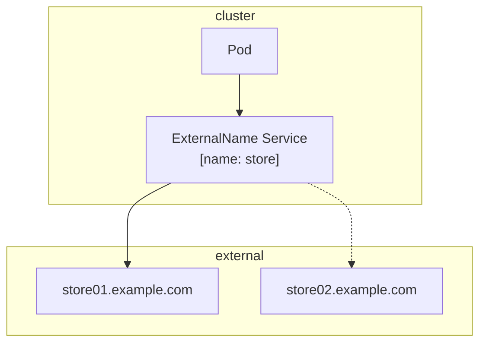

# 概要<!-- omit in toc -->

- 書籍名
  - Kubernetes完全ガイド

# 学習目的<!-- omit in toc -->

- [ ] Kubernetesの基礎知識やキーワードを理解しつつ、おおよその全体像を把握できるようになること

# 学習アウトプット<!-- omit in toc -->

- [ ] Kubernetesの基礎知識やキーワードを整理してリポジトリに反映する
- [ ] 「Rails + Nginx」を自宅サーバ（k8sクラスタ）で実行する
- [ ] 個人的なバッチ処理を自宅サーバ（k8sクラスタ）のCronJobで実行する
- [ ] 上記の構築手順を技術記事にして公開する

# 目次<!-- omit in toc -->

- [第1章 Docker の復習と「Hello, Kubernetes」](#第1章-docker-の復習とhello-kubernetes)
  - [1.1 Docker の復習](#11-docker-の復習)
  - [1.2 さあ、Kubernetes の世界へ](#12-さあkubernetes-の世界へ)
- [第2章 なぜKubernetes が必要なのか？](#第2章-なぜkubernetes-が必要なのか)
  - [2.1 Kubernetes とは](#21-kubernetes-とは)
  - [2.2 Kubernetes の歴史](#22-kubernetes-の歴史)
  - [2.3 Kubernetes を使うと何ができるのか](#23-kubernetes-を使うと何ができるのか)
    - [2.3.1 宣言的なコードによる管理(IaC)](#231-宣言的なコードによる管理iac)
    - [2.3.2 スケーリング/オートスケール](#232-スケーリングオートスケール)
    - [2.3.3 スケジューリング](#233-スケジューリング)
    - [2.3.4 リソース管理](#234-リソース管理)
    - [2.3.5 セルフヒーリングƒ](#235-セルフヒーリングƒ)
    - [2.3.6 ロードバランシングとサービスディスカバリ](#236-ロードバランシングとサービスディスカバリ)
    - [2.3.7 データの管理](#237-データの管理)
  - [2.4 まとめ](#24-まとめ)
- [第3章 Kubernetes 環境の選択肢](#第3章-kubernetes-環境の選択肢)
  - [3.1 Kubernetes 環境の種別](#31-kubernetes-環境の種別)
  - [3.2 ローカルKubernetes](#32-ローカルkubernetes)
    - [3.2.1 Minikube](#321-minikube)
    - [3.2.2 Docker Desktop for Mac](#322-docker-desktop-for-mac)
    - [3.2.3 kind (Kubernetes in Docker)](#323-kind-kubernetes-in-docker)
  - [3.3 Kubernetes 構築ツール](#33-kubernetes-構築ツール)
    - [3.3.1 Kubernetesのサービスレベル目標(SLO)](#331-kubernetesのサービスレベル目標slo)
    - [3.3.2 kubeadm](#332-kubeadm)
    - [3.3.3 Flannel](#333-flannel)
    - [3.3.4 Rancher](#334-rancher)
  - [3.4 パブリッククラウド上のマネージドKubernetes サービス](#34-パブリッククラウド上のマネージドkubernetes-サービス)
    - [3.4.1 GKE (Google Kubernetes Engine)](#341-gke-google-kubernetes-engine)
    - [3.4.2 AKS (Azure Kubernetes Service)](#342-aks-azure-kubernetes-service)
    - [3.4.3 EKS (Elastic Kubernetes Service)](#343-eks-elastic-kubernetes-service)
  - [3.5 Kubernetes プレイグラウンド](#35-kubernetes-プレイグラウンド)
  - [3.6 まとめ](#36-まとめ)
- [第4章 API リソースとkubectl](#第4章-api-リソースとkubectl)
  - [4.1 本章以降を読み進めるための準備](#41-本章以降を読み進めるための準備)
  - [4.2 Kubernetes の基礎](#42-kubernetes-の基礎)
  - [4.3 Kubernetes とリソース](#43-kubernetes-とリソース)
    - [4.3.1 Workloads APIs カテゴリ](#431-workloads-apis-カテゴリ)
    - [4.3.2 Service APIs カテゴリ](#432-service-apis-カテゴリ)
    - [4.3.3 Config \& Storage APIs カテゴリ](#433-config--storage-apis-カテゴリ)
    - [4.3.4 Cluster APIs カテゴリ](#434-cluster-apis-カテゴリ)
    - [4.3.5 Metadata APIs カテゴリ](#435-metadata-apis-カテゴリ)
  - [4.4 Namespace による仮想的なクラスタの分離](#44-namespace-による仮想的なクラスタの分離)
  - [4.5 CLI ツールkubectl](#45-cli-ツールkubectl)
    - [4.5.1 認証情報とContext (config)](#451-認証情報とcontext-config)
    - [4.5.2 Kubectx / kubensによる切り替え](#452-kubectx--kubensによる切り替え)
    - [4.5.3 マニフェストとリソースの作成 / 削除 / 更新 (create / delete / apply)](#453-マニフェストとリソースの作成--削除--更新-create--delete--apply)
    - [4.5.4 リソース作成にも kubectl apply を使うべき理由](#454-リソース作成にも-kubectl-apply-を使うべき理由)
    - [4.5.5 Server-side apply](#455-server-side-apply)
    - [4.5.6 Pod の再起動 (rollout restart)](#456-pod-の再起動-rollout-restart)
    - [4.5.7 generateNameによるランダムな名前のリソースの作成](#457-generatenameによるランダムな名前のリソースの作成)
    - [4.5.8 リソースの状態のチェックと待機(wait)](#458-リソースの状態のチェックと待機wait)
    - [4.5.9 マニフェストファイルの設計](#459-マニフェストファイルの設計)
      - [1つのマニフェストファイルの中に複数のリソースを記述する](#1つのマニフェストファイルの中に複数のリソースを記述する)
      - [複数のマニフェストファイルを同時に適用する](#複数のマニフェストファイルを同時に適用する)
      - [マニフェストファイルの設計指針](#マニフェストファイルの設計指針)
    - [4.5.10 アノテーションとラベル (annotate / label)](#4510-アノテーションとラベル-annotate--label)
      - [アノテーション (annotate)](#アノテーション-annotate)
        - [システムコンポーネントのためにデータを保存する](#システムコンポーネントのためにデータを保存する)
        - [すべての環境では利用できない設定を行う](#すべての環境では利用できない設定を行う)
        - [正式に組み込まれる前の機能の設定を行う](#正式に組み込まれる前の機能の設定を行う)
      - [ラベル (label)](#ラベル-label)
        - [システムが利用するラベル](#システムが利用するラベル)
    - [4.5.11 Pruneによるリソースの削除 (--pruneオプション)](#4511-pruneによるリソースの削除---pruneオプション)
    - [4.5.12 エディターによる編集j (edit)](#4512-エディターによる編集j-edit)
    - [4.5.13 リソースの一部情報の更新 (set)](#4513-リソースの一部情報の更新-set)
    - [4.5.14 ローカルマニフェストとKubernetes上の登録情報の差分取得 (diff)](#4514-ローカルマニフェストとkubernetes上の登録情報の差分取得-diff)
    - [4.5.15 利用可能なリソース種別の一覧取得 (api-resources)](#4515-利用可能なリソース種別の一覧取得-api-resources)
    - [4.5.16 リソースの情報取得 (get)](#4516-リソースの情報取得-get)
    - [4.5.17 リソースの詳細情報の取得 (describe)](#4517-リソースの詳細情報の取得-describe)
    - [4.5.18 実際のリソースの使用量の確認 (top)](#4518-実際のリソースの使用量の確認-top)
    - [4.5.19 コンテナ上でのコマンドの実行 (exec)](#4519-コンテナ上でのコマンドの実行-exec)
    - [4.5.20 Pod上にデバッグ用の一時的なコンテナの追加 (debug)](#4520-pod上にデバッグ用の一時的なコンテナの追加-debug)
    - [4.5.21 ローカルマシンからPodへのポートフォワーディング (port-forward)](#4521-ローカルマシンからpodへのポートフォワーディング-port-forward)
    - [4.5.22 コンテナのログ確認](#4522-コンテナのログ確認)
    - [4.5.23 Sternによる高度なログ確認](#4523-sternによる高度なログ確認)
    - [4.5.24 コンテナとローカルマシン間でのファイルのコピー (cp)](#4524-コンテナとローカルマシン間でのファイルのコピー-cp)
    - [4.5.25 kubectl pluginとパッケージマネージャ (plugin / krew)](#4525-kubectl-pluginとパッケージマネージャ-plugin--krew)
    - [4.5.26 kubectlにおけるデバッグ](#4526-kubectlにおけるデバッグ)
    - [4.5.27 kubectlのその他のTIPS](#4527-kubectlのその他のtips)
      - [aliasの作成](#aliasの作成)
      - [kube-ps1](#kube-ps1)
      - [Podが起動しない場合のデバッグ](#podが起動しない場合のデバッグ)
  - [4.6 まとめ](#46-まとめ)
- [第5章 Workloads APIs カテゴリ](#第5章-workloads-apis-カテゴリ)
  - [5.1 Workloads APIs カテゴリの概要](#51-workloads-apis-カテゴリの概要)
  - [5.2 Pod](#52-pod)
    - [5.2.1 Podのデザインパターン](#521-podのデザインパターン)
      - [サイドカーパターン](#サイドカーパターン)
      - [アンバサダーパターン](#アンバサダーパターン)
      - [アダプタパターン](#アダプタパターン)
    - [5.2.2 Podの作成](#522-podの作成)
    - [5.2.4 コンテナへのログインとコマンドの実行](#524-コンテナへのログインとコマンドの実行)
    - [5.2.5 ENTRYPOINT命令 / CMD命令とcommand / args](#525-entrypoint命令--cmd命令とcommand--args)
    - [5.2.6 Pod名の制限](#526-pod名の制限)
    - [5.2.7 ホストのネットワーク構成を利用したPodの起動](#527-ホストのネットワーク構成を利用したpodの起動)
    - [5.2.8 PodのDNS設定 (dnsPolicy) とサービスディスカバリ](#528-podのdns設定-dnspolicy-とサービスディスカバリ)
      - [ClusterFirst (デフォルト)](#clusterfirst-デフォルト)
      - [None](#none)
      - [Default](#default)
      - [ClusterFirstWithHostNet](#clusterfirstwithhostnet)
    - [5.2.9 静的な名前解決の設定 (/etc/hosts)](#529-静的な名前解決の設定-etchosts)
    - [5.2.10 Workingディレクトリの設定](#5210-workingディレクトリの設定)
  - [5.3 ReplicaSet ／ ReplicationController](#53-replicaset--replicationcontroller)
    - [5.3.1 ReplicaSetの作成](#531-replicasetの作成)
    - [5.3.2 Podの停止とセルフヒーリング](#532-podの停止とセルフヒーリング)
    - [5.3.3 ReplicaSetとラベル](#533-replicasetとラベル)
    - [5.3.4 ReplicaSetのスケーリング](#534-replicasetのスケーリング)
    - [5.3.5 equality-based条件とset-based条件](#535-equality-based条件とset-based条件)
  - [5.4 Deployment](#54-deployment)
    - [5.4.1 Deploymentの作成](#541-deploymentの作成)
    - [5.4.2 Deploymentのアップデート (ReplicaSetが作成される) 条件](#542-deploymentのアップデート-replicasetが作成される-条件)
    - [5.4.3 変更のロールバック](#543-変更のロールバック)
    - [5.4.4 Deployment更新の一時停止](#544-deployment更新の一時停止)
    - [5.4.5 Deploymentのアップデート戦略](#545-deploymentのアップデート戦略)
      - [Recreate](#recreate)
      - [RollingUpdate](#rollingupdate)
    - [5.4.6 より詳細なアップデートパラメータ](#546-より詳細なアップデートパラメータ)
    - [5.4.7 Deploymentのスケーリング](#547-deploymentのスケーリング)
    - [5.4.8 マニフェストを書かずにDeploymentを作成する](#548-マニフェストを書かずにdeploymentを作成する)
  - [5.5 DaemonSet](#55-daemonset)
    - [5.5.1 DaemonSetの作成](#551-daemonsetの作成)
    - [5.5.2 DaemonSetのアップデート戦略](#552-daemonsetのアップデート戦略)
      - [OnDelete](#ondelete)
      - [RollingUpdate](#rollingupdate-1)
  - [5.6 StatefulSet](#56-statefulset)
    - [5.6.1 StatefulSetの作成](#561-statefulsetの作成)
    - [5.6.2 StatefulSetのスケーリング](#562-statefulsetのスケーリング)
    - [5.6.3 StatefulSetのライフサイクル](#563-statefulsetのライフサイクル)
    - [5.6.4 StatefulSetのアップデート戦略](#564-statefulsetのアップデート戦略)
    - [5.6.5 永続化領域のデータ保持の確認](#565-永続化領域のデータ保持の確認)
    - [5.6.6 StatefulSetの削除とPersistentVolumeの削除](#566-statefulsetの削除とpersistentvolumeの削除)
  - [5.7 Job](#57-job)
    - [5.7.1 ReplicaSetとの違いとJobの使い所](#571-replicasetとの違いとjobの使い所)
    - [5.7.2 Jobの作成](#572-jobの作成)
    - [5.7.3 restartPolicyによる挙動の違い](#573-restartpolicyによる挙動の違い)
    - [5.7.4 タスク型とワークキュー型の並列実行](#574-タスク型とワークキュー型の並列実行)
      - [One Shot Task: 1回だけ実行するタスク](#one-shot-task-1回だけ実行するタスク)
      - [Multi Task: N並列で実行させるタスク](#multi-task-n並列で実行させるタスク)
      - [Multi WorkQueue: N並列で実行するワークキュー](#multi-workqueue-n並列で実行するワークキュー)
      - [Single WorkQueue: 1個ずつ実行するワークキュー](#single-workqueue-1個ずつ実行するワークキュー)
    - [5.7.5 一定期間後のJobの削除](#575-一定期間後のjobの削除)
    - [5.7.6 マニフェストを書かずにJobを作成する](#576-マニフェストを書かずにjobを作成する)
  - [5.8 CronJob](#58-cronjob)
    - [5.8.1 CronJobの作成](#581-cronjobの作成)
    - [CronJobを任意のタイミングで実行する](#cronjobを任意のタイミングで実行する)
    - [5.8.4 同時実行に関する制御](#584-同時実行に関する制御)
    - [5.8.5 実行開始期限に関する制御](#585-実行開始期限に関する制御)
    - [5.8.6 CronJobの履歴](#586-cronjobの履歴)
    - [5.8.7 マニフェストを書かずにCronJobを作成する](#587-マニフェストを書かずにcronjobを作成する)
  - [5.9 まとめ](#59-まとめ)
- [第6章 Service APIs カテゴリ](#第6章-service-apis-カテゴリ)
  - [6.1 Service APIs カテゴリの概要](#61-service-apis-カテゴリの概要)
  - [6.2 Kubernetes クラスタのネットワークとService](#62-kubernetes-クラスタのネットワークとservice)
    - [6.2.1 Pod宛トラフィックのロードバランシング](#621-pod宛トラフィックのロードバランシング)
      - [複数ポートの割り当て](#複数ポートの割り当て)
      - [名前によるポートの参照](#名前によるポートの参照)
    - [6.2.2 クラスタ内DNSとサービスディスカバリ](#622-クラスタ内dnsとサービスディスカバリ)
      - [環境変数を利用したサービスディスカバリ](#環境変数を利用したサービスディスカバリ)
      - [DNS Aレコードを利用したサービスディスカバリ](#dns-aレコードを利用したサービスディスカバリ)
      - [DNS SRVレコードを利用したサービスディスカバリ](#dns-srvレコードを利用したサービスディスカバリ)
    - [6.2.3 クラスタ内DNSとクラスタ外DNS](#623-クラスタ内dnsとクラスタ外dns)
    - [6.2.4 Node Local DNS Cache](#624-node-local-dns-cache)
  - [6.3 ClusterIP Service](#63-clusterip-service)
    - [6.3.1 ClusterIP Serviceの作成](#631-clusterip-serviceの作成)
    - [6.3.2 ClusterIP 仮想IPの静的な指定](#632-clusterip-仮想ipの静的な指定)
  - [6.4 ExternalIP Service](#64-externalip-service)
    - [6.4.1 ExternalIP Serviceの作成](#641-externalip-serviceの作成)
  - [6.5 NodePort Service](#65-nodeport-service)
    - [6.5.1 NodePort Serviceの作成](#651-nodeport-serviceの作成)
    - [6.5.2 NodePortの注意点](#652-nodeportの注意点)
  - [6.6 LoadBalancer Service](#66-loadbalancer-service)
    - [6.6.1 LoadBalancer Serviceの作成](#661-loadbalancer-serviceの作成)
    - [6.6.2 LoadBalancerが払い出す仮想IPの静的な指定](#662-loadbalancerが払い出す仮想ipの静的な指定)
    - [6.6.3 LoadBalancerのファイアウォールルールの設定](#663-loadbalancerのファイアウォールルールの設定)
    - [6.6.4 GKEやクラウドプロバイダでの注意点](#664-gkeやクラウドプロバイダでの注意点)
  - [6.7 Service のその他の機能](#67-service-のその他の機能)
    - [6.7.1 セッションアフィニティ](#671-セッションアフィニティ)
    - [6.7.2 ノード間通信の排除と転送元IPアドレスの保持](#672-ノード間通信の排除と転送元ipアドレスの保持)
    - [6.7.3 トポロジを意識したService転送](#673-トポロジを意識したservice転送)
  - [6.8 Headless Service（None）](#68-headless-servicenone)
    - [6.8.2 Headless ServiceによるPod名の名前解決](#682-headless-serviceによるpod名の名前解決)
    - [6.8.3 StatefulSet以外のPod名の名前解決](#683-statefulset以外のpod名の名前解決)
  - [6.9 ExternalName Service](#69-externalname-service)
    - [6.9.1 ExternalName Serviceの作成](#691-externalname-serviceの作成)
    - [6.9.2 外部サービスとの疎結合性の確保](#692-外部サービスとの疎結合性の確保)
    - [6.9.3 外部サービスと内部サービス間の切り替え](#693-外部サービスと内部サービス間の切り替え)
  - [6.10 None-Selector Service](#610-none-selector-service)
    - [6.10.1 None-Selector Serviceの作成](#6101-none-selector-serviceの作成)
  - [6.11 Ingress](#611-ingress)
    - [6.11.1 リソースとコントローラ](#6111-リソースとコントローラ)
    - [6.11.2 IngressリソースとIngress Controller](#6112-ingressリソースとingress-controller)
    - [6.11.3 Ingressの種類](#6113-ingressの種類)
      - [クラスタ外のロードバランサを利用したIngress](#クラスタ外のロードバランサを利用したingress)
      - [クラスタ内にIngress用のPodをデプロイするIngress](#クラスタ内にingress用のpodをデプロイするingress)
    - [6.11.4 Ingress Controllerのデプロイ](#6114-ingress-controllerのデプロイ)
      - [GKE Ingress Controllerのデプロイ](#gke-ingress-controllerのデプロイ)
      - [Nginx Ingress Controllerのデプロイ](#nginx-ingress-controllerのデプロイ)
    - [6.11.5 Ingressリソースを作成する前の事前準備](#6115-ingressリソースを作成する前の事前準備)
    - [6.11.6 Ingressリソースの作成](#6116-ingressリソースの作成)
      - [GKE用のIngressリソースの作成](#gke用のingressリソースの作成)
      - [Nginx Ingress用のIngressリソースの作成](#nginx-ingress用のingressリソースの作成)
    - [6.11.7 X-Forwarded-For(XFF)ヘッダによるクライアントIPアドレスの参照](#6117-x-forwarded-forxffヘッダによるクライアントipアドレスの参照)
    - [6.11.8 Ingress ClassによるIngressの分割](#6118-ingress-classによるingressの分割)
    - [6.11.9 IngressのGAに向けた変更](#6119-ingressのgaに向けた変更)
  - [6.12 まとめ](#612-まとめ)
- [第7章 Config ＆ Storage APIs カテゴリ](#第7章-config--storage-apis-カテゴリ)
  - [7.1 Config ＆ Storage APIs カテゴリの概要](#71-config--storage-apis-カテゴリの概要)
  - [7.2 環境変数の利用](#72-環境変数の利用)
    - [7.2.1 静的設定](#721-静的設定)
    - [7.2.2 Podの情報](#722-podの情報)
    - [7.2.3 コンテナの情報](#723-コンテナの情報)
    - [7.2.4 Secretリソースの機密情報](#724-secretリソースの機密情報)
    - [7.2.5 ConfigMapリソースの設定値](#725-configmapリソースの設定値)
    - [7.2.6 環境変数利用時の注意点](#726-環境変数利用時の注意点)
  - [7.3 Secret](#73-secret)
    - [7.3.1 Secretの分類](#731-secretの分類)
    - [7.3.2 一般的な汎用用途のSecret (Opaque)](#732-一般的な汎用用途のsecret-opaque)
      - [kubectlでファイルから値を参照して作成する(`--from-file`)](#kubectlでファイルから値を参照して作成する--from-file)
      - [kubectlでenvfileから値を参照して作成する(`--from-env-file`)](#kubectlでenvfileから値を参照して作成する--from-env-file)
      - [kubectlで直接値を渡して作成する(`--from-literal`)](#kubectlで直接値を渡して作成する--from-literal)
      - [マニフェストから作成する(`-f`)](#マニフェストから作成する-f)
    - [7.3.3 TLSタイプのSecret](#733-tlsタイプのsecret)
      - [kubectlで秘密鍵と証明書ファイルから作成する(--key / --cert)](#kubectlで秘密鍵と証明書ファイルから作成する--key----cert)
    - [7.3.4 DockerレジストリタイプのSecret](#734-dockerレジストリタイプのsecret)
      - [kubectlから直接作成する](#kubectlから直接作成する)
      - [イメージの取得時のSecretの利用](#イメージの取得時のsecretの利用)
    - [7.3.5 Basic認証タイプのSecret](#735-basic認証タイプのsecret)
    - [7.3.6 SSH認証タイプのSecret](#736-ssh認証タイプのsecret)
    - [7.3.7 Secretの利用](#737-secretの利用)
      - [環境変数として渡す](#環境変数として渡す)
      - [Volumeとしてマウントする](#volumeとしてマウントする)
  - [7.4 ConfigMap](#74-configmap)
  - [7.5 PersistentVolumeClaim](#75-persistentvolumeclaim)
  - [7.6 Volume](#76-volume)
  - [7.7 PersistentVolume（PV）](#77-persistentvolumepv)
  - [7.8 PersistentVolumeClaim (PVC)](#78-persistentvolumeclaim-pvc)
  - [7.9 volumeMounts で利用可能なオプション](#79-volumemounts-で利用可能なオプション)
  - [7.10 まとめ](#710-まとめ)
- [第8章 Cluster APIs カテゴリとMetadata APIs カテゴリ](#第8章-cluster-apis-カテゴリとmetadata-apis-カテゴリ)
  - [8.1 Cluster APIs カテゴリとMetadata APIs カテゴリの概要](#81-cluster-apis-カテゴリとmetadata-apis-カテゴリの概要)
  - [8.2 Node](#82-node)
  - [8.3 Namespace](#83-namespace)
  - [8.4 まとめ](#84-まとめ)
- [第9章 リソース管理とオートスケーリング](#第9章-リソース管理とオートスケーリング)
  - [9.1 リソースの制限](#91-リソースの制限)
  - [9.2 Cluster Autoscaler とリソース不足](#92-cluster-autoscaler-とリソース不足)
  - [9.3 LimitRange によるリソース制限](#93-limitrange-によるリソース制限)
  - [9.4 QoS Class](#94-qos-class)
  - [9.5 ResourceQuota によるNamespace のリソースクォータ制限](#95-resourcequota-によるnamespace-のリソースクォータ制限)
  - [9.6 HorizontalPodAutoscaler（HPA）](#96-horizontalpodautoscalerhpa)
  - [9.7 VerticalPodAutoscaler（VPA）](#97-verticalpodautoscalervpa)
  - [9.8 まとめ](#98-まとめ)
- [第10章 ヘルスチェックとコンテナのライフサイクル](#第10章-ヘルスチェックとコンテナのライフサイクル)
  - [10.1 ヘルスチェック](#101-ヘルスチェック)
  - [10.2 コンテナのライフサイクルと再始動（restartPolicy）](#102-コンテナのライフサイクルと再始動restartpolicy)
  - [10.3 Init Containers](#103-init-containers)
  - [10.4 起動直後と終了直前に任意のコマンドを実行する（postStart ／ preStop）](#104-起動直後と終了直前に任意のコマンドを実行するpoststart--prestop)
  - [10.5 Pod の安全な停止とタイミング](#105-pod-の安全な停止とタイミング)
  - [10.6 リソースを削除した時の挙動](#106-リソースを削除した時の挙動)
  - [10.7 まとめ](#107-まとめ)
- [第11章 メンテナンスとノードの停止](#第11章-メンテナンスとノードの停止)
  - [11.1 ノードの停止とPod の停止](#111-ノードの停止とpod-の停止)
  - [11.2 スケジューリング対象からの除外と復帰（cordon ／ uncordon）](#112-スケジューリング対象からの除外と復帰cordon--uncordon)
  - [11.3 ノードの排出処理によるPod の退避（drain）](#113-ノードの排出処理によるpod-の退避drain)
  - [11.4 PodDisruptionBudget（PDB）による安全な退避](#114-poddisruptionbudgetpdbによる安全な退避)
  - [11.5 まとめ](#115-まとめ)
- [第12章 高度で柔軟なスケジューリング](#第12章-高度で柔軟なスケジューリング)
  - [12.1 フィルタリングとスコアリング](#121-フィルタリングとスコアリング)
  - [12.2 マニフェストで指定するスケジューリング](#122-マニフェストで指定するスケジューリング)
  - [12.3 ビルトインノードラベルとラベルの追加](#123-ビルトインノードラベルとラベルの追加)
  - [12.4 nodeSelector（Simple Node Affinity）](#124-nodeselectorsimple-node-affinity)
  - [12.5 Node Affinity](#125-node-affinity)
  - [12.6 matchExpressions のオペレータとset-based 条件](#126-matchexpressions-のオペレータとset-based-条件)
  - [12.7 Node Anti-Affinity](#127-node-anti-affinity)
  - [12.8 Inter-Pod Affinity](#128-inter-pod-affinity)
  - [12.9 Inter-Pod Anti-Affinity](#129-inter-pod-anti-affinity)
  - [12.10 複数の条件を組み合わせたPod のスケジューリング](#1210-複数の条件を組み合わせたpod-のスケジューリング)
  - [12.11 1.18 Beta TopologySpreadConstraints によるトポロジ均衡](#1211-118-beta-topologyspreadconstraints-によるトポロジ均衡)
  - [12.12 Taints とTolerations](#1212-taints-とtolerations)
  - [12.13 PriorityClass によるPod の優先度と退避](#1213-priorityclass-によるpod-の優先度と退避)
  - [12.14 その他のスケジューリング](#1214-その他のスケジューリング)
  - [12.15 まとめ](#1215-まとめ)
- [第13章 セキュリティ](#第13章-セキュリティ)
  - [13.1 ServiceAccount](#131-serviceaccount)
  - [13.2 RBAC（Role Based Access Control）](#132-rbacrole-based-access-control)
  - [13.3 SecurityContext](#133-securitycontext)
  - [13.4 PodSecurityContext](#134-podsecuritycontext)
  - [13.5 1.18 Beta PodSecurityPolicy](#135-118-beta-podsecuritypolicy)
  - [13.6 NetworkPolicy](#136-networkpolicy)
  - [13.7 認証／認可とAdmission Control](#137-認証認可とadmission-control)

# 第1章 Docker の復習と「Hello, Kubernetes」

## 1.1 Docker の復習

## 1.2 さあ、Kubernetes の世界へ

# 第2章 なぜKubernetes が必要なのか？

## 2.1 Kubernetes とは

- Kubernetes Node
  - 実際にコンテナが動作するノード（物理マシン, 仮想マシン）
- Kubernetes Master
  - Kubernetes Nodeを管理するノード

## 2.2 Kubernetes の歴史

## 2.3 Kubernetes を使うと何ができるのか

- コンテナ運用の課題
  - 複数のKubernetes Nodeの管理
  - コンテナのスケジューリング
  - ローリングアップデート
  - スケーリング・オートスケーリング
  - コンテナの死活監視
  - 障害時のセルフヒーリング
  - ロードバランシング
  - データの管理
  - ワークロードの管理
  - ログの管理
  - IaC
  - その他エコシステムとの連携や拡張
- ワークロード
  - Kubernetes上で実行中のアプリケーションのこと

### 2.3.1 宣言的なコードによる管理(IaC)

- マニフェストファイルで宣言的にリソースを管理できる(IaC)
  - .yaml形式で管理することが多い

### 2.3.2 スケーリング/オートスケール

- コンテナのレプリカを自動増減（オートスケール）することで、負荷分散や耐障害性を確保できる

### 2.3.3 スケジューリング

- どのKubernetes Nodeにコンテナを配置するのか判断するステップのこと
- Affinity, Anti-Affinity機能

### 2.3.4 リソース管理

- Kubernetes NodeのCPUやメモリの空リソースをみて、Kubernetesが自動的に判断して実行する（ユーザーが管理する必要なし）
- クラスタオートスケール機能では、Kubernetes Node自体の増減も自動的に行える

### 2.3.5 セルフヒーリングƒ

- Kubernetesがコンテナのプロセス監視を行う
- プロセス停止を検知するとコンテナを再デプロイする
- Kubernetes Nodeに障害が発生しても、アプリケーションを自動復旧するようなつくり

### 2.3.6 ロードバランシングとサービスディスカバリ

- ロードバランシング機能
  - Service, Ingressなどの機能が存在する
  - アプリケーションのコンテナ群に対してルーティングを行うエンドポイントを払い出す
  - オートスケールや障害発生時には、Kubernetesが自動的に切り替える
- Service
  - サービスディスカバリが可能
  - マイクロサービスアーキテクチャに効果的
  - 各サービスのマニフェストファイルを元に、システム全体を簡単に連携できる

### 2.3.7 データの管理

- データストアにetcdを採用している(KVS)
  - マニフェストファイルやServiceなどを保持する
  - 認証情報や設定ファイルなどを保持できる仕組みもあるため、Kubernetes上で集中管理できる
- サードパーティ連携
  - Ansible
    - Kubernetesへのコンテナのデプロイ
  - Apache Ignite
    - Kubernetesのサービスディスカバリを利用したクラスタ形成とスケーリング
  - Fluentd
    - Kubernetes上のコンテナのログを転送
  - GitLab
    - CI/CDを実現するための一連の様々なツールとKubernetesの統合
  - Jenkins
    - ジョブ実行時にジョブワーカー用のコンテナをKubernetesにデプロイ
  - Prometheus
    - Kubernetesのモニタリング
  - Spark
    - ジョブをKubernetes上でネイティブ実行（YARN代替）
  - Spinnaker
    - Kubernetesへのコンテナのデプロイ
  - Kubeflow
    - Kubernetes上にML Platformをデプロイ
  - Rook
    - Kubernetes上に分散ファイルシステムをデプロイ
  - Vitess
    - Kubernetes上にMySQLクラスタをデプロイ

## 2.4 まとめ

# 第3章 Kubernetes 環境の選択肢

## 3.1 Kubernetes 環境の種別

- ローカルKubernetes
  - Minikube
  - Docker Desktop
  - kind (Kubernetes in Docker)
- Kubernetes構築ツール
  - kubeadm
  - Rancher
- パブリッククラウド
  - GKE
  - AKS
  - EKAS

## 3.2 ローカルKubernetes

### 3.2.1 Minikube

- シングルノード構成
- 複数台構成が必要なKubernetesの機能は使用できない

### 3.2.2 Docker Desktop for Mac

### 3.2.3 kind (Kubernetes in Docker)

- ローカル環境でマルチノードクラスタを構築できる
- kindで使用するDockerイメージはDockerHubのkindest Organizationで管理されている

## 3.3 Kubernetes 構築ツール

### 3.3.1 Kubernetesのサービスレベル目標(SLO)

### 3.3.2 kubeadm

- Kubernetes公式の構築ツール

### 3.3.3 Flannel

- Kubernetesクラスタ内のPod同士の通信（Podネットワーク）を実現するもの

### 3.3.4 Rancher

- Kubernetesの構築・運用をサポートする機能を持つ
  - 複数クラスタの統合管理
  - Kubernetesクラスタのデプロイ（AWS, OpenStack, VMware, ...etc）
  - 既存のKubernetesクラスタをRancherで管理（クラスタのインポート機能）
  - 複数クラスタに対するアプリケーションデプロイ機能
  - WebUIの提供（認証・モニタリングなど可能）

## 3.4 パブリッククラウド上のマネージドKubernetes サービス

### 3.4.1 GKE (Google Kubernetes Engine)

- GCE (Google Compute Engine)
  - 24時間で自動停止するインスタンス
  - 安い
- Preemptible-killer
  - ランダムにノードを入れ替えることができる
- Cloud Logging
  - GKEのログを集約する
- NodePool

  - GKE特有の機能
  - Nodeにラベリングしてグルーピングができる

  ```mermaid
  graph

  subgraph Kubernetes Cluster
    subgraph "NodePool A (High CPU)"
      A["NodePoor: A"]
      B["NodePoor: A"]
      C["NodePoor: A"]
    end

    subgraph "NodePool B (High Memory)"
      E["NodePoor: B"]
      F["NodePoor: B"]
    end
  end
  ```

- GCPのコマンドラインツールで操作する

### 3.4.2 AKS (Azure Kubernetes Service)

### 3.4.3 EKS (Elastic Kubernetes Service)

- IAMとKubernetesユーザーを紐づけられる
- EC2インスタンスをKubernetes Nodeとして利用する
- EKS on Fargateというのもある
  - FargateをKubernetes Nodeとして利用する
  - 一部のKubernetesコンポーネントがまだマネージドでない可能性あり
- eksctlで操作する

## 3.5 Kubernetes プレイグラウンド

## 3.6 まとめ

# 第4章 API リソースとkubectl

## 4.1 本章以降を読み進めるための準備

- kindでcluster構築

  ```shell
  # クラスタ作成
  ## kindという名前のクラスタを作成
  kind create cluster
  ## k8sという名前のクラスタを作成
  kind create cluster --name=k8s

  # クラスタ削除
  ## kindという名前のクラスタを削除
  kind delete cluster
  ## k8sという名前のクラスタを削除
  kind delete cluster --name=k8s
  ```

## 4.2 Kubernetes の基礎

- Kubernetesの各ノード
  - Kubernetes Master
    - APIエンドポイントの提供
    - コンテナのスケジューリング、スケーリング
  - Kubernetes Node
    - コンテナを起動
- Kubernetes Masterへのリソースの登録
  - kubectlとマニフェストファイルで行う
  - kubectlがマニフェストファイルの内容に基づいて、Kubernetes MasterのAPIにリクエストを送信してKubernetesを操作する

## 4.3 Kubernetes とリソース

- Kubernetesのリソース

  | 種別                           | 概要                                                         |
  | ------------------------------ | ------------------------------------------------------------ |
  | Workload APIs カテゴリ         | コンテナの実行に関するリソース                               |
  | Service APIs カテゴリ          | コンテナを外部公開するようなエンドポイントを提供するリソース |
  | Config & Storage APIs カテゴリ | 設定 / 機密情報 / 永続化ボリュームに関するリソース           |
  | Cluster APIs カテゴリ          | セキュリティやクォータなどに関するリソース                   |
  | Metadata APIs カテゴリ         | クラスタ内の他リソースを操作するためのリソース               |

### 4.3.1 Workloads APIs カテゴリ

- クラスタ上にコンテナを起動させるためのリソース
- リソースの種類
  - Pod
  - ReplicationController
  - ReplicaSet
  - Deployment
  - DaemonSet
  - StatefulSet
  - Job
  - CronJob

### 4.3.2 Service APIs カテゴリ

- コンテナのサービスディスカバリや、クラスタの外部からアクセス可能なエンドポイントを提供するリソース
- リソースの種類
  - Service
    - ClusterIP
    - ExternalIP (ClusterIPの一種)
    - NodePort
    - LoadBalancer
    - Headless (None)
    - ExternalName
    - None-Selector
  - Ingress

### 4.3.3 Config & Storage APIs カテゴリ

- 設定や機密データをコンテナに埋め込んだり、永続ボリュームを提供するリソース
- リソースの種類
  - Secret
  - ConfigMap
  - PersistentVolumeClaim

### 4.3.4 Cluster APIs カテゴリ

- クラスタ自体の振る舞いを定義するリソース
- リソースの種類
  - Node
  - Namespace
  - PersistentVolume
  - ResourceQuota
  - ServiceAccount
  - Role
  - ClusterRole
  - RoleBinding
  - ClusterRoleBinding
  - NetworkPolicy

### 4.3.5 Metadata APIs カテゴリ

- クラスタ内の他のリソースの動作を制御するためのリソース
- リソースの種類
  - LimitRange
  - HorizontalPodAutoscaler
  - PodDisruptionBudget
  - CustomResourceDefinition

## 4.4 Namespace による仮想的なクラスタの分離

- Namespace
  - 仮想的なKubernetesクラスタの分離機能のこと
- Namespaceでできること
  - 本番環境、ステージング環境、開発環境のように、環境ごとに分割すること
  - 同じKubernetesクラスタを複数チームでの利用すること
- Namespaceの慣習
  - kube-system
    - Kubernetes Dashboardなどのシステムコンポーネントやアドオンをデプロイする
  - kube-public
    - 全ユーザーが共通して利用する設定値などを保存する
  - kube-node-lease
    - Kubernetes Nodeのハードビート情報を保存するためのLeaseリソースを保存する
  - default
    - ユーザーが任意のリソースを登録する
- Namespace、RBAC (RoleBased Access Control)、Network Policyを組み合わせることで分離性を高められる
- Namespaceの分割粒度
  - マイクロサービス単位（開発チーム単位）での分割が好ましい。（権限分離性の観点で）
- クラスタの分離粒度
  - 本番環境、ステージング環境、開発環境の環境単位でクラスタごと分離するのが好ましい
  - 理由
    - すべての環境で同時に障害が発生するリスクがあるため
    - マニフェストの再利用性が著しく低下するため
    - 環境名を考慮した命名が必要で煩雑になるため

## 4.5 CLI ツールkubectl

- クラスタの操作方法
  - Kubernetes MasterのAPI
  - クライアントライブラリ
  - CLIツール「kubectl」 => 最も一般的

### 4.5.1 認証情報とContext (config)

- kubeconfig

  - Kubernetes Masterとの通信に必要な認証情報などを記述する

    ```yaml
    # ~/.kube/config

    apiVersion: v1
    kind: Config
    preferences: {}
    clusters: # 接続先クラスタ
      - name: sample-cluster
        cluster:
          server: https://localhost:6443
    users: # 認証情報
      - name: sample-user
        user:
          client-certificate-data: LS0tLS1CRUdJTi...
          client-key-data: LS0tLS1CRUdJTi...
    contexts: # 接続先と認証情報の組み合わせ
      - name: sample-context
        context:
          cluster: sample-cluster
          namespace: default
          user: sample-user
    current-context: sample-context
    ```

- kubeconfigの設定変更の方法
  - kubeconfigを直接編集する
  - kubectlコマンドで設定変更（kubeconfigファイルも自動的に更新される）

### 4.5.2 Kubectx / kubensによる切り替え

- ContextやNamespaceを簡単に切り替えられるOSS

### 4.5.3 マニフェストとリソースの作成 / 削除 / 更新 (create / delete / apply)

- リソース操作
  - 作成
    - `kubectl create -f hoge.yaml`
  - 削除
    - `kubectl delete -f hoge.yaml`
    - オプション
      - `--wait`：削除完了するまで待機する
      - `--force`：強制削除
  - 更新
    - `kubectl apply -f hoge.yaml`
    - applyできないフィールドも存在する
- Podのイメージの詳細確認
  - `kubectl get pod Pod名 -o jsonpath={}`
  - `kubectl get pod Pod名 -o jsonpath={.spec.containers}`

### 4.5.4 リソース作成にも kubectl apply を使うべき理由

- 常に`kubectl apply`を使用するべき
- 理由：差分検知が想定通りに動作しないケースがあるため

### 4.5.5 Server-side apply

- Client-side apply
  - コマンド: `kubectl apply -f hoge.yaml`
  - 手元のマニフェストファイルで更新してしまうため、サーバ側の情報を直接書き換えたりしていると内容を破棄してしまうケースがある
- Server-side apply
  - コマンド: `kubectl apply -f hoge.yaml --server-side`
  - サーバ側の実態とマニフェストを比較し、コンフリクトがある場合は処理を中断する
  - `--force-conflicts`で、コンフリクトを無視してマニフェストファイルの内容で更新する

### 4.5.6 Pod の再起動 (rollout restart)

- リソースに紐づくPodを再起動する
  - `kubectl rollout restart リソースの種類 リソース名`
- 注意点: Podに対して直接実行することはできない
  - `kubectl rollout restart pod Pod名`はエラーで動作しない

### 4.5.7 generateNameによるランダムな名前のリソースの作成

- マニフェストファイルでランダムな名前のリソースを定義可能

  ```yaml
  apiVersion: v1
  kind: Pod
  metadata:
    generateName: hoge- # hoge-cglj9 のようなランダムなリソース名にできる
  spec:
    containers:
      - name: nginx-container
        image: nginx:1.16
  ```

- 注意点
  - createでのみ利用可能
  - applyでは不可能

### 4.5.8 リソースの状態のチェックと待機(wait)

- 構文
  - `kubectl wait --for=条件 リソースを指定`
- 例
  - Podの起動を待機する場合
    - `kubectl wait --for=condition=Ready pod/Pod名`
  - Podの削除を待機する場合
    - `kubectl wait --for=delete pod --all --timeout=5s`
  - マニフェストファイルでPodの起動を待機する場合
    - `kubectl wait --for=condition=Ready -f マニフェストファイルのPath`

### 4.5.9 マニフェストファイルの設計

#### 1つのマニフェストファイルの中に複数のリソースを記述する

- マニフェストファイルのユースケース
  - 1つのマニフェストファイルにまとめるケース
    - 「Podを起動するWorkloads APIsカテゴリのリソース」と「外部公開するService APIsカテゴリのリソース」をまとめることで、1つのマニフェストファイルでサービスを公開できるようにしたいケース
  - マニフェストファイルを分割するケース
    - 設定ファイル（ConfigMapリソース）やパスワード（Secretリソース）を共通化したいケース
- 複数リソースの記述方法
  - `---`で区切る

#### 複数のマニフェストファイルを同時に適用する

- ディレクトリ構成が以下の場合

  ```
  ./
  ├── sample-pod1.yaml
  ├── sample-pod2.yaml
  └── innerdir
      └── sample-pod3.yaml
  ```

- ディレクトリ内のマニフェストファイルを適用
  - `kubectl apply -f ./`
- ディレクトリ内のマニフェストファイルを再帰的に適用（サブディレクトリ内のマニフェストも適用）
  - `kubectl apply -f ./ -R`

#### マニフェストファイルの設計指針

- マイクロサービス単位でマニフェストファイルを分割するパターン

  ```
  ./whole-system
  ├── microservice-A.yaml (Deployment + Service)
  ├── microservice-B.yaml (Deployment + Service)
  ├── microservice-C.yaml (Deployment + Service)
  └── microservice-D.yaml (Deployment + Service)
  ```

  - メリット
    - マイクロサービス単位で適用できること
- マイクロサービス単位でディレクトリを分割するパターン

  ```
  ./microservice-A/
  ├── deployment.yaml
  └── service.yaml

  ./microservice-B/
  ├── deployment.yaml
  └── service.yaml

  ./microservice-C/
  ├── deployment.yaml
  └── service.yaml

  ./microservice-D/
  ├── deployment.yaml
  └── service.yaml
  ```

  - メリット
    - 可読性が高まること
  - デメリット
    - 適用の順序制御が難しい

### 4.5.10 アノテーションとラベル (annotate / label)

- アノテーション
  - システムコンポーネントが利用するメタデータ
- ラベル
  - リソース管理に利用するメタデータ

#### アノテーション (annotate)

- マニフェストファイルの`metadata.annotations`で設定できるメタデータ
- アノテーションのデータ構造
  - Key-Value形式
- アノテーションの用途
  - システムコンポーネントのためにデータを保存する
  - すべての環境では利用できない設定を行う
  - 正式に組み込まれる前の機能の設定を行う

##### システムコンポーネントのためにデータを保存する

##### すべての環境では利用できない設定を行う

- 「GKE / AKS / EKS」それぞれに独自の拡張機能があり、その設定にアノテーションを使うケースが多い

##### 正式に組み込まれる前の機能の設定を行う

#### ラベル (label)

- マニフェストファイルの`metadata.labels`で設定できるメタデータ
- ラベルの用途
  - 開発者が利用するラベル
  - システムが利用するラベル

##### システムが利用するラベル

- ラベルをもとにリソースをフィルタリングしたり指定できる
  - `kubectl get pods -l label1=val1,label2`
- ラベルが衝突することによる副作用が発生するケースが考えられる
  - Podの数を維持するリソース(ReplicaSet)にて、停止させるべきでないPodを停止させてしまうケース
  - ロードバランサからPodにリクエストを転送するリソース(LoadBalancer)にて、転送するべきでないPodに転送してしまうケース
- 推奨されるラベル

  | ラベルのキー名               | 概要                                               |
  | ---------------------------- | -------------------------------------------------- |
  | app.kubernetes.io/name       | アプリケーションの名前                             |
  | app.kubernetes.io/version    | アプリケーションのバージョン                       |
  | app.kubernetes.io/component  | アプリケーションの役割                             |
  | app.kubernetes.io/part-of    | アプリケーションが全体として構成するシステムの名前 |
  | app.kubernetes.io/instance   | アプリケーションやシステムを識別するインスタンス名 |
  | app.kubernetes.io/managed-by | アプリケーションが管理されているツール             |

### 4.5.11 Pruneによるリソースの削除 (--pruneオプション)

- Kubernetesを実運用する場合

  - マニフェストファイルをGit管理
  - マニフェストファイルをスクリプトで自動実行

  ```mermaid
  flowchart LR
    A[(マニフェスト<br>Git リポジトリ)]
    B["スクリプト"]
    C["Kubernetesクラスタ"]
    D["開発者"]

    A--git clone-->B
    B--kubectl apply -f-->C
    D--NG: kubectl apply -f<br>実運用では自動化する-->C
    D--マニフェストの追加/変更-->A
  ```

- `apply`だけだと、マニフェストから削除されたリソースを削除できない
- 「`--prune`オプション」を付与することで、削除されたリソースを検知して自動削除できる
- `--prune`の仕組み
  - ラベルに一致する全リソースのうち、マニフェストファイルに含まれないリソースを削除する挙動をとる

### 4.5.12 エディターによる編集j (edit)

### 4.5.13 リソースの一部情報の更新 (set)

- マニフェストファイルを更新せずにリソースを更新する方法
  - env
  - image
  - resource
  - selector
  - serviceaccount
  - subject
- 注意点
  - リソースを更新しても、マニフェストファイルは更新されないため乱用すべきでない

### 4.5.14 ローカルマニフェストとKubernetes上の登録情報の差分取得 (diff)

- マニフェストファイルとリソースの差分を表示できる
  - `kubectl diff -f hoge.yaml`

### 4.5.15 利用可能なリソース種別の一覧取得 (api-resources)

### 4.5.16 リソースの情報取得 (get)

- Pod一覧
  - `kubectl get pods`
- 特定のPod
  - `kubectl get pod hoge-pod`
- 特定のラベルを持つPod
  - `kubectl get pod -l label1=val1`
- 詳細情報を表示
  - `kubectl get pods -o wide`
  - `kubectl get pods -o yaml`
  - `kubectl get pods -o json`
  - `kubectl get pods -o json hoge-pod`
- Node一覧
  - `kubectl get nodes`
- ほぼすべての種類のリソースを表示
  - `kubectl get all`
- すべての種類のリソースを表示
  - `kubectl get $(kubectl api-resources --namespeced=true --verbs=list -o name | tr '\n' ',' | sed -e 's|,$||g')`
- リソースの状態変化を表示
  - `kubectl get pods --watch`
  - `kubectl get pods --watch --output-watch-events`

### 4.5.17 リソースの詳細情報の取得 (describe)

- リソースの詳細情報を表示
  - `kubectl describe pod hoge-pod`
- 確認できる情報
  - Event配下で、リソースの状態遷移などのライフサイクル情報が確認できる
  - など

### 4.5.18 実際のリソースの使用量の確認 (top)

- リソースの使用量を確認
  - `kubectl top node`
  - `kubectl top pod`

### 4.5.19 コンテナ上でのコマンドの実行 (exec)

- Pod内のコンテナでbash
  - `kubectl exec -it hoge-pod -- /bin/bash`
- Pod内の特定のコンテナでbash
  - `kubectl exec -it hoge-pod -c hoge-container -- /bin/bash`

### 4.5.20 Pod上にデバッグ用の一時的なコンテナの追加 (debug)

- 課題
  - 最小限のコンテナイメージで`kubectl exec`しても、ツールが揃っておらずデバッグが困難である
- 解決策
  - 一時的なコンテナを起動して、そのコンテナのツールを利用してデバッグできるようにする
  - `kubectl debug sample-pod --image=amsy810/tools:v2.0 -it -- bash`

### 4.5.21 ローカルマシンからPodへのポートフォワーディング (port-forward)

- ホストの8888ポートへのリクエストをPodの80番ポートに転送する
  - `kubectl port-forward hoge-pod 8888:80`

### 4.5.22 コンテナのログ確認

- Kubernetesでのロギングのベストプラクティス
  - 標準出力、標準エラー出力にログを出力すること
- Kubernetesでのログの確認方法
  - `kubectl logs hoge-pod`
  - `kubectl logs hoge-pod -c hoge-container`
- １つのPodのログを監視し続けたい場合
  - `kubectl logs -f hoge-pod`
- 複数のPodのログを監視し続けたい場合（該当するラベルのログ）
  - `kubectl logs --selector app=hoge-app`

### 4.5.23 Sternによる高度なログ確認

- Stern
  - 高機能なログ出力をサポートするOSS
- できること
  - Pod名のサフィックスなどで絞り込んで複数Podのログ出力
  - Podごとに色分けしてログ出力

### 4.5.24 コンテナとローカルマシン間でのファイルのコピー (cp)

- hoge-pod内の/etc/hostnameファイルをローカルマシンにコピー
  - `kubectl cp hoge-pod:/etc/hostname ./hostname`
- ローカルマシンのhostnameファイルをhoge-pod内の/etc/hostnameにコピー
  - `kubectl cp ./hostname hoge-pod:/etc/hostname`

### 4.5.25 kubectl pluginとパッケージマネージャ (plugin / krew)

- krewをセットアップ

  - 手順(https://krew.sigs.k8s.io/docs/user-guide/setup/install/)
  - gitインストール

    ```shell
    sudo apt install -y git
    ```

  - パッケージ取得

    ```shell
    (
      set -x; cd "$(mktemp -d)" &&
      OS="$(uname | tr '[:upper:]' '[:lower:]')" &&
      ARCH="$(uname -m | sed -e 's/x86_64/amd64/' -e 's/\(arm\)\(64\)\?.*/\1\2/' -e 's/aarch64$/arm64/')" &&
      KREW="krew-${OS}_${ARCH}" &&
      curl -fsSLO "https://github.com/kubernetes-sigs/krew/releases/latest/download/${KREW}.tar.gz" &&
      tar zxvf "${KREW}.tar.gz" &&
      ./"${KREW}" install krew
    )
    ```

  - bashにPATHを追加

    ```shell
    # ~/.bashrc
    export PATH="${KREW_ROOT:-$HOME/.krew}/bin:$PATH"
    ```

- plugin一覧

  ```shell
  kubectl pluglin list
  #=> The following compatible plugins are available:
  #=> /home/user/.krew/bin/kubectl-krew
  ```

- plugin追加

  ```shell
  kubectl krew install plugin名
  ```

### 4.5.26 kubectlにおけるデバッグ

- `kubectl`と`Kubernetes MasterのAPI`の疎通ログを表示してデバッグできるようにする
  - `kubectl -v=6 get pod`

### 4.5.27 kubectlのその他のTIPS

#### aliasの作成

- 各種コマンドのエイリアスを作成して効率化する

#### kube-ps1

- プロンプトにクラスタとNamespaceなどを表示できるライブラリ

#### Podが起動しない場合のデバッグ

- コンテナが出力するログを確認する
  - `kubectl logs`
  - アプリケーション側に問題がある場合のデバッグに有効
- KubernetesのEventの項目を確認する
  - `kubectl describe`
  - Kubernetesの設定やリソース設定に問題がある場合のデバッグに有効
  - よくある原因
    - リソース枯渇によりスケジューリングに失敗している
    - スケジューリングポリシーに該当するリソースが存在しない
    - ボリュームマウントに失敗した
- コンテナのシェル上で確認する
  - `kubectl run`
  - コンテナ内の環境やアプリケーションに問題がある場合のデバッグに有効

## 4.6 まとめ

# 第5章 Workloads APIs カテゴリ

## 5.1 Workloads APIs カテゴリの概要

- クラスタ上にコンテナを起動させるためのリソース
- リソースの種類
  - Pod
  - ReplicationController
  - ReplicaSet
  - Deployment
  - DaemonSet
  - StatefulSet
  - Job
  - CronJob

## 5.2 Pod

- Pod
  - Workloadsリソースの最小単位のこと
  - 1つ以上のコンテナを持つ
  - Pod単位でIPアドレスが付与される（それぞれのコンテナは同一IPを持つことになる）
  - それぞれのコンテナ同士はlocalhostで通信可能
- メインコンテナ
  - Pod内にある主要な機能を持つコンテナのこと
- サブコンテナ
  - メインコンテナを補助するようなコンテナのこと
- Pod内に複数のメインコンテナを持つことは非推奨である

### 5.2.1 Podのデザインパターン

|                      | 役割                                       |
| -------------------- | ------------------------------------------ |
| サイドカーパターン   | メインコンテナに機能を追加する             |
| アンバサダーパターン | 外部システムとのやり取りの代理を行う       |
| アダプタパターン     | 外部からのアクセスのインターフェースとなる |

#### サイドカーパターン

- メインコンテナに加えて、補助的な機能を追加するコンテナを内包したパターン

  ```mermaid
  flowchart RL
    subgraph Pod
      direction RL
      A["Config Updater<br>(変更の検知)"]
      B["Application<br>(動的な設定の変更)"]
      A--設定の動的書き換え-->B
    end
  ```

  ```mermaid
  flowchart RL
    subgraph Pod
      direction RL
      A["Git Syncer<br>(Gitリポジトリの内容と同期)"]
      B[("ローカルストレージ")]
      C["Application<br>(ローカルストレージのファイルを利用)"]
      A-->B-->C
    end

    Git-.->A
  ```

  ```mermaid
  flowchart LR
    subgraph Pod
      direction LR
      A["S3 Transfer<br>(オブジェクトストレージへ転送)"]
      B[("ローカルストレージ")]
      C["Application<br>(ログの出力)"]
      C-->B-->A
    end

    A-.->S3
  ```

#### アンバサダーパターン

- メインコンテナが外部システムと接続する際に、代理で中継を行うサブコンテナ（アンバサダーコンテナ）を内包したパターン

  ```mermaid
  flowchart LR
    subgraph Pod
      direction LR
      A["Application<br>(DBへのRead/Write)"]
      B["CloudSQL Proxy<br>(CloudSQLへの転送)"]
      A--DBへの接続<br>localhost-->B
    end

    B-.->DB
  ```

  ```mermaid
  flowchart LR
    subgraph Pod
      direction LR
      A["Application<br>(RedisへのRead/Write)"]
      B["Redis Proxy<br>(ShardingされたRedisへの転送)"]
      A--Redisへの接続<br>localhost-->B
    end

    B-.->DB
  ```

- メインコンテナからアンバサダーコンテナへの接続はlocalhostで行う
- メリット
  - アンバサダーコンテナによる中継を挟むことで、開発・本番での環境差を考慮する必要がなくなる（開発環境では単一DBで、本番環境では分割DBのようなケース）

#### アダプタパターン

- 外部からのリクエストに対して差分を吸収するコンテナ（アダプタコンテナ）を内包したパターン

  ```mermaid
  flowchart LR
    subgraph Pod
      direction LR
      A["MySQL<br>(MySQL独自の形式でメトリクスを提供)"]
      B["MySQL Exporter<br>(Prometheusの形式に合わせてメトリクスを整形)"]
      A<-->B
    end

    B<-.->Prometheus
  ```

  ```mermaid
  flowchart LR
    subgraph Pod
      direction LR
      A["Redis<br>(Redis独自の形式でメトリクスを提供)"]
      B["Redis Exporter<br>(Prometheusの形式に合わせてメトリクスを整形)"]
      A<-->B
    end

    B<-.->Prometheus
  ```

### 5.2.2 Podの作成

### 5.2.4 コンテナへのログインとコマンドの実行

### 5.2.5 ENTRYPOINT命令 / CMD命令とcommand / args

```yaml
apiVersion: v1
kind: Pod
metadata:
  name: sample-entrypoint
spec:
  containers:
    - name: nginx-container-112
      image: nginx:1.16
      command: ['/bin/sleep'] # ENTRYPOINT命令に対応
      args: ['3600'] # CMD命令に対応
```

### 5.2.6 Pod名の制限

### 5.2.7 ホストのネットワーク構成を利用したPodの起動

- `hostNetwork: true`により、ホスト上でプロセスを起動するのと同等のネットワーク構成でPodを起動可能
- 基本的には使用しない（Portの衝突を回避できないため）

### 5.2.8 PodのDNS設定 (dnsPolicy) とサービスディスカバリ

#### ClusterFirst (デフォルト)

- デフォルト設定
- Podはクラスタ内DNSを用いて名前解決を行う
- 名前解決できないドメインは、アップストリームのDNS設定サーバに問い合わせを行う

#### None

- クラスタ外のDNS設定サーバを参照させたいケースで利用する

#### Default

- Kubernetes NodeのDNS設定をそのまま引き継ぎたいケースで利用する
- 注意点
  - クラスタ内DNSを利用したサービスディスカバリができなくなる

#### ClusterFirstWithHostNet

- hostNetworkを利用したPodでクラスタ内DNSを参照させたいケースで利用する
- `hostNetwork: true`の場合は、Kubernetes Nodeのネットワーク設定(DNS設定など)が利用されてしまうため、`ClusterFirstWithHostNet`を明示的に指定する必要がある

### 5.2.9 静的な名前解決の設定 (/etc/hosts)

- Linux系では、DNSの前に`/etc/hosts`による静的な名前解決を行う
- `spec.hostAliases`でコンテナ内の`/etc/hosts`を上書きできる

### 5.2.10 Workingディレクトリの設定

- `spec.containers[].workingDir`で上書き可能

## 5.3 ReplicaSet ／ ReplicationController

- ReplicaSet
  - Podのレプリカを作成し、指定数のPodを維持し続けるリソース

### 5.3.1 ReplicaSetの作成

- レプリカ数の定義
  - `spec.replicas`
- ReplicaSetの確認
  - `kubectl get replicasets -o wide`

### 5.3.2 Podの停止とセルフヒーリング

- Podが停止すると、自動的に新たなPodを起動する
- Podの停止
  - `kubectl delete pod Pod名`

### 5.3.3 ReplicaSetとラベル

- ReplicaSetでのPod数調整は、特定のラベルを持つPodの数をカウントすることで実現
  - `spec.selector`でカウントするPodのラベルを指定する
  - ラベルが不一致の場合はエラーが発生する
- Pod数が超過している場合
  - ラベルが一致するPodから超過数を削除する
- Pod数が不足している場合
  - ラベルが一致するPodから不足数を追加する
- 注意点
  - 別のマニフェストファイルであっても、ラベルが同一であればPod数の調整に影響が生じる

### 5.3.4 ReplicaSetのスケーリング

- Pod数の変更方法
  - マニフェストファイルを書き換えて`kubectl apply -f`を実行する
  - `kubectl scale`コマンドでスケールする（IaCの観点では使用しないほうが良い）

### 5.3.5 equality-based条件とset-based条件

## 5.4 Deployment

- Deployment
  - 複数のReplicaSetを管理するリソース
  - ローリングアップデートやロールバックなどを実現する
  - Kubernetesで最も推奨されるコンテナ起動方法
- 主なフロー
  1. Deployment: 新しいReplicaSetを作成
  2. 新しいReplicaSet: 新しいReplicaSetのPodを増やす
  3. 古いReplicaSet: 古いReplicaSetのPodを減らす
  4. Deployment: 古いReplicaSetはPod数がゼロで保持する

### 5.4.1 Deploymentの作成

### 5.4.2 Deploymentのアップデート (ReplicaSetが作成される) 条件

- `spec.template`に変更がある場合に、ReplicaSetを新規作成してローリングアップデートを行う
- `spec.template`に変更がない場合は、既存のReplicaSetを利用する

### 5.4.3 変更のロールバック

- 実運用ではほぼ利用されることがない
- 古いReplicaSetを再度利用することで、レプリカ数を増やして利用可能な状態にする
  - レプリカ数ゼロの古いReplicaSetを残している意味がこれ
- 変更履歴を確認する
  - `kubectl rollout history deployment デプロイ名`
- ロールバックを行う
  - リビジョンを指定する
    - `kubectl rollout undo deployment デプロイ名 --to-revision 1`
  - 一つ前にロールバックする
    - `kubectl rollout undo deployment デプロイ名`

### 5.4.4 Deployment更新の一時停止

- Deploymentの即時適用をしてほしくないとき
  - 一時停止
    - `kubectl rollout pause deployment デプロイ名`
  - 再開
    - `kubectl rollout resume deployment デプロイ名`

### 5.4.5 Deploymentのアップデート戦略

#### Recreate

- `spec.strategy.type: Recreate`で指定
- 一度すべてのPodを削除してから再度Podを作成するため、ダウンタイムが発生する
- 切り替え完了が早い

#### RollingUpdate

- `spec.strategy.type: RollingUpdate`で指定
- `spec.strategy.rollingUpdate.maxUnavaibale`
  - アップデート中に許容する不足Pod数
- `spec.strategy.rollingUpdate.maxSurge`
  - アップデート中に許容する超過Pod数

### 5.4.6 より詳細なアップデートパラメータ

- minReadySeconds
  - PodがReadyになってからDeploymentがPod起動完了と判断するまでの秒数
- revisionHistoryLimit
  - Deploymentが保持するReplicaSet数
  - ロールバック可能な履歴数
- progressDeadlineSeconds
  - Recreate / RollingUpdate処理のタイムアウト時間
  - タイムアウト経過後、自動的にロールバックされる

### 5.4.7 Deploymentのスケーリング

### 5.4.8 マニフェストを書かずにDeploymentを作成する

## 5.5 DaemonSet

- DeamonSet
  - ReplicaSetの特殊なパターン
  - 各Node上に確実に配置できる
  - FluentdやDatadogなど、全Node上で起動して監視したいケースなどで利用する

### 5.5.1 DaemonSetの作成

- `kind: DaemonSet`でリソース種別を指定する

### 5.5.2 DaemonSetのアップデート戦略

#### OnDelete

- `spec.updateStrategy.type: OnDelete`
- マニフェストファイルを更新してもPodのアップデートは行われない
- 明示的にアップデートしたい場合は、`kubectl apply`を適用した後に、Podを手動で削除してセルフヒーリングにより新しいPodを起動させること

#### RollingUpdate

- `spec.updateStrategy.type: RollingUpdate`
- `spec.updateStrategy.rollingUpdate.maxUnavailable: 許容する超過Pod数`
  - ローリングアップデート時に許容する超過Pod数

## 5.6 StatefulSet

- StatefulSet
  - ReplicaSetの特殊なパターン
  - ステートフルなワークロードに対応するためのリソース
  - Pod名のサフィックスが数字のインデックスになる
  - データを永続化するための仕組みを持つ

### 5.6.1 StatefulSetの作成

### 5.6.2 StatefulSetのスケーリング

- サフィックスのインデックスの小さな順に、一つずつPodの削除/作成を同時に行う

### 5.6.3 StatefulSetのライフサイクル

### 5.6.4 StatefulSetのアップデート戦略

### 5.6.5 永続化領域のデータ保持の確認

- `/dev/sdb`などの別のディスク(PersistentVolume)がマウントされる

### 5.6.6 StatefulSetの削除とPersistentVolumeの削除

- statefulSetの削除
  - `kubectl delete statefulset statefulSet名`
- PersistentVolumeClaimの確認
  - `kubectl get persistenvolumeclaims`
- PersistentVolumeの確認
  - `kubectl get persistenvolumes`
- PersistentVolumeの開放
  - `kubectl delete persistentvolumeclaims PersistentVolumeClaim名`

## 5.7 Job

- Job
  - コンテナを利用して一度限りの処理を実行させるリソース
  - N並列で実行を行い、指定回数のコンテナの実行（正常終了）を保証する

### 5.7.1 ReplicaSetとの違いとJobの使い所

- JobとReplicaSetの違い
  - Job: Podの正常終了(停止)を前提としたリソース
  - ReplicaSet: Podの停止を予期せぬエラーとするリソース
- Jobの例
  - S3への画像アップロードなどのバッチ処理

### 5.7.2 Jobの作成

- `kind: Job`

### 5.7.3 restartPolicyによる挙動の違い

- `spec.restartPolicy: Never`
  - Pod障害時に新規のPodを作成してJobを再開する
- `spec.restartPolicy: OnFailure`
  - Pod障害時に同一のPodを利用してJobを再開する

### 5.7.4 タスク型とワークキュー型の並列実行

- `spec.completions: 10`
  - 成功回数
- `spec.parallelism: 2`
  - 並列実行数
- `spec.backoffLimit: 10`
  - 失敗を許容する回数

#### One Shot Task: 1回だけ実行するタスク

- 成功の有無に関わらず、必ず1回だけ実行する

  ```yaml
  spec:
    completions: 1
    parallelism: 1
    backoffLimit: 0
  ```

#### Multi Task: N並列で実行させるタスク

#### Multi WorkQueue: N並列で実行するワークキュー

- いずれか一つが正常終了したら、それ以降はPodを作成しない
- 実行中の残りのPodは強制停止することなく、終了するまで動作し続ける
- 処理全体の進捗管理するためのメッセージキューが別途必要

  ```yaml
  spec:
    # completions: 1 #=> 指定しない
    parallelism: 5
    backoffLimit: 1
  ```

#### Single WorkQueue: 1個ずつ実行するワークキュー

- 一度正常終了するまで1個ずつ実行するワークキュー

  ```yaml
  spec:
    # completions: 1 #=> 指定しない
    parallelism: 1
    backoffLimit: 1
  ```

### 5.7.5 一定期間後のJobの削除

- `spec.ttlSecondsAfterFinished`
  - Jobが終了後に一定秒数経過でJobを削除する

### 5.7.6 マニフェストを書かずにJobを作成する

## 5.8 CronJob

- CronJob
  - スケジュールされた時間にJobを作成する
  - Jobを管理するリソース

### 5.8.1 CronJobの作成

### CronJobを任意のタイミングで実行する

- `--from`でCronJobをもとにJobを作成できる
  - `kubectl create job Job名 --from CronJob名`

### 5.8.4 同時実行に関する制御

- CronJobの同時実行に関するポリシーを設定できる

  | ポリシー | 概要                                                                   |
  | -------- | ---------------------------------------------------------------------- |
  | Allow    | 同時実行に対して制限を行わない（デフォルトがこれ）                     |
  | Forbid   | 前のJobが終了していない場合、次のJobは実行しない（同時実行を行わない） |
  | Replace  | 前のJobをキャンセルし、Jobを開始する                                   |

### 5.8.5 実行開始期限に関する制御

- CronJobは、指定時刻にMaster NodeがJobを作成する
- Master Nodeがダウンしていた場合などの、作成開始時刻の遅れの許容値を設定可能
  - `spec.startingDeadlineSeconds`

### 5.8.6 CronJobの履歴

- Jobを保存する数を指定できる

  | ポリシー | 概要 |
  | - | - |
  | spec.successfulJobsHistoryLimit | 成功したJobを保存する数 |
  | spec.failedJobsHistoryLimit | 失敗したJobを保存する数 |

- `kubectl logs`でログを確認したいときに、Jobに基づくPodのログを確認できる
- ただし、実運用ではログ集約基盤を用意して対応すべき

### 5.8.7 マニフェストを書かずにCronJobを作成する

## 5.9 まとめ

# 第6章 Service APIs カテゴリ

## 6.1 Service APIs カテゴリの概要

- Service
  - ClusterIP
  - ExternalIP (ClusterIPの一種)
  - NodePort
  - LoadBalancer
  - Headless (None)
  - ExternalName
  - None-Selector
- Ingress

## 6.2 Kubernetes クラスタのネットワークとService

- 同じPod内では同じIPアドレスが割り当てられる
- コンテナとの通信方法
  - 同じPod内のコンテナとの通信: localhost
  - 別Podのコンテナとの通信: 別PodのIP
- kubernetesの内部ネットワーク
  - ノードごとに異なるネットワークセグメントを構成

### 6.2.1 Pod宛トラフィックのロードバランシング

- Service
  - 受信したトラフィックを複数Podにロードバランシングする機能を提供する
  - DeploymentによりPodを起動するたびに、それぞれ異なるIPが割り当てられるが、Serviceは自動的に調べてロードバランシングしてくれる
  - ほぼ均等にロードバランシングしてくれる
- ClusterIP
  - クラスタ内からのみ接続可能なIPアドレス

#### 複数ポートの割り当て

- ClusterIP Serviceに複数ポートを割り当てる
- http, httpsのClusterIPを揃えたいときに、一つのIPに複数のPortを持たせることがある

  ```yaml
  spec:
    type: ClusterIP
    Ports:
    - name: "http-port"
      protocol: "TCP"
      port: 8080
      targetPort: 80
    - name: "https-port"
      protocol: "TCP"
      port: 8443
      targetPort: 443
  ```

#### 名前によるポートの参照

```yaml
kind: Pod
spec:
  ports:
    name: http # ポートに名前付け
```

```yaml
kind: Service
spec:
  type: ClusterIP
  Ports:
    targetPort: http # 名前からポート番号を参照
```

### 6.2.2 クラスタ内DNSとサービスディスカバリ

- サービスディスカバリ
  - Serviceに属するPodを列挙したり、Serviceの名前からエンドポイントの情報を返すこと
- サービスディスカバリの方法
  - 環境変数を利用したサービスディスカバリ
  - DNS Aレコードを利用したサービスディスカバリ
  - DNS SRVレコードを利用したサービスディスカバリ

#### 環境変数を利用したサービスディスカバリ

- Serviceの情報は、Pod内の環境変数からも参照できる

#### DNS Aレコードを利用したサービスディスカバリ

- IPアドレスはService作成のたびに変わるため、明示的にIPを指定すると管理しづらくなる
- DNS名を指定することで、IPアドレスの変更を気にしなくてもよくなる

```bash
kubectl run --image=amsy810/tools:v2.0 --restart=Never --rm -i testpod --command -- curl -s http://sample-clusterip:8080

#=>
Host=sample-clusterip  Path=/  From=sample-deployment-6d56f445cf-nvxbx  ClientIP=172.17.125.73  XFF=
```

- FQDN
  - `[Service].[Namespace].svc.cluster.local`
  - 実態としては`[Service].[Namespace]`でも繋がる

#### DNS SRVレコードを利用したサービスディスカバリ

- SRVレコード
  - Port名とProtocolを利用して、Serviceを提供しているPort番号を含めたエンドポイントをDNSで解決する仕組み
- FQDN
  - `[_ServiceのPort名].[_Protocol].[Service名].[Namespace].svc.cluster.local`

```bash
kubectl run --image=amsy810/tools:v2.0 --restart=Never --rm -i testpod --command -- dif _http-port._tcp.sample-clusterip.default.svc.cluster.local SRV
```

### 6.2.3 クラスタ内DNSとクラスタ外DNS

- Podは基本的にクラスタ内DNSで名前解決する

### 6.2.4 Node Local DNS Cache

- 各ノードのローカル上にDNSキャッシュサーバを用意する仕組みのこと

## 6.3 ClusterIP Service

- `type: ClusterIP`
- クラスタ内からのみ疎通可能なInternal Networkの仮想IPが割り当てられる

### 6.3.1 ClusterIP Serviceの作成

- `spec.ports[].port`
  - ClusterIPで受け付けるPort番号
- `spec.ports[].targetPort`
  - 転送先のコンテナのPort番号
- `spec.selector.app`
  - 転送先のPod名

### 6.3.2 ClusterIP 仮想IPの静的な指定

- 基本的に、クラスタ内DNSレコードでホストを指定するのが望ましい
- IPアドレス指定が必要な場合は、ClusterIPを静的に指定することも可能
- `spec.clusterIP`
- ClusterIPは後から変更不可能。「削除 → 作成」で作り直すしかない

## 6.4 ExternalIP Service

- 特定のKubernetes NodeのIPアドレスで受信したトラフィックを、クラスタ内のコンテナに転送することで外部疎通性を確立するServiceのこと
- 特別な理由がない限り、NodePort Serviceを利用したほうが良い

### 6.4.1 ExternalIP Serviceの作成

- `type: ClusterIP`
- `spec.externalIPs`
  - Kubernetes NodeのIPを指定
- `spec.ports[].port`
  - ExternalIPで受け付けるPort番号
- `spec.ports[].targetPort`
  - 転送先のコンテナのPort番号
- `spec.selector.app`
  - 転送先のPod名

## 6.5 NodePort Service

- `すべてのKubernetes NodeのIPアドレス:Port`で受信したトラフィックを、クラスタ内のコンテナに転送することで外部疎通性を確立するServiceのこと

### 6.5.1 NodePort Serviceの作成

- `spec.ports[].port`
  - ExternalIPで受け付けるPort番号
- `spec.ports[].targetPort`
  - 転送先のコンテナのPort番号
- `spec.ports[].nodePort`
  - 全Kubernetes Nodeで受け付けるPort番号
- `spec.selector.app`
  - 転送先のPod名

### 6.5.2 NodePortの注意点

- NodePortで利用できるポート範囲が決まっている
  - GKE: 30000 ~ 32767 (Kubernetesのデフォルト値)
- 範囲外を指定するとエラーになる
- 複数のNodePort Serviceで同じPortを利用することもできない
  - Kubernetes Node上で同じポートをListenできないので当然。

## 6.6 LoadBalancer Service

- プロダクション環境でクラスタ外からトラフィックを受ける場合に、一番実用的で使い勝手の良いService
- 主に、クラウドプロバイダなどで利用可能
- クラスタ外のロードバランサに外部疎通性のある仮想IPを払い出す
- NodePortやExternalIPでは、Kubernetes NodeのIPアドレスで通信するため、ノードが単一障害点になってしまう
- LoadBalancer Serviceでは、外部のロードバランサをを利用するため、ノードに障害が発生したら通信を遮断するなどができる

### 6.6.1 LoadBalancer Serviceの作成

### 6.6.2 LoadBalancerが払い出す仮想IPの静的な指定

### 6.6.3 LoadBalancerのファイアウォールルールの設定

### 6.6.4 GKEやクラウドプロバイダでの注意点

## 6.7 Service のその他の機能

### 6.7.1 セッションアフィニティ

- セッションアフィニティとは
  - PodからClusterIPに向けて送られたトラフィックは、ClusterIP Serviceに紐づくPodに対して転送された後、その後のトラフィックも同じPodに対して送られるようにすること
- `spec.sessionAffinity`
  - 転送タイプを指定
- `spec.sessionAffinityConfig`
  - 転送設定テーブルに残しておく秒数を指定
- NodePort Serviceでもセッションアフィニティを有効化できるが、複数のKubernetes Nodeを構成する場合はどのNodeと通信するかによって、転送されるPodが変わってしまうので利用ケースは少ない

### 6.7.2 ノード間通信の排除と転送元IPアドレスの保持

### 6.7.3 トポロジを意識したService転送

## 6.8 Headless Service（None）

### 6.8.2 Headless ServiceによるPod名の名前解決

### 6.8.3 StatefulSet以外のPod名の名前解決

## 6.9 ExternalName Service

### 6.9.1 ExternalName Serviceの作成

### 6.9.2 外部サービスとの疎結合性の確保

- 外部サービスのエンドポイントをハードコーディングするとアクセス先の切り替えが大変
- ExternalName Serviceを利用すれば、これを変更するだけで切り替え可能になる



### 6.9.3 外部サービスと内部サービス間の切り替え

## 6.10 None-Selector Service

### 6.10.1 None-Selector Serviceの作成

## 6.11 Ingress

### 6.11.1 リソースとコントローラ

### 6.11.2 IngressリソースとIngress Controller

### 6.11.3 Ingressの種類

#### クラスタ外のロードバランサを利用したIngress

#### クラスタ内にIngress用のPodをデプロイするIngress

### 6.11.4 Ingress Controllerのデプロイ

#### GKE Ingress Controllerのデプロイ

#### Nginx Ingress Controllerのデプロイ

### 6.11.5 Ingressリソースを作成する前の事前準備

### 6.11.6 Ingressリソースの作成

#### GKE用のIngressリソースの作成

#### Nginx Ingress用のIngressリソースの作成

### 6.11.7 X-Forwarded-For(XFF)ヘッダによるクライアントIPアドレスの参照

### 6.11.8 Ingress ClassによるIngressの分割

### 6.11.9 IngressのGAに向けた変更

## 6.12 まとめ

- Service
  - L4ロードバランシング
  - クラスタ内DNSによる名前解決
  - ラベルを利用したPodのサービスディスカバリ

| Serviceの種類 | IPエンドポイントの内容 |
| -- | -- |
| ClusterIP | Kubernetes Cluster内でのみ疎通可能な仮想IP |
| ExternalIP | 特定のKubernetes NodeのIPアドレス |
| NodePort | 全Kubernetes Nodeの全IPアドレス |
| LoadBalancer | クラスタ外で提供されているLoadBalancerの仮想IP |
| Headless (None) | PodのIPアドレスを用いたDNS Round Robin |
| ExternalName | CNAMEを用いた疎結合性の確保 |
| None-Selector | 自由に宛先メンバを設定可能な様々な種別のエンドポイント |

- Ingress
  - L7ロードバランシング
  - HTTPS終端
  - パスベースルーティング

| Ingressの種類 | 実装例 |
| -- | -- |
| クラスタ外のロードバランサを利用したIngress | GKE |
| クラスタ内にIngress用のPodをデプロイするIngress | Nginx Ingress |

# 第7章 Config ＆ Storage APIs カテゴリ

## 7.1 Config ＆ Storage APIs カテゴリの概要

- コンテナに設定ファイルやパスワードなどの機密情報などをインジェクトしたり、永続化ボリュームを提供したりするリソース
- リソースの種類
  - Secret
  - ConfigMap
  - PersistentVolumeClaim

## 7.2 環境変数の利用

- Kubernetesで環境変数を渡す際には、Podテンプレートに`env`や`envForm`を指定する
- 環境変数に埋め込める情報源
  - 静的設定
  - Podの情報
  - コンテナの情報
  - Secretリソースの機密情報
  - ConfigMapリソースの設定値

### 7.2.1 静的設定

- `spec.containers[].env`に静的な値を定義できる

### 7.2.2 Podの情報

- `fieldRef`でPodの情報を参照できる
- 参照可能な値の確認コマンド
  - `kubectl get pods -o yaml`

### 7.2.3 コンテナの情報

- `resourceFieldRef`でコンテナのリソースに関する情報を参照できる

### 7.2.4 Secretリソースの機密情報

### 7.2.5 ConfigMapリソースの設定値

### 7.2.6 環境変数利用時の注意点

- マニフェスト内の環境変数を参照する場合は`$(ENV_NAME)`で参照可能
- OSからしか参照できない環境変数を利用する場合は、Entrypoint(`spec.containers[].command`)をentrypoint.shなどのシェルスクリプトにしてそこで処理する

## 7.3 Secret

- 機密情報の受け渡す方法は何が考えられるか？
  1. Dockerビルド時にコンテナイメージに埋め込んでおく
     - 機密情報を含んだイメージをDockerレジストリにアップロードするのがセキュリティ面で好ましくない
     - 機密情報の変更のたびにイメージをアップロードするのが利便性が悪い
  2. PodやDeploymentのマニフェストに記載して渡す
     - マニフェスト自体に機密情報を含むため、マニフェストファイルの管理が困難になる（セキュリティリスクになる）
- 機密情報を別リソースとして定義しておき、Podから読み込めるようにしたのがSecretリソース

### 7.3.1 Secretの分類

| type | 概要 |
| -- | -- |
| Opaque | 一般的な汎用用途 |
| kubernetes.io/tls | TLS証明書 |
| kubernetes.io/basic-auth | Basic認証用 |
| kubernetes.io/dockerconfigjson | Dockerレジストリの認証情報用 |
| kubernetes.io/ssh-auth | SSHの認証情報用 |
| kubernetes.io/service-account-token | Service Accountのトークン用 |
| bootstrap.kubernetes.io/token | Bootstrapトークン用 |

### 7.3.2 一般的な汎用用途のSecret (Opaque)

- 作成方法
  - kubectlでファイルから値を参照して作成する(`--from-file`)
  - kubectlでenvfileから値を参照して作成する(`--from-env-file`)
  - kubectlで直接値を渡して作成する(`--from-literal`)
  - マニフェストから作成する(`-f`)
- Secretリソースは複数の`Key-Value値`を保存する

#### kubectlでファイルから値を参照して作成する(`--from-file`)

- ファイル名がKeyになるため、ファイルの拡張子は外しておくこと
- Valueはbase64エンコードされる
- Secretを作成
  - `kubectl create secret generic --save-config sample-db-auth --from-file=./username --from-file=./password`
- Secret一覧を取得
  - `kubectl get secret -o json`

#### kubectlでenvfileから値を参照して作成する(`--from-env-file`)

- 一つのファイルから一括で作成する場合
- Secretを作成
  - `kubectl create secret generic --save-config sample-db-auth --from-env-file ./env-secret.txt`

#### kubectlで直接値を渡して作成する(`--from-literal`)

- 直接値を渡して作成する場合
- Secretを作成
  - `kubectl create secret generic --save-config sample-db-auth --from-literal=username=root --from-literal=password=rootpassword`

#### マニフェストから作成する(`-f`)

- マニフェストから作成する場合は、base64でエンコード済みの値をマニフェストに埋め込む
  - `data.{env_name}`
- 平文で記述したい場合は以下のフィールドで設定する
  - `stringData.{env_name}`

### 7.3.3 TLSタイプのSecret

#### kubectlで秘密鍵と証明書ファイルから作成する(--key / --cert)

### 7.3.4 DockerレジストリタイプのSecret

#### kubectlから直接作成する

#### イメージの取得時のSecretの利用

### 7.3.5 Basic認証タイプのSecret

### 7.3.6 SSH認証タイプのSecret

### 7.3.7 Secretの利用

- Secretをコンテナから利用するパターン
  - 環境変数として渡す
  - Volumeとしてマウントする

#### 環境変数として渡す

- Secretの一つのキーを環境変数に渡す

  ```yaml
  spec:
    containers:
      ...
      env:
      - name: DB_USERNAME
        valueFrom:
          secretKeyRef:
            name: sample-db-auth
            key: username
  ```

- Secretのすぺてのキーを環境変数に渡す

  ```yaml
  spec:
    containers:
      ...
      envFrom:
      - secretRef:
          name: sample-db-auth
  ```

- Secretのすぺてのキーを環境変数に渡す(Keyの衝突対策あり)

  ```yaml
  spec:
    containers:
      ...
      envFrom:
      - secretRef:
          name: sample-db-auth
        prefix: DB1_
      - secretRef:
          name: sample-db-auth
        prefix: DB2_
  ```

#### Volumeとしてマウントする

- TODO

## 7.4 ConfigMap

## 7.5 PersistentVolumeClaim

## 7.6 Volume

## 7.7 PersistentVolume（PV）

## 7.8 PersistentVolumeClaim (PVC)

## 7.9 volumeMounts で利用可能なオプション

## 7.10 まとめ

# 第8章 Cluster APIs カテゴリとMetadata APIs カテゴリ

## 8.1 Cluster APIs カテゴリとMetadata APIs カテゴリの概要

## 8.2 Node

## 8.3 Namespace

## 8.4 まとめ

# 第9章 リソース管理とオートスケーリング

## 9.1 リソースの制限

## 9.2 Cluster Autoscaler とリソース不足

## 9.3 LimitRange によるリソース制限

## 9.4 QoS Class

## 9.5 ResourceQuota によるNamespace のリソースクォータ制限

## 9.6 HorizontalPodAutoscaler（HPA）

## 9.7 VerticalPodAutoscaler（VPA）

## 9.8 まとめ

# 第10章 ヘルスチェックとコンテナのライフサイクル

## 10.1 ヘルスチェック

## 10.2 コンテナのライフサイクルと再始動（restartPolicy）

## 10.3 Init Containers

## 10.4 起動直後と終了直前に任意のコマンドを実行する（postStart ／ preStop）

## 10.5 Pod の安全な停止とタイミング

## 10.6 リソースを削除した時の挙動

## 10.7 まとめ

# 第11章 メンテナンスとノードの停止

## 11.1 ノードの停止とPod の停止

## 11.2 スケジューリング対象からの除外と復帰（cordon ／ uncordon）

## 11.3 ノードの排出処理によるPod の退避（drain）

## 11.4 PodDisruptionBudget（PDB）による安全な退避

## 11.5 まとめ

# 第12章 高度で柔軟なスケジューリング

## 12.1 フィルタリングとスコアリング

## 12.2 マニフェストで指定するスケジューリング

## 12.3 ビルトインノードラベルとラベルの追加

## 12.4 nodeSelector（Simple Node Affinity）

## 12.5 Node Affinity

## 12.6 matchExpressions のオペレータとset-based 条件

## 12.7 Node Anti-Affinity

## 12.8 Inter-Pod Affinity

## 12.9 Inter-Pod Anti-Affinity

## 12.10 複数の条件を組み合わせたPod のスケジューリング

## 12.11 1.18 Beta TopologySpreadConstraints によるトポロジ均衡

## 12.12 Taints とTolerations

## 12.13 PriorityClass によるPod の優先度と退避

## 12.14 その他のスケジューリング

## 12.15 まとめ

# 第13章 セキュリティ

## 13.1 ServiceAccount

## 13.2 RBAC（Role Based Access Control）

## 13.3 SecurityContext

## 13.4 PodSecurityContext

## 13.5 1.18 Beta PodSecurityPolicy

## 13.6 NetworkPolicy

## 13.7 認証／認可とAdmission Control
