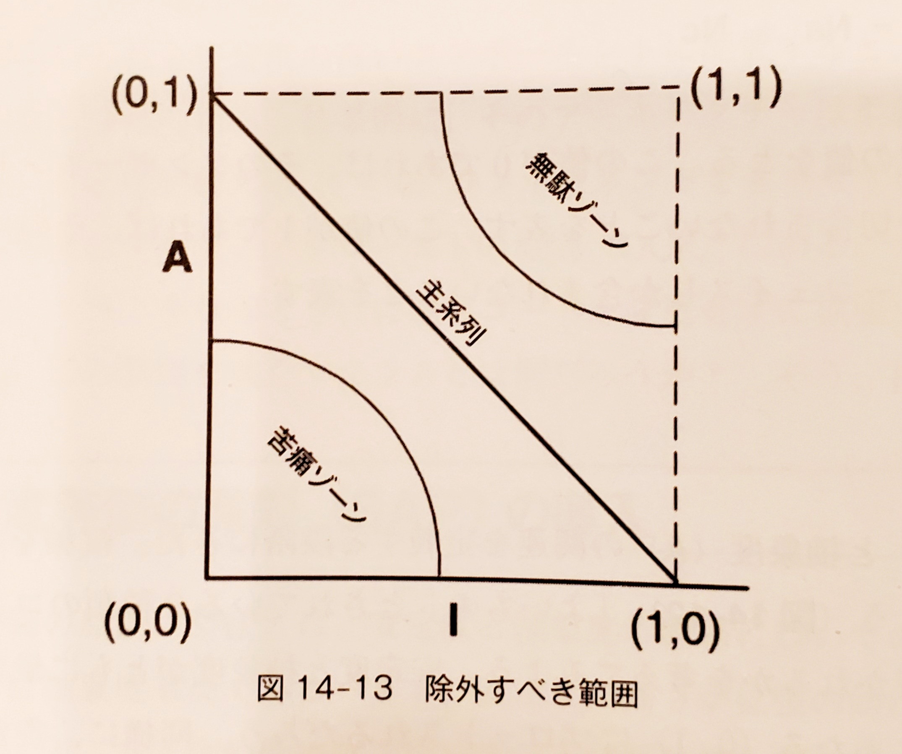
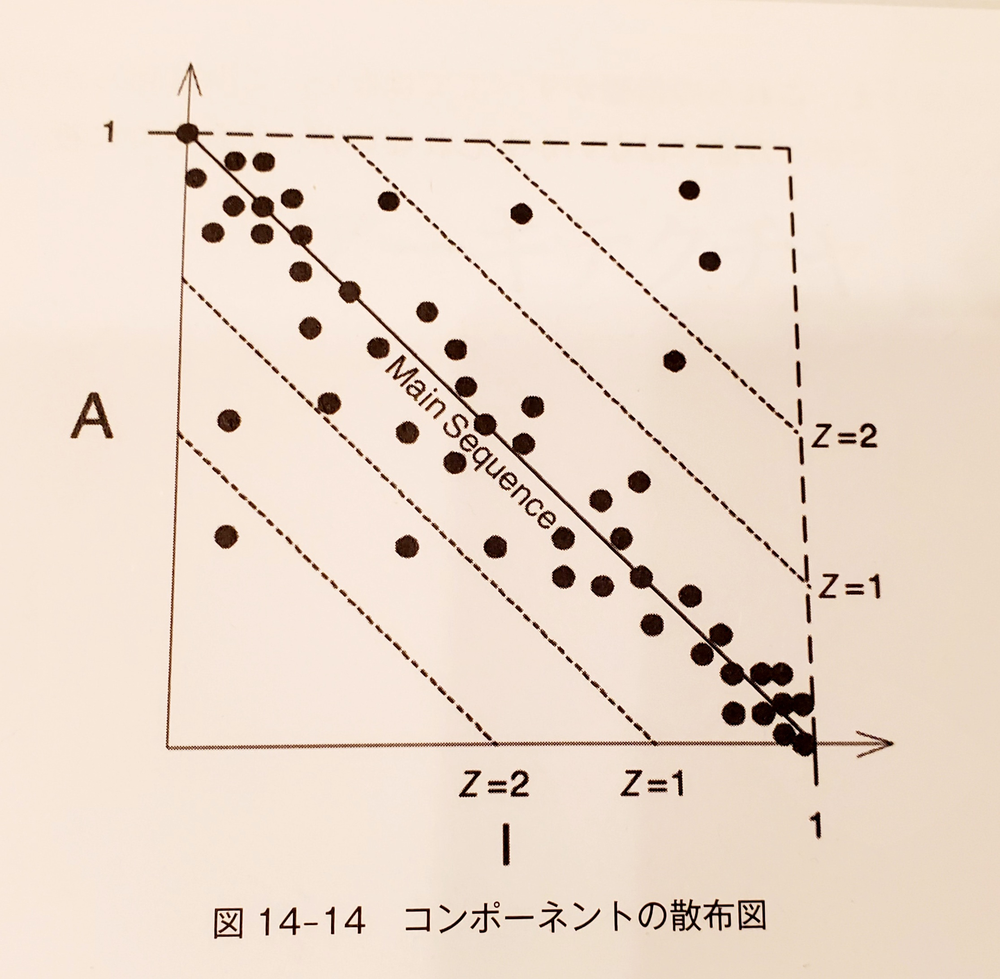
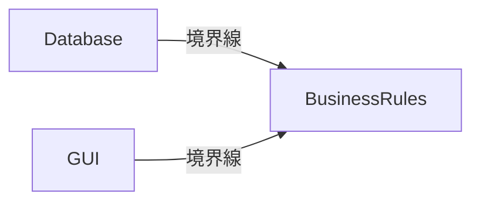
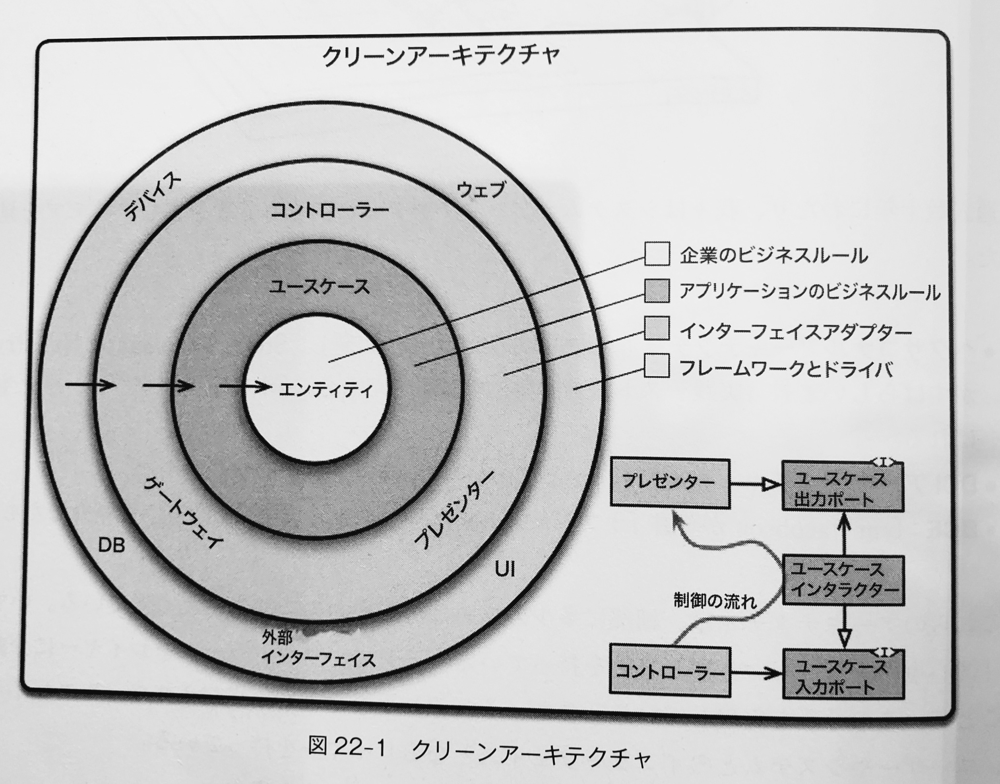
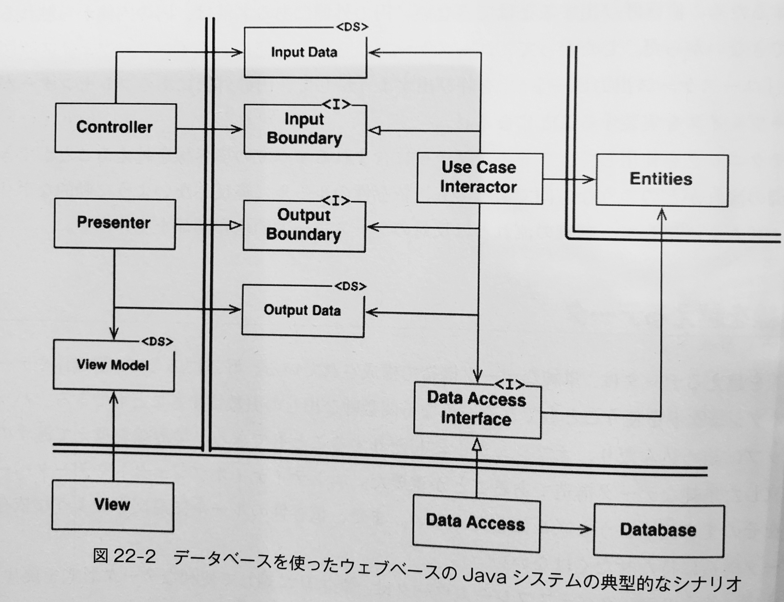
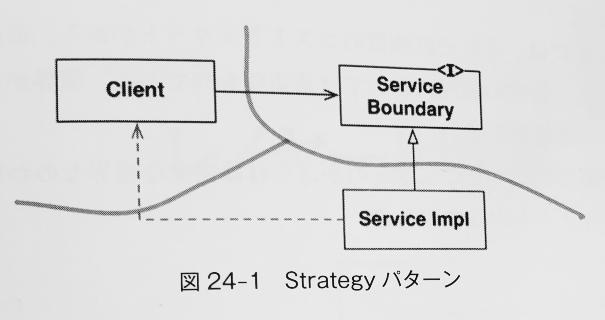
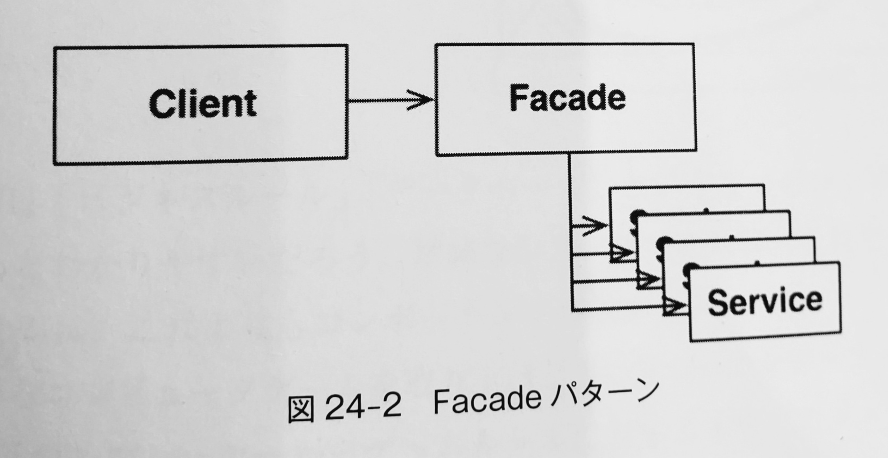

# 概要<!-- omit in toc -->

- 書籍名
  - Clean Architecture 達人に学ぶソフトウェアの構造と設計

# 目次<!-- omit in toc -->

- [Part1: イントロダクション](#part1-イントロダクション)
- [Chap1: 設計とアーキテクチャ](#chap1-設計とアーキテクチャ)
  - [目的は？](#目的は)
  - [ケーススタディ](#ケーススタディ)
  - [崩壊のサイン](#崩壊のサイン)
  - [経営者の視点](#経営者の視点)
  - [何が間違っていたのか？](#何が間違っていたのか)
- [Chap2: 2 つの価値のお話](#chap2-2-つの価値のお話)
  - [振る舞い](#振る舞い)
  - [アーキテクチャ](#アーキテクチャ)
  - [大きな価値](#大きな価値)
  - [アイゼンハワーのマトリックス](#アイゼンハワーのマトリックス)
  - [アーキテクチャの戦い](#アーキテクチャの戦い)
- [Part2: 構成要素から始めよ : プログラミングパラダイム](#part2-構成要素から始めよ--プログラミングパラダイム)
- [Chap3: パラダイムの概要](#chap3-パラダイムの概要)
  - [構造化プログラミング](#構造化プログラミング)
  - [オブジェクト指向プログラミング](#オブジェクト指向プログラミング)
  - [関数型プログラミング](#関数型プログラミング)
  - [考えるべきこと](#考えるべきこと)
  - [まとめ](#まとめ)
- [Chap4: 構造化プログラミング](#chap4-構造化プログラミング)
  - [証明](#証明)
  - [有害宣言](#有害宣言)
  - [機能分割](#機能分割)
  - [正式に証明できない](#正式に証明できない)
  - [救済のための科学](#救済のための科学)
  - [テスト](#テスト)
  - [まとめ](#まとめ-1)
- [Chap5: オブジェクト指向プログラミング](#chap5-オブジェクト指向プログラミング)
  - [カプセル化とは？](#カプセル化とは)
  - [継承とは？](#継承とは)
  - [ポリモーフィズムとは？](#ポリモーフィズムとは)
  - [ポリモーフィズムのパワー](#ポリモーフィズムのパワー)
  - [依存関係逆転](#依存関係逆転)
  - [まとめ](#まとめ-2)
- [Chap6: 関数型プログラミング](#chap6-関数型プログラミング)
  - [整数の二乗](#整数の二乗)
  - [不変性とアーキテクチャ](#不変性とアーキテクチャ)
  - [不変性の分離](#不変性の分離)
  - [イベントソーシング](#イベントソーシング)
  - [まとめ](#まとめ-3)
- [Part3: 設計の原則](#part3-設計の原則)
- [Chap7: SRP : 単一責任の原則](#chap7-srp--単一責任の原則)
  - [症例 1: 想定外の重複](#症例-1-想定外の重複)
  - [症例 2: マージ](#症例-2-マージ)
  - [解決策](#解決策)
  - [まとめ](#まとめ-4)
- [Chap8: OCP : オープン・クローズドの原則](#chap8-ocp--オープンクローズドの原則)
  - [思考実験](#思考実験)
  - [方向の制御](#方向の制御)
  - [情報隠蔽](#情報隠蔽)
  - [まとめ](#まとめ-5)
- [Chap9: LSP : リスコフの置換原則](#chap9-lsp--リスコフの置換原則)
  - [継承の使い方の指針](#継承の使い方の指針)
  - [正方形・長方形問題](#正方形長方形問題)
  - [リスコフの置換原則（LSP）とアーキテクチャ](#リスコフの置換原則lspとアーキテクチャ)
  - [リスコフの置換原則（LSP)違反の例](#リスコフの置換原則lsp違反の例)
- [Chap10: ISP : インターフェイス分離の原則](#chap10-isp--インターフェイス分離の原則)
  - [インターフェイス分離の原則（LSP)と言語との関係](#インターフェイス分離の原則lspと言語との関係)
  - [インターフェイス分離の原則（LSP)とアーキテクチャとの関係](#インターフェイス分離の原則lspとアーキテクチャとの関係)
  - [まとめ](#まとめ-6)
- [Chap11: DIP : 依存関係逆転の原則](#chap11-dip--依存関係逆転の原則)
  - [安定した抽象](#安定した抽象)
  - [Factory](#factory)
  - [まとめ](#まとめ-7)
- [Part4: コンポーネントの原則](#part4-コンポーネントの原則)
- [Chap12: コンポーネント](#chap12-コンポーネント)
  - [コンポーネントの簡単な歴史](#コンポーネントの簡単な歴史)
  - [リロケータビリティ（再配置可能性）](#リロケータビリティ再配置可能性)
  - [リンカ](#リンカ)
  - [まとめ](#まとめ-8)
- [Chap13: コンポーネントの凝集性](#chap13-コンポーネントの凝集性)
  - [再利用・リリース等価の原則（REP)](#再利用リリース等価の原則rep)
  - [閉鎖性共通の原則（CCP)](#閉鎖性共通の原則ccp)
    - [単一責任の原則（SRP）との類似点](#単一責任の原則srpとの類似点)
  - [全再利用の原則（CRP）](#全再利用の原則crp)
    - [インターフェイス分離の原則（ISP）との関係](#インターフェイス分離の原則ispとの関係)
  - [コンポーネントの凝集性のテンション図](#コンポーネントの凝集性のテンション図)
  - [まとめ](#まとめ-9)
- [Chap14: コンポーネントの結合](#chap14-コンポーネントの結合)
  - [非循環依存関係の原則（ADP）](#非循環依存関係の原則adp)
    - [週次ビルド](#週次ビルド)
    - [循環依存の除去](#循環依存の除去)
    - [コンポーネントの依存グラフにおける循環依存の影響](#コンポーネントの依存グラフにおける循環依存の影響)
    - [循環依存の解消](#循環依存の解消)
    - [「変化」するもの](#変化するもの)
  - [トップダウンの設計](#トップダウンの設計)
  - [安定依存の原則（SDP）](#安定依存の原則sdp)
    - [安定度](#安定度)
    - [安定度の指標](#安定度の指標)
    - [すべてのコンポーネントに高い安定度を求める必要はない](#すべてのコンポーネントに高い安定度を求める必要はない)
      - [抽象コンポーネント](#抽象コンポーネント)
  - [安定度・抽象度等価の原則(SAP)](#安定度抽象度等価の原則sap)
    - [上位レベルの方針をどこに適用するか](#上位レベルの方針をどこに適用するか)
    - [安定度・抽象度等価の原則(SAP)の導入](#安定度抽象度等価の原則sapの導入)
    - [抽象度の計測](#抽象度の計測)
    - [主系列](#主系列)
      - [苦痛ゾーン](#苦痛ゾーン)
      - [無駄ゾーン](#無駄ゾーン)
    - [除外すべきゾーンを回避する](#除外すべきゾーンを回避する)
    - [主系列からの距離](#主系列からの距離)
    - [まとめ](#まとめ-10)
- [Part5: アーキテクチャ](#part5-アーキテクチャ)
- [Chap15: アーキテクチャとは？](#chap15-アーキテクチャとは)
  - [開発](#開発)
  - [デプロイ](#デプロイ)
  - [運用](#運用)
  - [保守](#保守)
  - [選択肢を残しておく](#選択肢を残しておく)
  - [デバイス非依存](#デバイス非依存)
  - [ダイレクトメール](#ダイレクトメール)
  - [物理アドレス](#物理アドレス)
  - [まとめ](#まとめ-11)
- [Chap16: 独立性](#chap16-独立性)
  - [ユースケース](#ユースケース)
  - [運用](#運用-1)
  - [開発](#開発-1)
  - [デプロイ](#デプロイ-1)
  - [選択肢を残しておく](#選択肢を残しておく-1)
  - [レイヤーの切り離し](#レイヤーの切り離し)
  - [ユースケースの切り離し](#ユースケースの切り離し)
  - [切り離し方式](#切り離し方式)
  - [独立した開発が可能](#独立した開発が可能)
  - [独立デプロイ可能性](#独立デプロイ可能性)
  - [重複](#重複)
  - [切り離し方式(再び)](#切り離し方式再び)
  - [まとめ](#まとめ-12)
- [Chap17: バウンダリー:　境界線を引く](#chap17-バウンダリー境界線を引く)
  - [結合の悲しき物語](#結合の悲しき物語)
  - [FitNesse](#fitnesse)
  - [あなたの境界線は何か？　　いつ境界線を引くのか？](#あなたの境界線は何かいつ境界線を引くのか)
  - [入力と出力はどうする？](#入力と出力はどうする)
  - [プラグインアーキテクチャ](#プラグインアーキテクチャ)
  - [プラグインの戦い](#プラグインの戦い)
  - [まとめ](#まとめ-13)
- [Chap18: 境界の解剖学](#chap18-境界の解剖学)
  - [境界を越える](#境界を越える)
  - [恐怖のモノリス](#恐怖のモノリス)
  - [デプロイコンポーネント](#デプロイコンポーネント)
  - [スレッド](#スレッド)
  - [ローカルプロせず](#ローカルプロせず)
  - [サービス](#サービス)
  - [まとめ](#まとめ-14)
- [Chap19: 方針とレベル](#chap19-方針とレベル)
  - [レベル](#レベル)
  - [まとめ](#まとめ-15)
- [Chap20: ビジネスルール](#chap20-ビジネスルール)
  - [エンティティ](#エンティティ)
  - [ユースケース](#ユースケース-1)
  - [リクエストとレスポンスのモデル](#リクエストとレスポンスのモデル)
  - [まとめ](#まとめ-16)
- [Chap21: 叫ぶアーキテクチャ](#chap21-叫ぶアーキテクチャ)
  - [アーキテクチャのテーマ](#アーキテクチャのテーマ)
  - [アーキテクチャの目的](#アーキテクチャの目的)
  - [だが、ウェブはどうか？](#だがウェブはどうか)
  - [フレームワークはツールであり、生き方ではない](#フレームワークはツールであり生き方ではない)
  - [テスト可能なアーキテクチャ](#テスト可能なアーキテクチャ)
  - [まとめ](#まとめ-17)
  - [依存性のルール](#依存性のルール)
    - [エンティティ](#エンティティ-1)
    - [ユースケース](#ユースケース-2)
    - [インターフェイスアダプタ](#インターフェイスアダプタ)
    - [フレームワークとドライバ](#フレームワークとドライバ)
    - [境界線を越える](#境界線を越える)
    - [境界を越えるデータ](#境界を越えるデータ)
  - [典型的なシナリオ](#典型的なシナリオ)
  - [まとめ](#まとめ-18)
  - [Humble Object パターン](#humble-object-パターン)
  - [プレゼンターとビュー](#プレゼンターとビュー)
  - [テストとアーキテクチャ](#テストとアーキテクチャ)
  - [データベースゲートウェイ](#データベースゲートウェイ)
  - [データマッパー](#データマッパー)
  - [サービスリスナー](#サービスリスナー)
  - [まとめ](#まとめ-19)
- [Chap24: 部分的な境界](#chap24-部分的な境界)
  - [最後のステップを省略する](#最後のステップを省略する)
  - [片方だけの境界](#片方だけの境界)
  - [Facade](#facade)
  - [まとめ](#まとめ-20)
- [Chap25: レイヤーと境界](#chap25-レイヤーと境界)
  - [Hunt the Wumpus](#hunt-the-wumpus)
  - [クリーンアーキテクチャ?](#クリーンアーキテクチャ)
  - [流れを横切る](#流れを横切る)
  - [まとめ](#まとめ-21)
- [Chap26: メインコンポーネント](#chap26-メインコンポーネント)
  - [究極的な詳細](#究極的な詳細)
  - [まとめ](#まとめ-22)
- [Chap27: あらゆる存在](#chap27-あらゆる存在)
  - [サービスアーキテクチャ?](#サービスアーキテクチャ)
  - [サービスのメリット?](#サービスのメリット)
    - [誤った分離](#誤った分離)
    - [誤った開発とデプロイの独立](#誤った開発とデプロイの独立)
  - [子猫の問題](#子猫の問題)
  - [救世主のオブジェクト](#救世主のオブジェクト)
  - [コンポーネントベースのサービス](#コンポーネントベースのサービス)
  - [横断的関心事](#横断的関心事)
  - [まとめ](#まとめ-23)
- [Chap28: テスト境界](#chap28-テスト境界)
  - [システムコンポーネントとしてのテスト](#システムコンポーネントとしてのテスト)
  - [テスト容易性のための設計](#テスト容易性のための設計)
  - [テスト API](#テスト-api)
    - [構造的結合](#構造的結合)
    - [セキュリティ](#セキュリティ)
  - [まとめ](#まとめ-24)
- [Chap29: クリーン組込みアーキテクチャ](#chap29-クリーン組込みアーキテクチャ)
  - [適正テスト](#適正テスト)
  - [ターゲットハードウェアのボトルネック](#ターゲットハードウェアのボトルネック)
    - [クリーン組込みアーキテクチャはテスト可能な組込みアーキテクチャ](#クリーン組込みアーキテクチャはテスト可能な組込みアーキテクチャ)
      - [レイヤー](#レイヤー)
      - [ハードウェアは詳細](#ハードウェアは詳細)
    - [ハードウェアの詳細は HAL のユーザーに明らかにしない](#ハードウェアの詳細は-hal-のユーザーに明らかにしない)
      - [プロセッサは詳細](#プロセッサは詳細)
      - [OS は詳細](#os-は詳細)
    - [インターフェイスに対するプログラミングと代替可能性](#インターフェイスに対するプログラミングと代替可能性)
    - [DRY な条件付きコンパイル命令](#dry-な条件付きコンパイル命令)
  - [まとめ](#まとめ-25)
- [Part6: 詳細](#part6-詳細)
- [Chap30: データベースは詳細](#chap30-データベースは詳細)
  - [リレーショナルデータベース](#リレーショナルデータベース)
  - [なぜデータベースシステムが普及しているのか?](#なぜデータベースシステムが普及しているのか)
  - [詳細](#詳細)
  - [だけど、パフォーマンスはどうなの?](#だけどパフォーマンスはどうなの)
  - [小話](#小話)
  - [まとめ](#まとめ-26)
- [Chap31: ウェブは詳細](#chap31-ウェブは詳細)
  - [止まらない振り子](#止まらない振り子)
  - [結論](#結論)
  - [まとめ](#まとめ-27)
- [Chap31: フレームワークは詳細](#chap31-フレームワークは詳細)
  - [フレームワークの作者たち](#フレームワークの作者たち)
  - [一方的な結婚](#一方的な結婚)
  - [リスク](#リスク)
  - [解決策](#解決策-1)
  - [今あなたたちを夫婦として宣言する](#今あなたたちを夫婦として宣言する)
  - [まとめ](#まとめ-28)
- [Chap33: 事例:動画販売サイト](#chap33-事例動画販売サイト)
  - [プロダクト](#プロダクト)
  - [ユースケース分析](#ユースケース分析)
  - [コンポーネントアーキテクチャ](#コンポーネントアーキテクチャ)
  - [依存性管理](#依存性管理)
  - [まとめ](#まとめ-29)
- [Chap34: 書き残したこと](#chap34-書き残したこと)
  - [レイヤーによるパッケージング](#レイヤーによるパッケージング)
  - [機能によるパッケージング](#機能によるパッケージング)
  - [ポートとアダプター](#ポートとアダプター)
  - [コンポーネントによるパッケージング](#コンポーネントによるパッケージング)
  - [悪魔は実装の詳細に宿る](#悪魔は実装の詳細に宿る)
  - [組織化かカプセル化か](#組織化かカプセル化か)
  - [そのほかの分割方法](#そのほかの分割方法)
  - [まとめ:言い残したこと](#まとめ言い残したこと)

# Part1: イントロダクション

# Chap1: 設計とアーキテクチャ

- 設計とアーキテクチャの両者には何も違いはない
  - 下位レベルの詳細と上位レベルの構造は全体の設計の一部となる
  - それらが連続した構造を作り、システムの形状を定義する。どちらも欠くことはできない

## 目的は？

- **ソフトウェアアーキテクチャの目的は、求められるシステムを構築・保守するために必要な人材を最小限に抑えることである。**
  - 必要な労力が少ない => 優れた設計
  - 必要な労力が多い => 優れていない設計

## ケーススタディ

- エンジニアリング部門の人材が増えるごとにリリースサイクルが伸び悩む

## 崩壊のサイン

- 開発者視点では一生懸命働いているが、リリースするたびに生産性が低下してしまう状態
- 生産性が低下する理由 => 崩壊の対応を続けることで機能の開発がほとんどできないため

## 経営者の視点

- リリースごとに開発者の給与が上昇
- ただし、生産性は低下してリリースサイクルが伸び悩んでしまう

## 何が間違っていたのか？

- イソップの「ウサギとカメ」という物語
  - 「遅くとも着実であれば競争に勝つ」
  - 「競争は短期決戦ではない。強い物が勝つわけではない」
  - 「急げば急ぐほど速度は落ちる」
- 優れた、クリーンな、うまく設計されたコードが**重要である**
- 「あとでクリーンにすればいい。先に市場に出さなければ」
  - => 次の開発が優先され続けて、コードをクリーンにすることに手が回らなくなる
- 崩壊したコードを書くと短期的には速度が上がる => 間違い
  - **崩壊したコードを書くほうがクリーンなコードを書くよりも常に遅い**
  - TDD のほうが全体的に 10%ほど速い
  - 「TDD を使わなかった最速時間よりも、TDD を使った最遅速度のほうが速い」のが真実
- **速く進む方法唯一の方法は、うまく進むことである。**
- 解決策
  - 自ら生み出した崩壊に対して責任を持たせること
- **自信過剰による再設計は、元のプロジェクトと同じように崩壊する**
  - 優れた設計について真剣に向き合うことが、最善の選択肢となる

# Chap2: 2 つの価値のお話

- すべてのソフトウェアシステムは、ステークホルダーに２つの異なる価値を提供する
  - 「振る舞い」と「構造（アーキテクチャ）」
- 開発者は「振る舞い」と「構造」を維持する責任を持つ
  - 片方だけにフォーカスすることが多く、一方が無視されてしまっている

## 振る舞い

- ソフトウェアに「振る舞い」を与えてステークホルダーの要求を満たす

## アーキテクチャ

- ソフトウェアの 2 つ目の価値は「ソフトウェア」という言葉に関連する
  - ソフトウェア =>「ソフト + ウェア」による複合語
  - ウェア => 「プロダクト」を意味する
- ソフトウェア => マシンの振る舞いを簡単に変更する手段になることを目的としたもの
- ハードウェア => マシンの振る舞いを簡単に変更したくないときに呼ばれるもの
- ソフトウェアは簡単に変更可能でなければならない
  - 変更の難易度は、変更の**形状**ではなく、変更の**スコープ**に比例しなければいけない
    - スコープが狭いにも関わらず変更の難易度が高い => ソフトウェアとしては不適合
- 形状について
  - ソフトウェア開発者は「四角い」ベグを「丸い」穴に打ち込まなければいけないような気持ちになることがある
  - アーキテクチャが特定の「形状」を選択していると、新しい機能がその構造に適さない可能性が高くなる
  - => 形状にとらわれないアーキテクチャにしたほうが現実的

## 大きな価値

- システムが動作することが重要なのか。簡単に変更できることのほうが重要なのか
- ビジネスサイドの意見としては「システムが動作することが重要」を優先しがち
  - **これが間違った態度である理由**
    - 完璧に動作するが、変更できないプログラムの場合
      - 要求が変更されると機能しなくなる、修正することも困難
      - いずれプログラムが役に立たなくなり、作り直すことになる（コスト増）
    - 動作しないが、簡単に変更できるプログラムの場合
      - 要求が変更されても修正可能のため動かし続けられる
      - 引き続きプログラムとして役立つことになる
- 変更コストと作り直すコストを比較して、作り直すコストのほうが低いときは、アーキテクチャに問題を抱えている可能性が高い
- 変更のコストがメリットを上回っており、変更が**事実上できなくなっている**システムは存在する

## アイゼンハワーのマトリックス

- ドワイト・D・アイゼンハワー大統領による「重要度と緊急度のマトリックス」
  - | -                     | -                             |
    | --------------------- | ----------------------------- |
    | 重要<br/>緊急         | 重要<br/>緊急ではない         |
    | 重要ではない<br/>緊急 | 重要ではない<br/>緊急ではない |
  - 「私には緊急と重要の 2 種類の問題がある。緊急と重要は違う。重要なことが緊急になるわけではない。」
  - 優先順位をつけると
    1. 緊急かつ重要
    2. 緊急ではないが重要
    3. 緊急だが重要ではない
    4. 緊急でも重要でもない
  - ソフトウェアに当てはめてみると
    - ソフトウェアの 1 つ目の価値（振る舞い）は緊急だが、常に重要とは限らない
    - ソフトウェアの 2 つ目の価値（アーキテクチャ）は重要だが、常に緊急とは限らない
  - ビジネスマネージャーはアーキテクチャの重要性を評価できない、というジレンマがある
    - ソフトウェア開発者には「**機能の緊急性よりもアーキテクチャの重要性を強く主張する責任がある**」

## アーキテクチャの戦い

- **ソフトウェア開発者もステークホルダー**である
  - ソフトウェアに対する責任がある
- アーキテクチャを後回しにすると、システムの開発コストはますます高くなり、システムの一部または全部が変更不能になる

# Part2: 構成要素から始めよ : プログラミングパラダイム

- さまざまなプログラミングの革命
  - 言語の革命
  - プログラミングパラダイムの革命
- パラダイム => プログラミング手法のこと

# Chap3: パラダイムの概要

- 3 つのパラダイム
  - 構造化プログラミング
  - オブジェクト指向プログラミング
  - 関数型プログラミング

## 構造化プログラミング

- **構造化プログラミングは、直接的な制御の移行に規律を課すものである**
  - goto 文の削除

## オブジェクト指向プログラミング

- **オブジェクト指向プログラミングは、間接的な制御の以降に規律を課すものである**
  - 関数ポインタの削除

## 関数型プログラミング

- **関数型プログラミングは、代入に規律を課すものである**
  - 代入の削除

## 考えるべきこと

- それぞれのパラダイムでは、プログラマから能力を削除している
- **何をすべきか**を伝えると言うよりも、**何をすべきでないか**を伝えているものである

## まとめ

- パラダイムの歴史的な教訓とアーキテクチャは「すべて」において関係している
- アーキテクチャの 3 つの関心ごと
  1. コンポーネントの分離
  2. データ管理
  3. 機能

# Chap4: 構造化プログラミング

## 証明

- goto を「うまく」使えば、 if/then/else などの選択や、do/while といった反復の制御構造に対応可能
- あらゆるプログラムは「順次」「選択」「反復」の 3 つの構造で構築できる

## 有害宣言

- GOTO 文の有害性が広く認められるようになる

## 機能分割

## 正式に証明できない

## 救済のための科学

- 科学の理論や法則は、正しいと証明することができない
  - 科学と数学の根本的に異なる点
  - 実証できても数学的に証明することができない
- 反証可能で成立している
  - 真ではないことを証明することで機能している

## テスト

- テストはバグが存在しないことではなく、バグが存在することを示すものである
  - テストによりプログラムが正しくないことを証明できるが、プログラムが正しいことは証明できない

## まとめ

- 機能分割がベストプラクティス
- 反証できる（テストできる）単位でモジュール、コンポーネント、サービスを定義する
- 反証可能なプログラムの単位を構成するために、goto 文に制限をかけたものが構造化プログラミング

# Chap5: オブジェクト指向プログラミング

- OO 言語 = オブジェクト指向言語
- OO 言語は、**カプセル化・継承・ポリモーフィズム**の性質を持つ、という人もいるがそうではない

## カプセル化とは？

- OO 言語登場以前は完璧なカプセル化を実現できていた
- OO 言語登場以降は逆に弱体化した
- OO 言語は強制的なカプセル化をほとんど、あるいは全く持っていない。
  - OO 言語がカプセル化に依存しているとは言えない
  - クラスのメンバーへのアクセスをコントロールすることはできるが、完璧なカプセル化を実現するわけではない

## 継承とは？

- 継承のトリックは OO 言語が登場する前から存在していた
  - OO 言語独自の機能ではない
- OO 言語登場以前の継承のトリックにはいくつか問題があり、便利ではなかった
  - 多重継承が困難
  - トリックの手続きが複雑
- OO 言語登場以降では、トリックの手続きが暗黙的で容易になったこと、多重継承も可能となった
- ただし、これだけでは OO 言語が優れているとはいえない

## ポリモーフィズムとは？

- ポリモーフィズムは OO 言語登場以前から存在する
- ポリモーフィズムは関数へのポインタの応用である
- OO 言語が新しいことを提供しているわけではないが、安全かつ便利にしてくれている
  - 関数へのポインタを意識せずに利用できるようになった（関数ポインタの削除）

## ポリモーフィズムのパワー

- 関数ポインタへの危険性を排除したことにより、プラグインアーキテクチャをどこでも何にでも使うことができる

## 依存関係逆転

- ポリモーフィズム以前の典型的な呼び出しツリーは、main 関数が上位の関数を呼び出し、それが中間レベルの関数を呼び出し、それが解レベルの関数を呼び出す、というもの
  - 制御の流れに従ったものとなる
- **依存関係逆転**
- OO 言語が安全で便利なポリモーフィズムを提供していると言うことは、**ソースコードの依存関係は（たとえどこにあっても）逆転できる**ことを意味する
- ソースコードの依存関係の方向を**絶対的に制御**できる
  - これが OO の提供するパワーである

## まとめ

- OO とは、「ポリモーフィズムを使用することで、システムにあるすべてのソースコードの依存関係を絶対的に制御する能力」である

# Chap6: 関数型プログラミング

## 整数の二乗

- 関数型言語の変数は変化しない

## 不変性とアーキテクチャ

- アーキテクチャの観点で不変性が重要となる理由
  - 競合状態、デッドロック状態、並行更新の問題の原因が、すべて可変変数にあるから
  - 並行処理（複数のスレッドやプロセスを必要とする）アプリケーションでは顕著

## 不変性の分離

- 不変性の妥協点
  - 「可変コンポーネント」と「不変コンポーネント」に分離すること
- トランザクショナルメモリ
  - 変更可能な変数を並行更新や競合状態から保護する方法
- 不変コンポーネントにできるだけ多くの処理を押し込み、可変コンポーネントからできるだけ多くのコードを追い払うべき

## イベントソーシング

- イベントソーシング
  - 状態ではなく取引（トランザクション）を保存するという戦略
  - 状態が必要なときに集計を行なって算出する
  - 集計処理のショートカットとして、毎日 0 時に状態を算出。これに加えて 0 時からの取引を集計すれば最新の状態を算出可能となる
- イベントソーシングを実現したとき、アプリケーションは CRUD ではなく CR だけで動作可能となる
  - つまり、**完全に関数型になる**

## まとめ

- 構造化プログラミングは、直接的な制御の移行に規律を課すものである
- オブジェクト指向プログラミングは、間接的な制御の移行に規律を課すものである
- 関数型プログラミングは、代入に規律を課すものである

# Part3: 設計の原則

- SOLID 原則とは
  - 以下のような性質を持つ中間レベルのソフトウェア構造を作ること
    - 変更に強いこと
    - 理解しやすいこと
    - コンポーネントの基盤として、多くのウェアシステムで利用できること
- モジュールレベルの開発によく使われるもの
- SOLID 原則
  - 単一責任の原則 (SRP: Single Responsibility Principle)
    - 個々のモジュールを変更する理由はたった一つだけになるようにすること
  - オープン・クローズドの原則 (OCP: Open-Closed Principle)
    - 既存コードの変更より、新しいコードの追加によって、システムの振る舞いを変更できるように設計すること
  - リスコフの置換原則 (LSP: Liskov Substitution Principle)
    - 個々のパーツが交換可能となるような規約に従うこと
  - インターフェイス分離の原則 (ISP: Interface Segregation Principle)
    - 使っていないものへの依存を回避すべきという原則
  - 依存関係逆転の原則 (DIP: Dependency Inversion Principle)
    - 上位レベルのクラスが下位レベルのクラスの実装コードに依存するのではなく、下位レベルのクラスを上位レベルのクラスの実装に依存させること

# Chap7: SRP : 単一責任の原則

- SOLID 原則のなかで最も誤解されがち
  - 「どのモジュールもたった一つのことだけを行うべき」
  - ex)
    - 巨大な関数をリファクタリングして、小さな関数に切り分けてそれぞれ一つのことだけを行うようにした
  - 最下位のレベルに対して実施するのはいいが、SOLID 原則の単一責任の原則 (SRP)とは別のものである
- **モジュールを変更する理由はたった一つだけであるべきである。**
  - 「変更する理由」 -> 「ユーザーやステークホルダー」を満足させるための変更
- **モジュールはたったひとりのユーザーやステークホルダーに対して責務を負うべきである。**
  - 実際のところ、ステークホルダーが複数になる場合が多いため、「たったひとりの」ではなく、グループとして扱うことが多い。
  - ステークホルダーのグループ == アクター と呼ぶ
- **モジュールはたったひとつのアクターに対して責務を負うべきである。**
- 「モジュール」は、いくつかの関数やデータをまとめた凝集性のあるものとして考える
- 「凝集性」が、ひとつのアクターに対する責務を負うコードをまとめるフォースとなる

## 症例 1: 想定外の重複

- 複数のアクターが利用するクラス
- ある一つのアクターでの処理を修正したとき
  - => 別のアクターの処理に影響を及ぼす可能性がある
- 複数のアクターにまたがるロジックが存在しており、共通メソッドとして切り出したとき
  - => 想定外のアクターから共有メソッドが呼び出すようになったり、想定外なアクターが共通メソッドを利用していることに気づかず、ロジックを修正して別のアクターの処理に影響を及ぼす可能性がある
- 別々のアクターのコードを一つにまとめてしまったのが問題の原因
- 単一責任の原則 (SRP)は、**アクターの異なるコードは分割するべき**という原則だ

## 症例 2: マージ

- 複数のアクターが利用するクラスで、それぞれのアクターに対するクラスの修正が入ったとき
- コンフリクトが発生する可能性や、コンフリクトが発生せずともロジック修正により別のアクターの処理に影響を及ぼす可能性がある
  - こうした問題を回避するために、**アクターの異なるコードは分割するべき**

## 解決策

- データを保持するクラスは複数のアクターに参照させて、関数だけクラスとして切り出す
  - 弱点
    - それぞれの関数のクラスをインスタンス化して、追跡する必要がある
  - 解決策
    - Facade パターン
    - 実行したい関数を持つクラスのインスタンスを生成して、処理を委譲するためのクラスを作成する

## まとめ

- 単一責任の原則 (SRP)は、関数やクラスに関する原則
- 同じような原則は別のレベルにも存在する
  - コンポーネントレベル: 閉鎖性共通の原則 (CCP)
  - アーキテクチャレベル: アーキテクチャの境界を作るための「変更の軸」

# Chap8: OCP : オープン・クローズドの原則

- ソフトウェアの振る舞いは、既存の成果物を変更せず拡張できるようにすべきである

## 思考実験

- 財務情報を Web ページに表示するシステムを例として考える
- 単一責任の原則 (SRP)を適用する際は、データフロー図を用いて整理する
  - 責任が複数存在する場合は、責務ごとにクラスを分割
- 変更を取り消すことなく振る舞いを拡張できるようにする方法
  - 処理をクラスに分割して、それぞれのクラスをコンポーネントにまとめる
    - Controller
    - Interactor
    - Database
    - Presenter
    - View
  - コンポーネント間の依存関係は、**すべて一方通行**となる
  - コンポーネント A がコンポーネント B からの変更から保護されるべきならば、コンポーネント B はコンポーネント A に依存するべきである
  - Interactor コンポーネントは依存される側の存在
    - Interactor コンポーネントはビジネスルールを含んでおり、アプリケーションの中でも最上位のレベルとなるため
  - Controller コンポーネントは Presenter コンポーネントに依存される存在
- 「レベル」の概念にもとづいた保護の階層がつくられる
- これが、アーキテクチャレベルにおけるオープン・クローズドの現族 (OCP)である

## 方向の制御

- それぞれのコンポーネント間にはインターフェイスが存在して、上位レベルのコンポーネントはインターフェイスが存在することで下位レベルのコンポーネントの知識が不要となる。
  - 依存関係を逆転させるため（正しい依存関係の方向を聖所するため）にインターフェイスを用意している

## 情報隠蔽

- 推移的な依存関係を排除するためのインターフェイス
- 「ソフトウェアのエンティティは自分が使っていないものに依存すべきではない」

## まとめ

- システムをコンポーネントに分割して、コンポーネントの依存関係を階層構造にする
- 上位レベルのコンポーネントが下位レベルのコンポーネントの変更の影響を受けないようにする

# Chap9: LSP : リスコフの置換原則

## 継承の使い方の指針

- 派生型に依存せず、派生元の型に置き換えられること

## 正方形・長方形問題

- LSP 違反の代表例
- 派生元と派生先とで、初期化方法やフィールド、メソッドが異なること、上位クラスがそれらを考慮しなくてはならなくなる
  - ex) 上位クラスに if 文を追加して派生元と派生先の型に依存させる
  - これでは、派生元と派生先の置換が不可能となる

## リスコフの置換原則（LSP）とアーキテクチャ

- インターフェイスと実装に関するソフトウェア設計の原則
- プログラムの実装方法に限らず、REST インターフェイスでも同様の考え方を用いることが可能

## リスコフの置換原則（LSP)違反の例

# Chap10: ISP : インターフェイス分離の原則

- 複数のクラスが同一のクラスを参照しており、参照先のクラスの一部の機能だけ利用している状態
- 一部の機能だけ参照しているだけだが、使用していない他の機能にも依存していることになる
- 別のクラスのためだけに参照先のクラスを修正したにも関わらず、Java のような言語だと参照元のクラスを全て再コンパイルしなければならなくなってしまう

## インターフェイス分離の原則（LSP)と言語との関係

- Java のようなコンパイルが必要な言語で発生
- Ruby では発生しない

## インターフェイス分離の原則（LSP)とアーキテクチャとの関係

- 必要としないモジュールに依存することは一般的に有害とされる
- アーキテクチャレベルでも同様であること

## まとめ

- 必要としないお荷物を抱えたものに依存すると、予期せぬトラブルにつながるということ

# Chap11: DIP : 依存関係逆転の原則

- ソースコードの依存関係が（具象ではなく）抽象だけを参照しているもの。それが、最も柔軟なシステムである。
  - Java => Interface のような抽象クラスにだけ依存させる
  - Ruby => 具象モジュールを参照しない
- 具象モジュール: 関数の実装が書かれているモジュールのこと
- 具象モジュールに依存する場合であっても、String クラスのような安定したクラスであれば問題ない
- 変化しやすい具象要素には依存するべきでない

## 安定した抽象

- 抽象インターフェイスは具象クラスよりも安定している
- インターフェイスの変動性をできるだけ抑えること
- 機能改修でもできるだけインターフェイスの変更なしで済ませられるようにする
- 変化しやすい具象への依存を避け、安定した抽象インターフェイスに依存するべき
- コーディングレベルのベストプラクティス
  - 変化しやすい具象クラスを参照しない
    - 代わりに抽象インターフェイスを参照
    - **Abstract Factory パターン**で対応するのが一般的
  - 変化しやすい具象クラスを継承しない
    - 継承が依存関係の一種であること
    - 動的型付け言語では大きな問題はないが、静的型付け言語だと強力な依存関係が生まれてしまう
  - 具象関数をオーバーライドしない
    - 具象関数は依存を要求することが多いため
    - 元の関数を抽象関数にして依存を管理する必要がある
  - 変化しやすい具象を名指しで参照しない

## Factory

- ベストプラクティスに従う場合は、Abstract Factory パターンで依存関係を管理する
- ソースコードの依存性は、具象側から抽象側へと向かわせる
- システムを二つのコンポーネントに分割
  - 抽象コンポーネント
    - すべての上位レベルのビジネスルールを含む
  - 具象コンポーネント
    - ビジネスルールが操作する実装の詳細を含む
- ソースコードの依存性と処理の流れは逆向きになる（依存関係逆転の原則 DIP）

###　具象コンポーネント

- DIP を完全に取り入れることは難しい
- DIP を満たさない具象コンポーネントを少数に絞り込んで分離することはできる

## まとめ

# Part4: コンポーネントの原則

- SOLID 原則: レンガを組み合わせて部屋を作る方法を伝える原則
- コンポーネントの原則: 部屋を組み合わせて建物を作る方法を伝える原則

# Chap12: コンポーネント

- コンポーネント: デプロイの単位のこと
  - Java => .jar
  - Ruby => gem
  - .Net => DLL
- よくできたコンポーネントは常に個別にデプロイできる状態を保っている

## コンポーネントの簡単な歴史

## リロケータビリティ（再配置可能性）

## リンカ

## まとめ

# Chap13: コンポーネントの凝集性

- 再利用・リリース等価の原則（REP）
- 閉鎖性共通の原則（CCP）
- 全再利用の原則（CRP）

## 再利用・リリース等価の原則（REP)

```
再利用の単位とリリースの単位は等価になる
```

- コンポーネントを形成するクラスやモジュールは凝集性のあるグループでなければいけない
- コンポーネントにはリリース番号が付与されており、再利用するコンポーネントの互換性が確認できること
- ひとつのコンポーネントを形成するクラスやモジュールは、**まとめてリリース可能**でなければいけない

## 閉鎖性共通の原則（CCP)

```
同じ理由、同じタイミングで変更されるクラスをコンポーネントにまとめること。変更の理由やタイミングが異なるクラスは、別のコンポーネントに分けること。
```

- 単一責任の原則（SRP）をコンポーネント向けに言い換えたもの
  - SRP: **クラス**を変更する理由が複数あるべきではない
  - CCP: **コンポーネント**を変更する理由が複数あるべきではない
- 一般的なアプリケーションでは、再利用性よりも保守性の方が重要
- 同じタイミングで変更されることの多いクラスはひとつにまとめておく
- CCP での「閉鎖性」は、オープン・クローズドの原則（OCP）の「クローズド」と同じ意味
- 「変更の種類が似ているクラスをひとつのコンポーネントにまとめる」

### 単一責任の原則（SRP）との類似点

- CCP は単一責任の原則（SRP）をコンポーネントに適用したもの
  - SRP: 変更の理由が異なるメソッドは別のクラスに分けるという原則
  - CCP: 変更の理由が異なるクラスは別のコンポーネントに分けるという原則

## 全再利用の原則（CRP）

```
コンポーネントのユーザーに対して、実際に使わないものへの依存を強要してはいけない。
```

- 一緒に用いられることが多いクラスやモジュールは同じコンポーネントにまとめてもよいというもの
- 使う側のコンポーネントと使われる側のコンポーネントに依存関係があって密結合しているとき、同じコンポーネントにまとめて再利用するべき
- CCP は「どのクラスをひとまとめにするべきでないか」を伝える原則
  - 密結合していないコンポーネントをひとつにまとめるべきでない

### インターフェイス分離の原則（ISP）との関係

- CCP はインターフェイス分離の原則（ISP）を一般化したもの
  - ISP: 使っていないメソッドを持つクラスに依存しないようにすること
  - CCP: 使っていないクラスを持つコンポーネントに依存しないようにすること

```
不要なものには依存しないこと。
```

## コンポーネントの凝集性のテンション図

- 再利用・リリース等価の原則（REP）、閉鎖性共通の原則（CCP）、全再利用の原則（CRP）はそれぞれに相反するところがある
  - REP, CCP
    - それぞれが包含関係
    - ひとつのコンポーネントを大きくする方向に働く
  - CRP
    - REP, CCP と相反関係
    - ひとつのコンポーネントを小さくする方法に働く
- 各原則の性質
  - REP: 再利用性のためのグループ化
  - CCP: 保守性のためのグループ化
  - CRP: 不要なリリース作業を減らすための分割

## まとめ

- コンポーネントの凝集性は、開発時の利便性と再利用性のトレードオフ

# Chap14: コンポーネントの結合

- コンポーネントの関連を扱う原則

## 非循環依存関係の原則（ADP）

```
コンポーネントの依存グラフに循環依存があってはいけない。
```

### 週次ビルド

- 週次ビルドとは
  - 週の最初の 4 日間: 他のメンバーの変更を一切無視。結合は気にしない
  - 金曜日: 全員の変更を統合してシステムをビルド
- メリット
  - 週の 4 日間は開発に集中できる
- デメリット
  - 結合作業がつらい

### 循環依存の除去

- 週次ビルドの問題点の解決策
  - 開発環境をリリース可能なコンポーネントに分割して、コンポーネントごとに開発担当者を割り当て
  - コンポーネント単位でリリースして、別のコンポーネントを開発するメンバーから利用できるようにする
  - コンポーネントにはリリース番号を割り当てる
- 解決策の注意点
  - コンポーネントの依存構造を管理する必要があること
  - 循環依存が存在しないこと

### コンポーネントの依存グラフにおける循環依存の影響

### 循環依存の解消

- DIP を適用する
- 循環依存にあるコンポーネントにて、両方が依存する新しいコンポーネントを作成する

### 「変化」するもの

## トップダウンの設計

- コンポーネントの構造をトップダウンで設計することは不可能であること
- コンポーネントの構造は常に変化していく

## 安定依存の原則（SDP）

```
安定度の高い方向に依存すること。
```

- 閉鎖性共通の原則（CCP）を満たすことで、特定の変更以外には影響を受け付けないコンポーネントを作ることができる
- 変動を見越した設計となる
- 安定依存の原則（SDP）を見たことで、変更しづらいモジュールから依存されていないことを保証できる

### 安定度

- 安定度とは
  - 変化の頻度とは無関係
  - stable: 簡単には動かせないこと
  - 変更する際に要する労力と関連
- 安定したコンポーネント

  - 多数のコンポーネントから依存されたコンポーネントは安定している（変更しづらいため）

    ```mermaid
    flowchart TB

    A-->X
    B-->X
    C-->X
    ```

- 不安定なコンポーネント

  - 多数のコンポーネントに依存したコンポーネントは不安定（変更しやすいため）

    ```mermaid
    flowchart TB

    X-->A
    X-->B
    X-->C
    ```

### 安定度の指標

- コンポーネントが依存しているコンポーネントの数を調べる
  - ファン・イン
    - 依存入力数。依存されている外部コンポーネントのクラス数
  - ファン・アウト
    - 依存出力数。依存している外部コンポーネントのクラス数
  - I（Instability: 不安定さ）
    - I = ファン・アウト / (ファン・イン + ファンアウト)
- I が高い場合
  - 依存されている外部コンポーネントが少ないので、気軽に変更しやすい
  - 依存している外部コンポーネントが多いので、依存先の変更の影響を受けやすい
- I が低い場合
  - 依存されている外部コンポーネントが多いいので、気軽に変更できない
  - 依存している外部コンポーネントが少ないので、依存先の変更の影響を受けづらい

### すべてのコンポーネントに高い安定度を求める必要はない

- すべてのコンポーネントが安定していると、手を加えることができない状態となる
- 安定度の低いコンポーネント、安定度の高いコンポーネントを程よく扱いたい
- 安定依存の原則(SDP)を満たす場合

  ```mermaid
  flowchart TB

  instable_1("instable (I = 1)")-->stable("stable (I = 0)")
  instable_2("instable (I = 1)")-->stable("stable (I = 0)")
  ```

- 安定依存の原則(SDP)に違反する場合

  ```mermaid
  flowchart TB

  instable_1("instable (I = 2)")-->stable("stable (I = 1)")
  instable_2("instable (I = 2)")-->stable("stable (I = 1)")
  stable("stable (I = 1)")-->Flexible("Flexible (I = 2)")
  ```

- 安定依存の原則(SDP)に違反する場合は、依存関係逆転の原則(DIP)で依存関係を逆転させる

#### 抽象コンポーネント

- ruby の場合

  - ```ruby
      class Button
        def initialize(device)
          @device = device
        end

        def call
          if @device.on?
            @device.turn_off
          else
            @devce.turn_on
          end
        end
      end

      class Computer
        def initialize
          # ...
        end

        def turn_on
          # ...
        end

        def turn_off
          # ...
        end
      end

      class Monitor
        def initialize
          # ...
        end

        def turn_on
          # ...
        end

        def turn_off
          # ...
        end
      end
    ```

- 上位クラスが下位クラスを呼び出すインターフェイスを統一することで、上位クラスが下位クラスのインターフェイスに依存しなくなる

## 安定度・抽象度等価の原則(SAP)

- コンポーネントの安定度と抽象度は同程度であるべき

### 上位レベルの方針をどこに適用するか

- 上位レベルの方針は頻繁に変更されるべきでない
  - 多くのクラスが依存するため、安定度の高いコンポーネントとして振る舞うべき
- 抽象クラスにより解決する
  - Java などでいう抽象クラス(Interface)が該当
  - Ruby では、ダックタイピングのような抽象度の高い実装方法が該当

### 安定度・抽象度等価の原則(SAP)の導入

- 安定度・抽象度等価の原則(SAP)とは
  - 安定度と抽象度の関係についての原則
- 安定度と抽象度の関係
  - 安定度の高いコンポーネント: 抽象度は高くあるべき
  - 安定度の低いコンポーネント: 抽象度は低く具体的であるべき
- 安定度とコードの変更容易性
  - 安定度が高い: コードを変更しづらい
  - 安定度が低い: コードを変更しやすい
- 安定度・抽象度等価の原則(SAP) + 安定依存の原則(SDP) = コンポーネント版の依存関係逆転の原則(DIP)
-

### 抽象度の計測

- Nc: コンポーネント内のクラスの総数
- Na: コンポーネント内の抽象クラスとインターフェイスの総数
- A: 抽象度
  - A = Na ÷ Nc
- 抽象度の指標
  - A = 0 のとき
    - 抽象クラスやインフェーフェイスが含まない
  - A = 1 のとき
    - 抽象クラスとインターフェイスのみ含む
  - A = 0 < x < 1
    - 抽象クラスやインターフェイス、具象クラスを含む

### 主系列

- I/A グラフで、(0, 1)と(1, 0)を繋いだ直線上の領域のこと
- I/A グラフ
  
- (0, 1)のとき
  - 安定度と抽象度が最大
- (1, 0)のとき
  - 安定度と抽象度が最低

#### 苦痛ゾーン

- (0, 0)のときに該当
- 苦痛ゾーンの特徴
  - 安定度が最大で、抽象度が最低（安定度が最大の具象コンポーネント）
  - 安定度が高く具象的であるため、機能拡張が困難
- 事例
  - DB スキーマや DB スキーマに依存しているクラス(ActiveRecord など)
  - String クラスなどの具象クラスも該当するが、破壊的変更が行われる可能性が低いため問題が顕在化することはない

#### 無駄ゾーン

- (1, 1)のときに該当
- 無駄ゾーンの特徴
  - 安定度が最低で、抽象度が最大（安定度が最低の抽象コンポーネント）
  - どこからも依存されない抽象コンポーネントで、存在が無意味なもの

### 除外すべきゾーンを回避する

- 苦痛ゾーンと無駄ゾーンはできるだけ避けて、主系列の範囲内に近づけるべき
- 安定度と抽象度のバランスが良い状態を示す
- 主系列の両端が理想で、できない場合でも主系列上の乗せるか近づける努力が求められる

### 主系列からの距離

- I/A グラフの主系列までの距離に着目
  
- 主系列からの距離の指標
  - D: 主系列からの距離
    - D = |A+I-1|
  - D = 0 のとき
    - 主系列上にある状態
  - D = 1 のとき
    - 主系列から最も離れた状態

### まとめ

- 依存性管理の指標がすべてではないが、導入予定のデザインパターンの指標を計測すれば、依存関係による変更容易性や拡張性について気づきがあるかもしれない。

# Part5: アーキテクチャ

# Chap15: アーキテクチャとは？

- ソフトウェアアーキテクチャ
  - システムに与えられた「形状」のこと
- アーキテクチャの「形状」の目的
  - 開発・デプロイ・運用・保守を容易にすること
  - 「できるだけ長い期間、できるだけ多くの選択肢を残すこと」
- アーキテクチャの主目的
  - システムのライフサイクルをサポートすることで、プログラマの生産性を最大にすること
- アーキテクチャの良し悪しの差分
  - ひどいアーキテクチャの場合
    - 「デプロイ・保守・開発」でトラブル発生
  - 優れたアーキテクチャの場合
    - 「システムの理解・開発・保守・デプロイ」が容易でトラブルが発生しない
- ソフトウェアアーキテクト
  - 最高のプログラマ、かつ、生産性を最大化する設計にチームを導く存在
  - コードを自分で書き、課題を経験していなければならない

## 開発

- 開発チームが 5 人程度の小規模チーム
  - アーキテクチャが存在しなくてもメンバー間で協力しながら開発可能
- 開発者が 7 人ずつの 5 チーム
  - 安定したインターフェイスで明確にコンポーネントを分割しなければ、作業をうまく進められない

## デプロイ

- デプロイのコストはできるだけ低くあるべき
- 単一のアクションでリリース可能な単位が望ましい
- 開発初期からデプロイコストを考慮したアーキテクチャを検討しなければならない

## 運用

- 開発・デプロイ・保守に比べると影響が少ない、と考えられがち
  - -> 間違い
- アーキテクチャが優れていれば、アーキテクチャが運用方法を明らかにする
  - ユースケース、機能、振る舞いが明確であれば、システムを理解するのが容易となるため

## 保守

- 保守が最もコストがかかる
- 保守の主なコスト
  - 洞窟探検
    - 既存ソフトウェアの理解と、最適な修正方法や場所を見つけるコストのこと
  - リスク
    - 既存ソフトウェアを修正する度に、意図しない不具合が発生する可能性のこと
- システムを分離して安定したインターフェイスを持たせることで、意図せず既存ソフトウェアを破壊するリスクを大幅に軽減できる

## 選択肢を残しておく

- ソフトウェアの価値には二つある
  - 「振る舞いの価値」
  - 「構造の価値」
    - こちらの方が大切
- ソフトウェアの柔軟性を保つためには、できるだけ長い期間、多くの選択肢を残すこと
- ソフトウェアは「方針・詳細」に分割できる
  - 方針
    - ビジネスルールや手順などを含む（方針の方が重要）
    - 安定度・抽象度等価の原則(SAP)における抽象クラスやインターフェイスを用いて、詳細を決定しなくても良い構造にする
  - 詳細
    - 方針についてのやりとりをするためのもの
    - 詳細は方針の振る舞いに影響を与えない

## デバイス非依存

## ダイレクトメール

## 物理アドレス

## まとめ

- 方針と詳細を慎重に区別して、方針が詳細に依存しないように分離する
- 抽象クラスやインターフェイスなどを用いて、できるだけ詳細の決定を延期・保留できるような方針をデザインする

# Chap16: 独立性

- アーキテクチャがサポートしなければならないこと
  - システムのユースケース
  - システムの運用
  - システムの開発
  - システムのデプロイ

## ユースケース

- アーキテクチャはユースケースをサポートしなければならない
- アーキテクチャレベルで振る舞いを明らかにする
- 振る舞いはシステムのトップレベルにある

## 運用

- アーキテクチャはユースケースでの運用を可能にする構造でなければならない

## 開発

- 単独で開発可能なコンポーネントにシステムを適切に分割しなければならない

## デプロイ

- アーキテクチャは、デプロイの手軽さの決定にも大きな役割を果たす

## 選択肢を残しておく

## レイヤーの切り離し

- 異なる理由で変更されるものは分離して、同じ理由で変更されるものをまとめる
  - SRP, CCP を利用して解消可能

## ユースケースの切り離し

- ユースケースが異なる場合は分離すること

## 切り離し方式

## 独立した開発が可能

- レイヤー、ユースケースが切り離されていれば、それぞれの開発者が独立して開発可能となる

## 独立デプロイ可能性

## 重複

- 似ていても、ユースケースやレイヤーが異なる場合は分離すること

## 切り離し方式(再び)

## まとめ

# Chap17: バウンダリー:　境界線を引く

- ソフトウェアアーキテクチャとは
  - 境界線を引く技芸のこと（バウンダリーともいう）
- 早すぎる決定とは
  - システムのビジネス要件（ユースケース）と関係のない決定のこと
- 優れたシステムアーキテクチャは、決定を最終時点まで引き伸ばせる

## 結合の悲しき物語

## FitNesse

- ビジネスルールとデータベースに境界線を引いた例
- 境界線を引くことで、決定を延期・留保できる

## あなたの境界線は何か？　　いつ境界線を引くのか？

- 「重要なもの」と「重要でないもの」の間に境界線を引く
  - 例
    - 「GUI」と「ビジネスルール」
    - 「GUI」と「データベース」
    - 「データベース」と「ビジネスルール」
- データベースはビジネスルールが間接的に利用できるツールでしかないため

  - データベースが RDB だろうが NoSQL だろうがビジネスルールには影響を与えない

    ```mermaid
    flowchart LR

    BusinessRules --> DatabaseInterface
    DatabaseAccess --境界線--> DatabaseInterface
    ```

- Database を BusinessRules に依存させることで、あらゆる手段を取れるようになり、決定を遅らせることできる

  ```mermaid
  flowchart LR

  Database --境界線--> BusinessRules
  ```

## 入力と出力はどうする？

- 大原則として「IO は無関係」であること
- GUI（画面上のインターフェイス）は、ビジネスルールにとって重要ではない

  ```mermaid
  flowchart LR

  GUI --境界線--> BusinessRules
  ```

- GUI が BusinessRules に依存しているのであって、BusinessRules にとって GUI は関心ごとではない

## プラグインアーキテクチャ

- BusinessRules との間に境界線を引くことで、Database と GUI はプラグインとして考えられるようになる
  - プラグインとしてさまざまな形式を採用できるようになる
  - BusinessRules を分離して独立することができる



## プラグインの戦い

- 境界線は「変更の軸」があるところに引く
- 単一責任の原則(SRP)の考え方で境界線を引く判断ができる

## まとめ

- システムをコンポーネントに分割すると、いくつかのコンポーネントがビジネスルールとなる
- ビジネスルール以外のコンポーネントはプラグインにする
- プラグインはビジネスルールに依存するように実装する

  ```mermaid
  flowchart LR

  プラグイン --境界線--> ビジネスルール
  ```

- 依存関係逆転の原則(SRP)と安定度・抽象度等価の原則(SAP)を適用したものとなる
- 依存の矢印が詳細レベルから抽象レベルを指すようになっている

  ```mermaid
  flowchart LR

  詳細 --> 抽象
  ```

# Chap18: 境界の解剖学

- システムのアーキテクチャとは、ソフトウェアコンポーネントとそれらを分離する境界により定義されるもの

## 境界を越える

## 恐怖のモノリス

## デプロイコンポーネント

## スレッド

## ローカルプロせず

## サービス

## まとめ

# Chap19: 方針とレベル

- 下位レベルのコンポーネントが上位レベルのコンポーネントに依存するように設計する

## レベル

- 「レベル」の定義は、「入力と出力からの距離」である

  ```mermaid
  graph LR

  A["実線 = データフロー"]
  B["波線 = 依存性の方向"]

  テーブル --> 変換
  文字の読み取り --> 変換
  文字の読み取り -.-> 変換
  文字の書き出し -.-> 変換
  変換 --> 文字の書き出し
  ```

- 入力と出力から最も離れた「変換」が最上位のコンポーネントということ
- データフローと依存性の方向は一致するわけではない
- 上位レベルと下位レベルでは変更の頻度や理由がことなる
- 上位レベルから下位レベルを呼び出す場合は、抽象化した下位レベルのインターフェイスを参照させることで依存の方向を逆転させる
  - 下位レベルの変更が上位レベルに影響を与えることがなくなる

## まとめ

- 方針には下記の原則が混在しているため、定期的に本書を読み返して確認すること
  - 単一責任の原則(SRP)
  - オープン・クローズドの原則(OCP)
  - 閉鎖性共通の原則(CCP)
  - 依存関係逆転の原則(DIP)
  - 安定依存の原則(SDP)
  - 安定度・抽象度等価の原則(SAP)

# Chap20: ビジネスルール

- ビジネスルール
  - ビジネスマネーを生み出したり節約したりするルールや手続きのこと
- 最重要ビジネスルール
  - システムにより自動化されていようがいまいが存在するルールのこと
- 最重要ビジネスデータ
  - 最重要ビジネスルールに必要なデータのこと
  - システムにより自動化されていようがいまいが存在するデータのこと

## エンティティ

- エンティティ
  - 最重要ビジネスデータを操作する最重要ビジネスルールを含んだオブジェクトのこと
- ビジネスを表すものとして、エンティティのクラスを独立させてシステムから切り離す
- クラスである必要もなく、モジュールとしてまとめるだけでも良い

## ユースケース

- ユースケース
  - 自動化されたシステムを使用する方法を記述したもの
- アプリケーション固有のビジネスルールを記述
- エンティティの最重要ビジネスルールを「いつ・どのように」呼び出すかを規定したルールを含む
- UI については記述しない
  - データがどのように入出力されるかはユースケースと無関係であるため
- ユースケースはオブジェクト
  - アプリケーション固有のビジネスルールと、データ要素（入出力、エンティティへの参照）を持つ
- エンティティはユースケースのことを知らない

  - ユースケースがエンティティに依存する関係

  ```mermaid
  graph BT
  ユースケース -.-> エンティティ
  ```

- エンティティが上位レベルである理由
  - 入出力から離れている
- ユースケースが下位レベルである理由
  - 入出力に近い

## リクエストとレスポンスのモデル

- ユースケースクラスは、入力としてシンプルなデータ構造を受け取り、出力としてシンプルなデータ構造を戻す
  - データ構造が何かに依存することはない
- リクエストとレスポンスが独立していないと、間接的な依存関係が生まれてしまう
  - エンティティとユースケースは目的が違うので、エンティティに寄せたデータ構造である必要もない
- 閉鎖性共通の原則(CCP)と単一責任の原則(SRP)を厳守すること

## まとめ

- ビジネスルールはシステムの中心的な機能である
- UI やデータベースとは分離して、システムの中で最も独立して再利用可能なコードでなければならない

# Chap21: 叫ぶアーキテクチャ

## アーキテクチャのテーマ

- ソフトウェアアプリケーションのアーキテクチャもアプリケーションのユースケースについて叫ぶべき

## アーキテクチャの目的

- 優れたアーキテクチャはユースケースを中心としている
- ユースケースをサポートする構造であること

## だが、ウェブはどうか？

- 提供の仕組み（IO デバイス）のうちの一つでしかないため、本質的には何も違いがない
- どんな提供方法でも問題なく提供できるようにするべき

## フレームワークはツールであり、生き方ではない

- フレームワークについては、冷静に疑いの目を持ってみるべき
- ユースケースを重視するべきであって、フレームワークにアーキテクチャを乗っ取られないようにしなければならない

## テスト可能なアーキテクチャ

- できる限りフレームワークから距離をとったプレーンなオブジェクトにするべき（Ruby の PORO のように）

## まとめ

- アーキテクチャはフレームワークではない
- アーキテクチャからシステムを把握できるような構造であるべき
  - ex) ヘルスケアシステムのリポジトリをみて、ヘルスケアのシステムであると把握できる
- ユースケースをすべて把握できる構造が求められる
- フレームワーク固有の「view・controller」などは「詳細」であり、重視する必要がないので後から決めればよい

#　 Chap22: クリーンアーキテクチャ



- アーキテクチャの事例
  - ヘクサゴナルアーキテクチャ
  - DCI アーキテクチャ
  - BCE アーキテクチャ
- 共通点
  - 「関心事の分離」という同じ目的を持つ

## 依存性のルール

- 円の外側: 仕組み
- 円の内側: 方針
- 円の外側が内側に影響を与えることはない

### エンティティ

- ビジネスルールをカプセル化したもの

### ユースケース

- アプリケーション固有のビジネスルールを含む
- システムの全てのユースケースがカプセル化されている
- ユースケースがエンティティに影響を与えることはない

### インターフェイスアダプタ

### フレームワークとドライバ

- 実装者がほぼ記述することはない

###　 4 つの円だけ？

- ソースコードの依存は内側にのみ向けること

### 境界線を越える

- 外側に向かう依存が生まれた場合は、DIP を使用して依存関係を逆転させる
- 円の内側でインターフェイスを定義して、円の外側のクラスにインターフェイスを継承させる
- 制御の流れと依存の方向を一致させる必要はない

### 境界を越えるデータ

- 境界線を越えてデータを渡すときは、常に内側の円にとって便利な形式にする
- 外側の円の都合により、内側の円に影響を与えてはいけないため

## 典型的なシナリオ



## まとめ

- システムの外部パーツ（DB, FW）が廃れても、最小限の労力で置き換えることができるようになる

#　 Chap23: プレゼンターと Humble Object

## Humble Object パターン

- テストしやすい振る舞いとテストしにくい振る舞いを分離するために生み出されたデザインパターン
- 振る舞いを二つのモジュール・クラスに分離する手法
  - Humble モジュール (Humble Object): テストしにくい振る舞い
  - もう一つのモジュール: HumbleObject から取り除かれたテストしやすい振る舞い
- GUI の場合は、Presenter と View に分割できる
  - View: Humble Object. テストしにくい振る舞い
  - Presenter: View (Humble Object)から取り除かれたテストしやすい振る舞い

## プレゼンターとビュー

## テストとアーキテクチャ

- 振る舞いをテストしやすい部分とテストしにくい部分に分割することが、アーキテクチャの境界の定義に繋がる

## データベースゲートウェイ

## データマッパー

- ActiveRecord のような ORM は、RDB から読み取ったデータをデータ構造に詰め込む「データマッパー」である
- ORM はデータベースレイヤーの存在
- Rails では取り入れずらい思想かも

## サービスリスナー

## まとめ

- アーキテクチャの境界の近くには、Humble Object パターンが潜んでいる

# Chap24: 部分的な境界

## 最後のステップを省略する

- 完全な境界をつくるのと同じだけのコードや予備的な設計が必要になる

## 片方だけの境界

- Strategy パターンの例
  
- Strategy パターンが片方だけの境界となる理由
  - 裏技的にインターフェイスを介さずに直接呼び出せてしまうため (画像の点線)

## Facade

- Facade パターンの例
  
- DIP すら諦めたシンプルなパターン
- Facade に実装したメソッド経由で Service を呼び出す手法
- Facade パターンが片方だけの境界となる理由
  - 裏技的に Facade を介さずに直接 Service を呼び出せてしまうため

## まとめ

- アーキテクチャの境界をいつどこに作るのか、完全な境界なのか部分的な境界なのかを決めるのは、アーキテクトの役割である。

# Chap25: レイヤーと境界

## Hunt the Wumpus

## クリーンアーキテクチャ?

## 流れを横切る

## まとめ

# Chap26: メインコンポーネント

## 究極的な詳細

## まとめ

# Chap27: あらゆる存在

## サービスアーキテクチャ?

- 振る舞いによってサービスを分離する方法
- 振る舞いを分離しているだけなので、アーキテクチャとは呼べない

## サービスのメリット?

### 誤った分離

### 誤った開発とデプロイの独立

- モノシリックなシステムでも大規模アプリケーションを構築可能である
- スケーラビリティだけを考慮してサービスを分離するのは理由にならない

## 子猫の問題

- サービスを複数に分割したところで、それぞれの結合度が高いのに変わりない
- すべての動作に影響を与える新機能の追加に対して非常に弱い

## 救世主のオブジェクト

## コンポーネントベースのサービス

## 横断的関心事

- アーキテクチャの境界は、サービスとサービスの中間に位置するわけではない
- アーキテクチャの境界は、サービスを横断することで、コンポーネントに分割しているのである
  - ex) モジュール化 -> モジュール化したものを別のマイクロサービスとして切り出し

## まとめ

- アーキテクチャは、システム内の境界と、教会を越える依存性によって定義される
- アーキテクチャは、要素の通信や実行の物理的な仕組みで定義されるわけではない

# Chap28: テスト境界

- テストはシステムの一部で、アーキテクチャにも関与している

## システムコンポーネントとしてのテスト

- テストは依存性のルールに従う
- テストはアーキテクチャの円の最も外側にあるもの

## テスト容易性のための設計

- テスト容易性の設計が必要
- 変化しやすいものに依存しない
- GUI を使用したテストスイートは脆弱なので、GUI を使用しなくてもビジネスルールのテストができるように設計する

## テスト API

- アプリケーションの構造からテストの構造を切り離すのが目的

### 構造的結合

- テスト API の役割は、アプリケーションの構造をテストから隠すこと
- アプリケーションを修正してもテストに影響を与えない、テストを修正してもアプリケーションに影響を与えないのが理想

### セキュリティ

- テスト用のスーパーパワーを持つ API は、プロダクションから必ず隔離しておくこと

## まとめ

# Chap29: クリーン組込みアーキテクチャ

## 適正テスト

## ターゲットハードウェアのボトルネック

### クリーン組込みアーキテクチャはテスト可能な組込みアーキテクチャ

#### レイヤー

#### ハードウェアは詳細

### ハードウェアの詳細は HAL のユーザーに明らかにしない

#### プロセッサは詳細

#### OS は詳細

### インターフェイスに対するプログラミングと代替可能性

### DRY な条件付きコンパイル命令

## まとめ

# Part6: 詳細

- detail: 詳細, 些細

# Chap30: データベースは詳細

- データベースはエンティティではない
- データベースは詳細であり、アーキテクチャの構成要素として現れることはない
- 優れたアーキテクトは、システムのアーキテクチャが下位レベルの仕組みに汚染されることを許さない

## リレーショナルデータベース

- リレーショナルデータベースも詳細にすぎない
- アプリケーションのユースケースはリレーショナルデータベースであるかを気にしない

## なぜデータベースシステムが普及しているのか?

## 詳細

## だけど、パフォーマンスはどうなの?

- ビジネスルールとパフォーマンスは切り離して考える

## 小話

## まとめ

# Chap31: ウェブは詳細

## 止まらない振り子

- 振り子
  - 計算能力がどこに必要になるかを見つけ出せず、集中と分散の間を行ったり来たりすること
- ビジネスルールと GUI は切り離すべき

## 結論

- GUI は詳細である
- ウェブは GUI である
- ウェブは詳細である
- ウェブは入出力デバイスの一種
- デバイスに依存しないアプリケーションをかくべき
- 「UI」と「ユースケースの実行」の間に境界線を設ける

## まとめ

# Chap31: フレームワークは詳細

- フレームワークはアーキテクチャではない

## フレームワークの作者たち

## 一方的な結婚

## リスク

## 解決策

- フレームワークと一定の距離を保つこと
- フレームワークは、アーキテクチャの円の外側にあるものとして扱う
- 円の外側にあるコンポーネントがフレームワークについて知ることは問題ないが、円の内側が知るべきではない

## 今あなたたちを夫婦として宣言する

## まとめ

# Chap33: 事例:動画販売サイト

## プロダクト

## ユースケース分析

## コンポーネントアーキテクチャ

## 依存性管理

## まとめ

# Chap34: 書き残したこと

## レイヤーによるパッケージング

## 機能によるパッケージング

## ポートとアダプター

## コンポーネントによるパッケージング

## 悪魔は実装の詳細に宿る

## 組織化かカプセル化か

## そのほかの分割方法

## まとめ:言い残したこと
