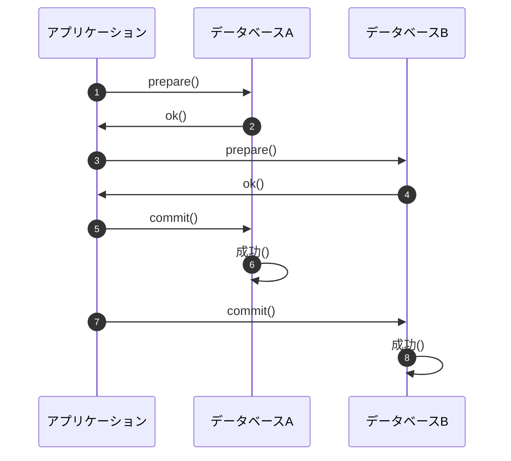

## 概要

- マイクロサービスで複数サービスを横断したトランザクションについて調査を実施

## 課題

- 一部のサービスで処理に失敗したときに、関連するプロセスで発生した変更を全てロールバックさせたい
- モノリスであれば単一のトランザクションで囲うだけで解決するが、複数サービスを横断する場合では難しい

## 分散トランザクションについて

参考記事

- https://www.ogis-ri.co.jp/otc/hiroba/technical/DTP/step1/index.html
- https://www.ogis-ri.co.jp/otc/hiroba/technical/DTP/step2/index.html

### そもそもトランザクションって？

- トランザクションとは、「一連のまとまりのある処理」のこと
  - 例
    - ユーザーを登録する
    - ユーザーを更新する
    - ユーザーを削除する
- トランザクションは二つに分類できる
  - ビジネストランザクション
    - 一つのユースケースに該当するもの（上記の事例にあたる）
  - システムトランザクション
    - ある処理によってデータベースの状態が遷移する際に、関連するシステムでデータが一貫していること
    - ある一貫した状態から別の一貫した状態への遷移を保証できる処理の最小単位のこと

### ACID 特性

- トランザクションには ACID 特性と呼ばれる特徴が必要になる

|                           |                                                                                                                                                                                                                                                                                                      |
| ------------------------- | ---------------------------------------------------------------------------------------------------------------------------------------------------------------------------------------------------------------------------------------------------------------------------------------------------- |
| 原子性 ( Atomicity )   | トランザクションが完全に実行されるか、全く実行されないかの 2 通りの結果しか持たないこと。これは、トランザクションを構成する一連の処理がこれ以上分割できないことを表す。トランザクションの正常な完了をコミット ( commit ) と呼ぶ。また、トランザクションの取り消しをロールバック ( rollback )と呼ぶ。 |
| 一貫性 ( Consistency ) | トランザクションがアクセスするデータはある有効な状態から別の有効な状態に変換されなければならないこと。                                                                                                                                                                                               |
| 分離性 ( Isolation )   | トランザクション実行中はそれ自身が他のトランザクションから何の影響も受けず隔離されていなければならないこと。                                                                                                                                                                                         |
| 耐久性 ( Durability )  | どんな障害が発生してもそのトランザクションの結果は永久に保障されていなければならないこと。                                                                                                                                                                                                           |

- 「原子性・分離性・耐久性」は RDB やフレームワークのトランザクション機能を利用することで実現可能
- 「一貫性」はアプリケーションに強く依存するため、プログラマが保証する要素となる

### 分散トランザクションとは

- 分散トランザクションとは、一つのトランザクションが複数のデータベースを参照するようなトランザクションのこと
  - 既存のトランザクション機能の問題点
    - データベース単位でコミットするため「原子性」を保証できないこと
    - 例
      - コミットしたつもりがコミットできていない
      - ロールバックしたつもりがロールバックできていない
- 「2 フェーズコミット」で実現可能

### 分散トランザクションを実現する 2 フェーズコミット

- トランザクションのコミット処理を 2 段階のフェーズに分けることで「原子性」を保証する

- 第 1 フェーズ: 上記シーケンス図 (1 ~ 4)
- 第 2 フェーズ: 上記シーケンス図 (5 ~ 8)

### ２フェーズコミットの特性

- 2 フェーズコミットは「ほとんどの」障害をうまく取り扱える
- ただし、「第 1 フェーズ」「第 2 フェーズ」の間で障害が発生したときに、アプリケーション側で期待するデータベースの状態と実際のデータベースの状態が異なることがある
- この場合、システム管理者に通知してデータ不整合を手動で直さなければならない

## 複数サービス間の整合性の取り方

参考記事

- https://techlife.cookpad.com/entry/2016/06/01/070000

### 可能な限り成立させる

- リトライを試みること
  - 一時的な不具合はリトライ処理で復旧
- 失敗する前提で、失敗したときの通知や自動復旧の仕組みを構築すること
  - 異常系のエラーで Slack 通知
  - 定期処理でデータの整合性チェックと自動修正
