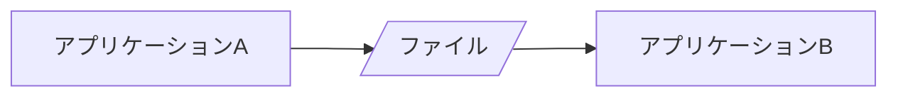
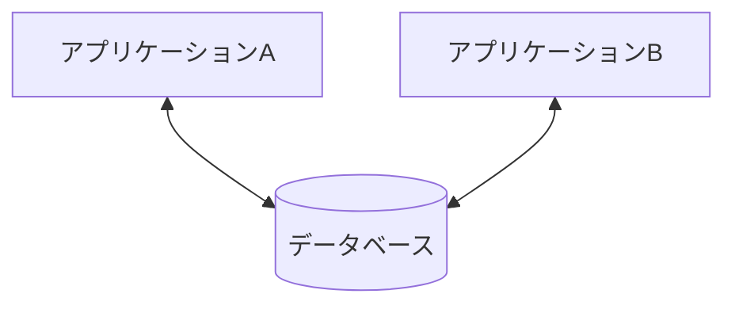
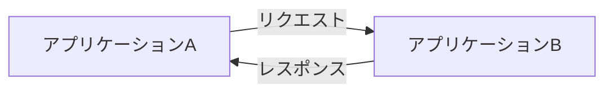
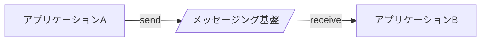

# 概要<!-- omit in toc -->

- 書籍名
  - 現場で役立つシステム設計の原則

# 目次<!-- omit in toc -->

- [Chap1: 小さくまとめてわかりやすくする](#chap1-小さくまとめてわかりやすくする)
  - [なぜソフトウェアの変更は大変なのか](#なぜソフトウェアの変更は大変なのか)
    - [ソフトウェアの変更に立ち向かう](#ソフトウェアの変更に立ち向かう)
    - [変更が大変なプログラムの特徴](#変更が大変なプログラムの特徴)
    - [変更するたびに変更が大変になる](#変更するたびに変更が大変になる)
  - [プログラムの変更が楽になる書き方](#プログラムの変更が楽になる書き方)
    - [わかりやすい名前を使う](#わかりやすい名前を使う)
    - [長いメソッドは「段落」に分けて読みやすくする](#長いメソッドは段落に分けて読みやすくする)
    - [目的ごとに変数を用意する](#目的ごとに変数を用意する)
    - [メソッドとして独立させる](#メソッドとして独立させる)
    - [異なるクラスの重複したコードをなくす](#異なるクラスの重複したコードをなくす)
    - [狭い関心事に特化したクラスにする](#狭い関心事に特化したクラスにする)
    - [メソッドは短く、クラスは小さく](#メソッドは短くクラスは小さく)
  - [小さなクラスでわかりやすく安全に](#小さなクラスでわかりやすく安全に)
    - [データとロジック](#データとロジック)
    - [基本データ型の落とし穴](#基本データ型の落とし穴)
    - [値の範囲を制限してプログラムをわかりやすく安全にする](#値の範囲を制限してプログラムをわかりやすく安全にする)
    - [「値」を扱うための専用のクラスを作る](#値を扱うための専用のクラスを作る)
    - [値オブジェクトは「不変」にする](#値オブジェクトは不変にする)
    - [「型」を使ってコードをわかりやすく安全にする](#型を使ってコードをわかりやすく安全にする)
  - [複雑さを閉じ込める](#複雑さを閉じ込める)
    - [配列やコレクションはコードを複雑にする](#配列やコレクションはコードを複雑にする)
    - [コレクション型を扱うコードの整理](#コレクション型を扱うコードの整理)
    - [コレクション型を扱うロジックを専用クラスに閉じ込める](#コレクション型を扱うロジックを専用クラスに閉じ込める)
    - [コレクションオブジェクトを安定させる](#コレクションオブジェクトを安定させる)
    - [コレクションオブジェクトは業務の関心事](#コレクションオブジェクトは業務の関心事)
- [Chap2:場合分けのロジックを整理する](#chap2場合分けのロジックを整理する)
  - [プログラムを複雑にする「場合分け」のコード](#プログラムを複雑にする場合分けのコード)
    - [区分や種別がコードを複雑にする](#区分や種別がコードを複雑にする)
    - [判断や処理のロジックをメソッドに独立させる](#判断や処理のロジックをメソッドに独立させる)
    - [else 句をなくすと条件分岐が単純になる](#else-句をなくすと条件分岐が単純になる)
    - [複文は単文に分ける](#複文は単文に分ける)
    - [区分ごとのロジックを別クラスに分ける](#区分ごとのロジックを別クラスに分ける)
    - [区分ごとのクラスを同じ「型」として扱う](#区分ごとのクラスを同じ型として扱う)
    - [区分ごとのクラスのインスタンスを生成する](#区分ごとのクラスのインスタンスを生成する)
    - [Java の列挙型を使えばもっとかんたん](#java-の列挙型を使えばもっとかんたん)
    - [区分ごとの業務ロジックを区分オブジェクトで分析し整理する](#区分ごとの業務ロジックを区分オブジェクトで分析し整理する)
    - [状態の遷移ルールをわかりやすく記述する](#状態の遷移ルールをわかりやすく記述する)
- [Chap3: 業務ロジックをわかりやすく整理する](#chap3-業務ロジックをわかりやすく整理する)
  - [データとロジックを別のクラスに分けることがわりにくさを生む](#データとロジックを別のクラスに分けることがわりにくさを生む)
    - [業務アプリケーションのコードが見通しが悪くなる原因](#業務アプリケーションのコードが見通しが悪くなる原因)
    - [データクラスを使うと同じロジックがあちこちに重複する](#データクラスを使うと同じロジックがあちこちに重複する)
    - [データクラスを使うと業務ロジックの見通しが悪くなる](#データクラスを使うと業務ロジックの見通しが悪くなる)
    - [共通機能ライブラリが失敗する理由](#共通機能ライブラリが失敗する理由)
    - [業務ロジックをわかりやすく整理する基本のアプローチ](#業務ロジックをわかりやすく整理する基本のアプローチ)
  - [データとロジックを一体にして業務ロジックを整理する](#データとロジックを一体にして業務ロジックを整理する)
    - [業務ロジックを重複させないためにはどう設計すればよいか](#業務ロジックを重複させないためにはどう設計すればよいか)
    - [メソッドをロジックの置き場にする](#メソッドをロジックの置き場にする)
    - [業務ロジックをデータを持つクラスに移動する](#業務ロジックをデータを持つクラスに移動する)
    - [使う側のクラスに業務ロジックを書き始めたら設計を見直す](#使う側のクラスに業務ロジックを書き始めたら設計を見直す)
    - [メソッドを短く書くとロジックの移動がやりやすくなる](#メソッドを短く書くとロジックの移動がやりやすくなる)
    - [メソッドは必ずインスタンス変数を使う](#メソッドは必ずインスタンス変数を使う)
    - [クラスが肥大化したら小さく分ける](#クラスが肥大化したら小さく分ける)
    - [パッケージを使ってクラスを整理する](#パッケージを使ってクラスを整理する)
  - [三層の感心事と業務ロジックの分離を徹底する](#三層の感心事と業務ロジックの分離を徹底する)
    - [業務ロジックを小さなオブジェクトに分けて記述する](#業務ロジックを小さなオブジェクトに分けて記述する)
    - [業務ロジックを全体を俯瞰して整理する](#業務ロジックを全体を俯瞰して整理する)
    - [三層＋ドメインモデルで関心事をわかりやすく分離する](#三層ドメインモデルで関心事をわかりやすく分離する)
- [Chap4: ドメインモデルの考え方で設計する](#chap4-ドメインモデルの考え方で設計する)
  - [ドメインモデルの考え方を理解する](#ドメインモデルの考え方を理解する)
    - [ドメインモデルで設計すると何がよいのか](#ドメインモデルで設計すると何がよいのか)
    - [ドメインモデルの設計は難しいのか](#ドメインモデルの設計は難しいのか)
    - [利用者の関心事とプログラミング単位を一致させる](#利用者の関心事とプログラミング単位を一致させる)
    - [分析クラスと設計クラスを一致させる](#分析クラスと設計クラスを一致させる)
    - [業務に使っている用語をクラス名にする](#業務に使っている用語をクラス名にする)
    - [データモデルではなくオブジェクトモデル](#データモデルではなくオブジェクトモデル)
    - [ドメインモデルとデータモデルは何が違うのか](#ドメインモデルとデータモデルは何が違うのか)
    - [なぜドメインモデルだと複雑な業務ロジックを整理しやすいのか](#なぜドメインモデルだと複雑な業務ロジックを整理しやすいのか)
  - [ドメインモデルをどうやって作っていくか](#ドメインモデルをどうやって作っていくか)
    - [部分を作りながら全体を組み立てていく](#部分を作りながら全体を組み立てていく)
    - [部分を作りながら全体を組み立てていく](#部分を作りながら全体を組み立てていく-1)
    - [全体を部分を行ったり来たりしながら作っていく](#全体を部分を行ったり来たりしながら作っていく)
    - [重要な部分から作っていく](#重要な部分から作っていく)
    - [独立した部品を組み合わせて機能を実現する](#独立した部品を組み合わせて機能を実現する)
    - [ドメインオブジェクトの機能を一部として設計しない](#ドメインオブジェクトの機能を一部として設計しない)
  - [ドメインオブジェクトの見つけ方](#ドメインオブジェクトの見つけ方)
    - [重要な関心事や関係性に注目する](#重要な関心事や関係性に注目する)
    - [業務の関心事を分類してみる](#業務の関心事を分類してみる)
    - [業務の関心事を分離してみる](#業務の関心事を分離してみる)
    - [コトに注目すると全体の関係を整理しやすい](#コトに注目すると全体の関係を整理しやすい)
    - [コトは業務ルールの宝庫](#コトは業務ルールの宝庫)
    - [何でも約束してよいわけではない](#何でも約束してよいわけではない)
    - [期待されるコト、期待されていないコト](#期待されるコト期待されていないコト)
      - [実行されなかったことの検知と対応](#実行されなかったことの検知と対応)
      - [取り決めのないときの取り決め](#取り決めのないときの取り決め)
    - [業務ルールの記述　〜手続き型とオブジェクト指向の違い](#業務ルールの記述手続き型とオブジェクト指向の違い)
      - [業務ルールの追加や変更への対応](#業務ルールの追加や変更への対応)
  - [業務の関心事の基本パターンを覚えておく](#業務の関心事の基本パターンを覚えておく)
    - [ドメインモデルで開発してもトランザクションスクリプトになりがち](#ドメインモデルで開発してもトランザクションスクリプトになりがち)
    - [業務ルールを記述するドメインオブジェクトの基本パターン](#業務ルールを記述するドメインオブジェクトの基本パターン)
      - [口座(Account)パターン](#口座accountパターン)
      - [期日(DueDate)パターン](#期日duedateパターン)
      - [方針(Policy)パターン](#方針policyパターン)
  - [ドメインオブジェクトの設計を段階的に改善する](#ドメインオブジェクトの設計を段階的に改善する)
    - [組み合わせて確認しながら改良する](#組み合わせて確認しながら改良する)
      - [クラス名やメソッド名の変更](#クラス名やメソッド名の変更)
      - [ロジックの移動](#ロジックの移動)
      - [取りまとめ役のクラスを導入](#取りまとめ役のクラスを導入)
    - [業務の言葉とコードを一致させると変更が楽になる](#業務の言葉とコードを一致させると変更が楽になる)
    - [業務を学びながらドメインモデルを成長させていく](#業務を学びながらドメインモデルを成長させていく)
  - [業務の理解がドメインモデルを洗練させる](#業務の理解がドメインモデルを洗練させる)
    - [業務知識を取捨選択し、重要な関心事に注力して学ぶ](#業務知識を取捨選択し重要な関心事に注力して学ぶ)
    - [業務知識の暗黙知を引き出す](#業務知識の暗黙知を引き出す)
    - [言葉をキャッチする](#言葉をキャッチする)
    - [重要な言葉を見極めながらそれをドメインモデルに反映していく](#重要な言葉を見極めながらそれをドメインモデルに反映していく)
    - [形式的な資料はかえって危険](#形式的な資料はかえって危険)
    - [言葉のあいまいさを具体的にする工夫](#言葉のあいまいさを具体的にする工夫)
    - [基本語彙を増やす努力](#基本語彙を増やす努力)
    - [繰り返しながらしだいに知識を広げていく](#繰り返しながらしだいに知識を広げていく)
    - [改善を続けながらドメインモデルを成長させる](#改善を続けながらドメインモデルを成長させる)
- [Chap5: アプリケーション機能を組み立てる](#chap5-アプリケーション機能を組み立てる)
  - [ドメインオブジェクトを使って機能を実現する](#ドメインオブジェクトを使って機能を実現する)
    - [アプリケーション層のクラスの役割](#アプリケーション層のクラスの役割)
    - [三層+ドメインモデルの構造をわかりやすく実装する](#三層ドメインモデルの構造をわかりやすく実装する)
    - [サービスクラスの設計はごちゃごちゃしやすい](#サービスクラスの設計はごちゃごちゃしやすい)
  - [サービスクラスを作りながらドメインモデルを改善する](#サービスクラスを作りながらドメインモデルを改善する)
    - [初期のドメインモデルは力不足](#初期のドメインモデルは力不足)
    - [ドメインモデルを育てる](#ドメインモデルを育てる)
  - [画面の多様な要求を小さく分けて整理する](#画面の多様な要求を小さく分けて整理する)
    - [プレゼンテーション層に影響される複雑さ](#プレゼンテーション層に影響される複雑さ)
    - [小さく分ける](#小さく分ける)
    - [小さく分けたサービスを組み立てる](#小さく分けたサービスを組み立てる)
      - [プレゼンテーション層で組み立てる](#プレゼンテーション層で組み立てる)
      - [組み合わせようのサービスクラスを作る](#組み合わせようのサービスクラスを作る)
    - [利用する側と提供する側の合意を明確にする](#利用する側と提供する側の合意を明確にする)
    - [シナリオクラスの効果](#シナリオクラスの効果)
  - [データベースの都合から分離する](#データベースの都合から分離する)
    - [データベースの入出力に引っ張られる問題](#データベースの入出力に引っ張られる問題)
    - [データベース操作ではなく業務の関心事で考える](#データベース操作ではなく業務の関心事で考える)
    - [実際のデータベース操作とリポジトリを組み合わせる](#実際のデータベース操作とリポジトリを組み合わせる)
    - [サービスクラスの記述をデータベース操作の詳細から解放する](#サービスクラスの記述をデータベース操作の詳細から解放する)
- [Chap6: データベースの操作とドメインオブジェクト](#chap6-データベースの操作とドメインオブジェクト)
  - [テーブル設計が悪いとプログラムの変更が大変になる](#テーブル設計が悪いとプログラムの変更が大変になる)
    - [データの整理に失敗しているデータベース](#データの整理に失敗しているデータベース)
    - [用途がわかりにくいカラム](#用途がわかりにくいカラム)
    - [いろいろな用途に使う巨大なテーブル](#いろいろな用途に使う巨大なテーブル)
    - [テーブルの関係がわかりにくい](#テーブルの関係がわかりにくい)
  - [データベース設計をすっきりさせる](#データベース設計をすっきりさせる)
    - [基本的な工夫を丁寧に実践する](#基本的な工夫を丁寧に実践する)
      - [名前を省略しない](#名前を省略しない)
      - [適切なデータ型を使う](#適切なデータ型を使う)
      - [制約を必ず使う](#制約を必ず使う)
      - [NOT NULL制約が導くテーブル設計](#not-null制約が導くテーブル設計)
      - [一意性制約でデータの重複を防ぐ](#一意性制約でデータの重複を防ぐ)
      - [外部キー制約でテーブル間の関係を明確にする](#外部キー制約でテーブル間の関係を明確にする)
  - [コトに注目するデータベース設計](#コトに注目するデータベース設計)
    - [業務アプリケーションの中核の関心事は「コト」の管理](#業務アプリケーションの中核の関心事はコトの管理)
    - [ヒトやモノとの関係を正確に記録するための3つの工夫](#ヒトやモノとの関係を正確に記録するための3つの工夫)
      - [記録のタイミングが異なるデータはテーブルを分ける](#記録のタイミングが異なるデータはテーブルを分ける)
      - [記録の変更を禁止する](#記録の変更を禁止する)
      - [カラムの追加はテーブルを追加する](#カラムの追加はテーブルを追加する)
  - [参照をわかりやすくする工夫](#参照をわかりやすくする工夫)
    - [コトの記録に注力したテーブル設計の問題](#コトの記録に注力したテーブル設計の問題)
    - [状態の参照](#状態の参照)
    - [UPDATE文は使わない](#update文は使わない)
    - [残高更新は同時でなくてもよい](#残高更新は同時でなくてもよい)
    - [残高更新は１カ所でなくてもよい](#残高更新は１カ所でなくてもよい)
    - [派生的な情報を転記して作成する](#派生的な情報を転記して作成する)
    - [コトの記録から状態を動的に導出する](#コトの記録から状態を動的に導出する)
  - [オブジェクトの設計とテーブルの設計](#オブジェクトの設計とテーブルの設計)
    - [オブジェクトとテーブルは似てくる](#オブジェクトとテーブルは似てくる)
    - [違うものとして明治的にマッピングする](#違うものとして明治的にマッピングする)
    - [オブジェクトはオブジェクトらしく、テーブルはテーブルらしく](#オブジェクトはオブジェクトらしくテーブルはテーブルらしく)
      - [オブジェクト設計とテーブル設計の独立性を保ちやすいフレームワーク](#オブジェクト設計とテーブル設計の独立性を保ちやすいフレームワーク)
    - [業務ロジックはオブジェクトで、事実の記録はテーブルで](#業務ロジックはオブジェクトで事実の記録はテーブルで)
- [Chap7: 画面とドメインオブジェクトの設計を連動させる](#chap7-画面とドメインオブジェクトの設計を連動させる)
  - [画面アプリケーションの開発の難しさ](#画面アプリケーションの開発の難しさ)
    - [画面にはさまざまな利用者の関心事が詰め込まれる](#画面にはさまざまな利用者の関心事が詰め込まれる)
    - [画面に引きずられた設計はソフトウェアの変更を大変にする](#画面に引きずられた設計はソフトウェアの変更を大変にする)
      - [表示のためのロジックと業務ロジックが混在してしまう](#表示のためのロジックと業務ロジックが混在してしまう)
      - [複数の画面に同じコードが重複してしまう](#複数の画面に同じコードが重複してしまう)
    - [関心事を分けて整理する](#関心事を分けて整理する)
  - [画面の関心事を小さく分けて独立させる](#画面の関心事を小さく分けて独立させる)
    - [複雑な画面は異なる関心事が混ざっている](#複雑な画面は異なる関心事が混ざっている)
    - [画面も分けてしまう](#画面も分けてしまう)
      - [タスクベースのユーザーインターフェースの長所](#タスクベースのユーザーインターフェースの長所)
    - [タスクベースのインターフェースが増えている2つの理由](#タスクベースのインターフェースが増えている2つの理由)
    - [タスクベースに分ける設計が今後の主流](#タスクベースに分ける設計が今後の主流)
  - [画面とドメインオブジェクトを連動させる](#画面とドメインオブジェクトを連動させる)
    - [画面もドメインオブジェクトも利用者の関心事のかたまり](#画面もドメインオブジェクトも利用者の関心事のかたまり)
    - [ドメインオブジェクトと画面の食い違いは設計改善の手がかり](#ドメインオブジェクトと画面の食い違いは設計改善の手がかり)
    - [ドメインオブジェクトに書くべきロジック](#ドメインオブジェクトに書くべきロジック)
      - [論理的な情報構造をドメインオブジェクトで表現する](#論理的な情報構造をドメインオブジェクトで表現する)
      - [用語とその用語の定義の対を表現する](#用語とその用語の定義の対を表現する)
      - [場合ごとの表示の違いをドメインオブジェクトで出し分ける](#場合ごとの表示の違いをドメインオブジェクトで出し分ける)
    - [HTMLのclass属性をドメインオブジェクトから出力する](#htmlのclass属性をドメインオブジェクトから出力する)
  - [画面（視覚表現）とソフトウェア(論理構造)を関係づける](#画面視覚表現とソフトウェア論理構造を関係づける)
    - [項目の並び順とドメインオブジェクトのフィールドの並び順](#項目の並び順とドメインオブジェクトのフィールドの並び順)
    - [画面項目のグルーピング](#画面項目のグルーピング)
    - [画面のデザインとソフトウェアの設計を連動させながら洗練させていく](#画面のデザインとソフトウェアの設計を連動させながら洗練させていく)
    - [画面以外の利用者向けの情報もソフトウェアと整合させる](#画面以外の利用者向けの情報もソフトウェアと整合させる)
- [Chap8: アプリケーション間の連携](#chap8-アプリケーション間の連携)
  - [アプリケーションとアプリケーションをつなぐ](#アプリケーションとアプリケーションをつなぐ)
    - [ほかのアプリケーションとの連携がアプリケーションの価値を高める](#ほかのアプリケーションとの連携がアプリケーションの価値を高める)
    - [アプリケーションを連携する4つのやり方](#アプリケーションを連携する4つのやり方)
      - [ファイル転送](#ファイル転送)
      - [データベース共有](#データベース共有)
      - [Web API](#web-api)
      - [メッセージング](#メッセージング)
  - [Web APIのしくみを理解する](#web-apiのしくみを理解する)
    - [HTTP通信を使ったアプリケーション間の連携の4つの約束事](#http通信を使ったアプリケーション間の連携の4つの約束事)
    - [要求の対象を指定する](#要求の対象を指定する)
    - [要求の種類を指定する](#要求の種類を指定する)
      - [データを取得する GET](#データを取得する-get)
      - [データを登録する POST と PUT](#データを登録する-post-と-put)
      - [データを削除する DELETE](#データを削除する-delete)
    - [エラー時の約束事](#エラー時の約束事)
  - [良いWeb APIとは何か](#良いweb-apiとは何か)
    - [使いにくいWeb API 〜大は小を兼ねるのか？](#使いにくいweb-api-大は小を兼ねるのか)
      - [大は小を兼ねるAPIが生まれる背景](#大は小を兼ねるapiが生まれる背景)
      - [大は小を兼ねるAPIはビジネスの発展を阻害する](#大は小を兼ねるapiはビジネスの発展を阻害する)
    - [アプリケーションを組み立てるための部品を提供する](#アプリケーションを組み立てるための部品を提供する)
  - [発展性に富んだAPI開発のやり方](#発展性に富んだapi開発のやり方)
    - [単純なことをかんたんにできるAPIの提供から始める](#単純なことをかんたんにできるapiの提供から始める)
    - [動かしながら設計を発展させていく](#動かしながら設計を発展させていく)
    - [APIを利用する側とAPIを提供する側の共同作業の環境を整える](#apiを利用する側とapiを提供する側の共同作業の環境を整える)
    - [中核となるAPIのセットを設計する](#中核となるapiのセットを設計する)
      - [登録と参照は別のAPIにする](#登録と参照は別のapiにする)
      - [リソースの単位を分ける](#リソースの単位を分ける)
    - [Web APIのバージョン管理](#web-apiのバージョン管理)
    - [APIを複合したサービスの提供](#apiを複合したサービスの提供)
  - [ドメインオブジェクトとWeb API](#ドメインオブジェクトとweb-api)
    - [データ形式とドメインオブジェクトを変換する際に起こる不一致](#データ形式とドメインオブジェクトを変換する際に起こる不一致)
      - [データ構造の不一致](#データ構造の不一致)
      - [関心事の不一致](#関心事の不一致)
    - [導出結果か生データか](#導出結果か生データか)
      - [マスタ項目のコードと名称](#マスタ項目のコードと名称)
      - [計算ロジックの置き場所](#計算ロジックの置き場所)
      - [日付データの形式](#日付データの形式)
  - [複雑な連携に取り組む](#複雑な連携に取り組む)
    - [共通部分と個別対応部分を明確にする](#共通部分と個別対応部分を明確にする)
    - [APIを進化させる](#apiを進化させる)
    - [小さなアプリケーションで分けて組み合わせる](#小さなアプリケーションで分けて組み合わせる)
    - [複雑なデータの交換](#複雑なデータの交換)
    - [非同期メッセージングを使ったアプリケーション間連携](#非同期メッセージングを使ったアプリケーション間連携)
      - [相手のアプリケーションの稼働状況から独立してメッセージを送ることができる](#相手のアプリケーションの稼働状況から独立してメッセージを送ることができる)
      - [共通の中間加工をやりやすい](#共通の中間加工をやりやすい)
      - [人間の仕事のやり方に合わせた処理を実現しやすい](#人間の仕事のやり方に合わせた処理を実現しやすい)

# Chap1: 小さくまとめてわかりやすくする

## なぜソフトウェアの変更は大変なのか

### ソフトウェアの変更に立ち向かう

- 修正や拡張が楽で安全になるコードを生み出すのが設計
- クラス図や仕様書が必要であるわけではない
- ソースコードを整理整頓して、どこに何が書いてあるのかわかりやすくするのが設計
- プログラムの修正工数に大きく影響があるのが設計

### 変更が大変なプログラムの特徴

- 特徴一覧
  - メソッドが長い
  - クラスが大きい
  - 引数が多い
- 長いメソッド
  - 理解することが難しくバグが混入しやすい
- 大きなクラス
  - 関心ごとを詰め込みすぎている
- 引数が多いメソッド
  - 引数の関係の理解に時間がかかる
  - 処理が肥大化しやすい

### 変更するたびに変更が大変になる

- 元々はシンプルな実装であったが、小さな変更が積み重なり複雑化していく

## プログラムの変更が楽になる書き方

### わかりやすい名前を使う

- 意味の伝わらない省略形を使用しないこと

### 長いメソッドは「段落」に分けて読みやすくする

- 空白行でまとまりをつくる

  ```ruby
  price = quantity * unit_price

  price += 500 if price < 3000

  price = price * tax_rate
  ```

### 目的ごとに変数を用意する

- 同じ変数を使い回すことで可読性が落ちている
- 「説明用の変数の導入」と呼ばれる手法を用いて改善

  ```ruby
  base_price = quantity * unit_price

  shipping_cost = 0
  shipping_cost = 500 if base_price < 3000

  item_price = (base_price + shipping_cost) * tax_rate
  ```

- 同じ変数に代入し続ける方法は「破壊的代入」と呼ばれ、プログラム変更時の副作用によるバグが発生しやすい

### メソッドとして独立させる

- メソッド化することにより、変更の影響範囲をメソッド内に閉じ込めることができる

  ```ruby
  def shipping_cost(base_price)
  	return 500 if base_price < 3000

  	0
  end
  ```

- 「メソッドの抽出」と呼ばれる手法
  - メイン処理がシンプルになり可読性が向上
  - メソッド名からコードの意図が理解しやすい
  - メソッド内に変更の影響を閉じ込めやすくなる

### 異なるクラスの重複したコードをなくす

- 手順
  - 手順 1.
    - 重複コードでメソッドの抽出を行う
  - 手順 2. 異なるクラス間に参照関係がある場合
    - 参照先にメソッドを実装して、参照しているクラスから参照先のメソッドを呼び出す
  - 手順 2’. 異なるクラス間に参照関係がない場合
    - 共通メソッドの置き場所として新たにクラスを作成してメソッドを実装する
- クラスの置き場所については、ビジネスルールに基づく共通処理であるか、プログラムの都合上の共通処理であるのか、などに基づいてスコープを限定できる場所に配置

### 狭い関心事に特化したクラスにする

- 「送料クラス」では「送料」だけにする
- 「割引」などが発生する場合は、「割引」という関心ごとのクラスを新たに作成する
- 関心事に対応するクラスを「ドメインオブジェクト」と呼ぶ
  - 業務用ごと対応するドメインオブジェクトを用意することが OOP らしいアプローチである

### メソッドは短く、クラスは小さく

- メソッド名とクラス名を、業務の関心事、業務の用語と一致させることで、どこに何が記述されているのかわかりやすくする

## 小さなクラスでわかりやすく安全に

### データとロジック

- 業務アプリケーションの基本データ型
  - 数値: 金額、数量
  - 日付: 予定日、注文日、有効期限
  - 文字: 氏名、電話番号、説明
- 基本データと業務ロジックの例
  - 金額: 合計、端数計算、カンマ付与、千円単位にまとめる
  - 有効期限: 期限切れの判定、期限までの残り日数
  - 電話番号: ハイフン有りに整形、市外局番の判別
- 業務ロジックとは？
  - 基本データ型を対象に、業務の約束事に従い「判断・加工・計算」を記述するロジックのこと

### 基本データ型の落とし穴

- 標準のデータ型をそのまま使用すると、業務における基本データより幅広い表現ができてしまう

### 値の範囲を制限してプログラムをわかりやすく安全にする

- 基本データを独自クラスとして定義

  ```ruby
  class Quantity
    MIN = 1
    MAX = 100

    attr_reader :value

    def initialize(value)
      raise StandardError, "不正: #{MIN}未満" if value < MIN
      raise StandardError, "不正: #{MAX}越" if value < MAX

      @value = value
    end

    def can_add(other)
      added = add_value(other)
      added <= MAX
    end

    def add(other)
      raise StandardError, "不正: 合計が#{MAX}以上" if can_add(other)
      added = add_value(value)
      Quantity.new(added)
    end

    private

    def add_value(other)
      value + other.value
    end
  end
  ```

### 「値」を扱うための専用のクラスを作る

- 値オブジェクト(Value Object)
  - 値の種類ごとに専用のクラスを用意すること
- 値オブジェクトは業務用語と対応する
  - 業務で扱うデータの名前 == クラス名
  - 業務上の判断や計算に使う用語 == メソッド名

### 値オブジェクトは「不変」にする

- 変数の上書きは危険であるのと同じように、値オブジェクトの上書きは禁止すること
  - 上書きによる副作用の発生リスクが生じるため
- 悪い例
  ```ruby
  price = Money.new(3000)
  price.set_value(2000)   # 値オブジェクトの上書き
  price = Money.new(1000) # 変数の上書き
  ```
- 良い例
  ```ruby
  base_price = Money.new(3000)
  discounted = base_price.minus(1000) # マイナス計算をした後に、新しくインスタンスを生成して返却
  option = Money.new(1000)            # 新しくインスタンスを生成
  ```
- 不変にする方法
  - インスタンス変数はコンストラクタでのみ定義する
  - インスタンス変数を更新する setter を定義しない
  - 別の値が必要であれば、別のインスタンスを生成する
- 「完全コンストラクタ」とも呼ばれる

### 「型」を使ってコードをわかりやすく安全にする

- 引数の型に独自クラスを当てることで、コードの意図をより分かりやすくする
  - 動的型付け言語の ruby では不可能

## 複雑さを閉じ込める

### 配列やコレクションはコードを複雑にする

- ex
  - 0 件の場合の処理
  - 要素の最大数の制限
  - 要素の内容を一部変更
- 配列操作の処理が散らばるとコードが読みにくくなる
- 専用の小さなクラスにまとめて整理することで、わかりやすく、変更容易性が向上する

### コレクション型を扱うコードの整理

- ex
  - push()
  - unshift()
  - size()
  - concat()

### コレクション型を扱うロジックを専用クラスに閉じ込める

- 顧客一覧`List<Customer>`を扱う場合は、「顧客一覧」の専用クラスを独自に宣言する

  ```ruby
  class Customers
    attr_reader :customers

    def initialize
      @customers = []
    end

    private

    attr_reader :customers

    def add(customer)
      customers.push(customer)
    end

    def remove_if_exist(customer)
      ...
    end

    def count
      ...
    end
  end
  ```

- `List<Customer>`を操作するロジックを全て`Customersクラス`に集める
- 「コレクションオブジェクト・ファーストクラスコレクション」と呼ばれる方法

### コレクションオブジェクトを安定させる

- コレクションを操作する場合は、新たにインスタンスを生成して返却させる

  ```ruby
  class Customers
    attr_reader :customers

    ...

    def add(customer)
      Customers.new(customers.push(customer))
    end
  end
  ```

### コレクションオブジェクトは業務の関心事

- 「商品の一覧」「顧客の一覧」のような、業務の関心事をコレクションオブジェクトで取り扱う

# Chap2:場合分けのロジックを整理する

- 「区分オブジェクト」の話

## プログラムを複雑にする「場合分け」のコード

### 区分や種別がコードを複雑にする

- 区分や種別の例
  - 顧客区分
  - 料金種別
  - 商品分類
  - 地域区分
  - 製品タイプ

### 判断や処理のロジックをメソッドに独立させる

- if 文の条件式としてベタ書きするのではなく、判別するメソッドとして切り出す

```ruby
class Hoge
  ...

  private

  def is_child?
    # 判断するロジックを記述
  end
end
```

### else 句をなくすと条件分岐が単純になる

- 早期リターンを使用して else を排除して見通しを良くする

  ```ruby
  def hoge
    return true if hoge.nil?
    return true if hoge.empty?

    false
  end
  ```

- 「ガード節」との呼ばれる

### 複文は単文に分ける

### 区分ごとのロジックを別クラスに分ける

```ruby
class AdultFee
  def fee
    ...
  end
end

class ChildFee
  def fee
    ...
  end
end

class SeniorFee
  def fee
    ...
  end
end
```

### 区分ごとのクラスを同じ「型」として扱う

- ダックタイピングを用いてインターフェースを共通にすることで、クラスによって振る舞いを変化させることができる

  ```ruby
  class AdultFee
    def yen
      # 大人料金を返却
    end
  end

  class ChildFee
    def yen
      # 子供料金を返却
    end
  end

  class SeniorFee
    def yen
      # シニア料金を返却
    end
  end
  ```

### 区分ごとのクラスのインスタンスを生成する

### Java の列挙型を使えばもっとかんたん

### 区分ごとの業務ロジックを区分オブジェクトで分析し整理する

### 状態の遷移ルールをわかりやすく記述する

- 状態遷移表は、ハッシュマップを用いてデータ構造として表現できる

  ```ruby
  hash = {
    # "現在の状態" => {
    #   "イベント名" => "イベントによる遷移後の状態"
    # }
    "審査中" => {
      "承認済" => "承認",
      "差し戻し中" => "差し戻し"
    },
    "承認済み" => {
      "実施中" => "開始",
      "終了" => "取り下げ"
    },
    ...
  }

  # 現在の状態が「審査中」で、「承認済」になったときに「承認」の状態に遷移できることを表す。
  puts hash["審査中"]["承認済"]
  #=> "承認"
  ```

# Chap3: 業務ロジックをわかりやすく整理する

## データとロジックを別のクラスに分けることがわりにくさを生む

### 業務アプリケーションのコードが見通しが悪くなる原因

- 業務ロジックを整理する方法として、「三層アーキテクチャ」が一般的
- 三層アーキテクチャ
  - プレゼンテーション層: 画面や外部接続インターフェース
  - アプリケーション層: 業務ロジック、業務ルール
  - データソース層: データベース入出力

### データクラスを使うと同じロジックがあちこちに重複する


- データクラスに基づいたロジックが各層で重複してしまう

### データクラスを使うと業務ロジックの見通しが悪くなる

- 画面の構造に引きずられる
- データベースの都合に影響される

### 共通機能ライブラリが失敗する理由

- 汎用的な共通関数が使いにくくなる
  - 特定ケースに対応するようなフラグが生えがち
  - 理解しづらい関数となり、誰も使用しなくなる
- 用途ごとに細分化した共通関数
  - メソッド数が膨大に膨れてしまう
  - メソッドの使い分けが困難になる

### 業務ロジックをわかりやすく整理する基本のアプローチ

- 基本方針
  - データとロジックを一体にして業務ロジックを整理する
  - 三層のそれぞれの関心事と業務ロジックの分離を徹底する

## データとロジックを一体にして業務ロジックを整理する

### 業務ロジックを重複させないためにはどう設計すればよいか

### メソッドをロジックの置き場にする

- 単純な getter メソッドを書かないこと

### 業務ロジックをデータを持つクラスに移動する

- 使う側のクラスにあったロジックを、使われる側のクラスに移動する
  - 使う側のクラスからロジックが減る
  - 使われる側のクラスにロジックが増える
- ロジックの重複が減る

### 使う側のクラスに業務ロジックを書き始めたら設計を見直す

- ロジックをどこに書くのが良いかを適切に判断するのが「設計」である
- データを持つクラスのメソッドを「ロジックの置き場所」として考える
- 改善を続けてよりよい設計を見つけていくのが、オブジェクト指向設計の基本

### メソッドを短く書くとロジックの移動がやりやすくなる

### メソッドは必ずインスタンス変数を使う

- インスタンスメソッドを参照しないメソッドは、そのクラスに置く意味がない

### クラスが肥大化したら小さく分ける

- インスタンス変数とメソッドの関連性をみて、グループ化を行いクラスを抽出する

### パッケージを使ってクラスを整理する

## 三層の感心事と業務ロジックの分離を徹底する

### 業務ロジックを小さなオブジェクトに分けて記述する

- ドメインオブジェクト
  - 関連する業務データと業務ロジックを一つにまとめたオブジェクトのこと

### 業務ロジックを全体を俯瞰して整理する

### 三層＋ドメインモデルで関心事をわかりやすく分離する


- 業務的な「判断・加工・計算」のロジックは、すべてドメインモデルに任せる
- 三層＋ドメインモデルのそれぞれの役割
  - プレゼンテーション層: UI などの外部との入出力を受け持つ
  - アプリケーション層: 業務機能のマクロな手順の記述
  - データソース層: データベースとの入出力を受け持つ
  - ドメインモデル: 業務データと関連する業務ロジックを表現したドメインオブジェクトの集合

# Chap4: ドメインモデルの考え方で設計する

## ドメインモデルの考え方を理解する

### ドメインモデルで設計すると何がよいのか

- 業務の関心事の単位とプログラミングの単位が一致していると、業務ルールの修正や追加が楽で安全になる

### ドメインモデルの設計は難しいのか

### 利用者の関心事とプログラミング単位を一致させる

- 必要な活動
  - 分析: 人間のやりたいことを正しく理解する
  - 設計: 人間のやりたいことを動くソフトウェアとして実現する方法を考える

### 分析クラスと設計クラスを一致させる

- 分析クラスは、現実的な詳細を無視した自由な発想になりがち
- 設計クラスと分析クラスに乖離が起きると、プログラムが複雑になったら保守性が低下する
- 分析クラスと設計クラスを揃えるために、プログラムの健全性などをビジネスサイドに伝える努力が必要となる
- 分析と設計は同じ人が担当すること

### 業務に使っている用語をクラス名にする

### データモデルではなくオブジェクトモデル

### ドメインモデルとデータモデルは何が違うのか

### なぜドメインモデルだと複雑な業務ロジックを整理しやすいのか

## ドメインモデルをどうやって作っていくか

### 部分を作りながら全体を組み立てていく

### 部分を作りながら全体を組み立てていく

- 手続き型のアプローチ
  - 全体を俯瞰して詳細を設計していく
  - トップダウンのアプローチ
- オブジェクト指向のアプローチ
  - 個々の部品を作りながら、それを組み合わせながら、段階的に全体を作る
  - ボトムアップのアプローチ

### 全体を部分を行ったり来たりしながら作っていく

- ボトムアップ型のオブジェクト指向のアプローチでも全体を意識すること
- 全体を俯瞰しやすい図

  - パッケージ図

    ```mermaid
    flowchart RL

    回収 -.-> 請求
    請求 -.-> 出荷
    出荷 -.-> 受注
    受注 -.-> 顧客
    受注 -.-> 商品
    出荷 -.-> 在庫
    受注 -.-> 在庫
    在庫 -.-> 商品
    ```

  - 業務フロー図

    ```mermaid
    sequenceDiagram

    顧客 ->> 顧客: 注文する
    顧客 ->> 販売部門: <br>
    販売部門 ->> 販売部門: 在庫を確認する
    販売部門 ->> 販売部門: 出荷を指示する
    販売部門 ->> 出荷部門: <br>
    出荷部門 ->> 出荷部門: 出荷する
    出荷部門 ->> 顧客: <br>
    出荷部門 ->> 出荷部門: 出荷を報告する
    出荷部門 ->> 経理部門: <br>
    経理部門 ->> 経理部門: 請求する
    顧客 ->> 顧客: 商品を受け取る
    経理部門 ->> 顧客: <br>
    顧客 ->> 顧客: 支払う
    顧客 ->> 経理部門: <br>
    経理部門 ->> 経理部門: 入金を確認する
    ```

### 重要な部分から作っていく

- 業務的に重要な関心事から作り始める
- オブジェクトはそれぞれ独立するため、単体で動作テストを行える

### 独立した部品を組み合わせて機能を実現する

- アプリケーション層で実現する

### ドメインオブジェクトの機能を一部として設計しない

- 機能を分解しながらプログラムの部品を作らないこと
  - 機能の分解構造に依存するため
  - 機能の処理の順序に依存するため
  - 上記理由により変更に弱いプログラムになってしまう

## ドメインオブジェクトの見つけ方

### 重要な関心事や関係性に注目する

### 業務の関心事を分類してみる

- 業務の重要な関心事と、そうでない関心事を区別する
- 重要な関心事から着手

### 業務の関心事を分離してみる

- 業務の関心事の 3 分類
  - ヒト：個人、担当者、企業、etc
    - 業務活動の当事者
  - モノ：商品、サービス、店舗、場所、etc
    - ヒトが業務を遂行するときの関心事の対象
  - コト：予約、注文、支払、出荷、キャンセル、etc
    - 業務活動で発生するさまざまな事象
- コトの基本属性
  - 対象：何について発生した事象か
  - 種別：どういう種類の事象か
  - 時点：いつ起きた事象か
- 業務アプリケーションの基本的な関心事は「コトを記録し、コトの発生を通知」すること

### コトに注目すると全体の関係を整理しやすい

- コトに注目することのメリット
  - コトはヒトとモノとの関係として出現する（誰の何について行動か）
  - コトは時間実に沿って明確な前後関係を持つ
- ヒト・モノに注目することのデメリット
  - 発散しがちで情報量が膨大になり整理がつかない

### コトは業務ルールの宝庫

### 何でも約束してよいわけではない

- 約束事をする前に、受注の妥当性の検証が必要
- 受注の妥当性の業務ルールは複雑であるため、洗い出す必要がある
- 受注の妥当性の実装は「部品」から行う

  ```mermaid
  graph TB
    subgraph 数量パッケージ

    A["販売可能数量"]
    B["数量"]
    C["数量単位"]

    A -. 使う .-> B
    B -- 持つ --> C
    end
  ```

### 期待されるコト、期待されていないコト

- 次の判断や行動に関するルールが存在する
  - 期待された通りの内容か判断する
  - 期待されていた場合の次のアクション
  - 期待されていなかった場合のアクション

#### 実行されなかったことの検知と対応

- 検知するために必要なもの

  - 予定の記録
  - 実績の記録
  - 差異の判定

  ```mermaid
  classDiagram

  class 差異 {
    +差異の検出()
  }

  class 予定 {
    +予定日
    +予定した数量
  }

  class 実績 {
    +実施日
    +実施した数量
  }

  差異 --> 予定
  差異 --> 実績
  ```

- 差異の検出ロジックは差異クラスに実装

#### 取り決めのないときの取り決め

- 注意した方がいいこと
  - 業務では必ず想定外のことが起きる
  - 想定外のコトが起きたときに、どう対応するかの原則がある
    - 通知機能
    - 復旧機能
    - etc...

### 業務ルールの記述　〜手続き型とオブジェクト指向の違い

- 手続き型だと if 文が増え続けて管理不能になる

#### 業務ルールの追加や変更への対応

- 手続き型だとどんどん変更がやっかいで危険になる

## 業務の関心事の基本パターンを覚えておく

### ドメインモデルで開発してもトランザクションスクリプトになりがち

### 業務ルールを記述するドメインオブジェクトの基本パターン

- 業務の関心事のパターン
  - 口座(Account)パターン
  - 期日(DueDate)パターン
  - 方針(Policy)パターン
  - 状態(State)パターン

#### 口座(Account)パターン

#### 期日(DueDate)パターン

#### 方針(Policy)パターン

## ドメインオブジェクトの設計を段階的に改善する

### 組み合わせて確認しながら改良する

#### クラス名やメソッド名の変更

#### ロジックの移動

#### 取りまとめ役のクラスを導入

- 複数の値オブジェクトをまとめたクラスのこと
- 業務の関心事の単位に合わせてまとめる

### 業務の言葉とコードを一致させると変更が楽になる

### 業務を学びながらドメインモデルを成長させていく

- 開発初期でも、理解した範囲内でクラスを設計して実装することが大切
- ソースコードで要求仕様を表現することで、プログラムの**自己文書化**ができる
- クラス名やパッケージ名、グループ化なども、業務の関心事の表現方法の一つ。

## 業務の理解がドメインモデルを洗練させる

### 業務知識を取捨選択し、重要な関心事に注力して学ぶ

### 業務知識の暗黙知を引き出す

### 言葉をキャッチする

### 重要な言葉を見極めながらそれをドメインモデルに反映していく

### 形式的な資料はかえって危険

- 思考停止に陥りがち
- 役立つ図法
  - コンテキスト図：システムの目的を表す言葉を探す
  - 業務フロー図：コトの発生を時系列に整理する
  - パッケージ図：業務の関心事を俯瞰する（用語の全体的な整理）
  - 主要クラス図：重要な関心事とその関係を明確にする

### 言葉のあいまいさを具体的にする工夫

### 基本語彙を増やす努力

### 繰り返しながらしだいに知識を広げていく

- 必ず見落としや勘違いがあることを意識しておく

### 改善を続けながらドメインモデルを成長させる

- 業務アプリケーションの変更理由で最も多いのは「業務ルールが変わる」ことである
- 変更に伴う思わぬ副作用は、ソフトウェア構造と業務の関心事のねじれの兆候である

# Chap5: アプリケーション機能を組み立てる

## ドメインオブジェクトを使って機能を実現する

### アプリケーション層のクラスの役割


- アプリケーション層のことを「**サービスクラス・アプリケーションサービスクラス**」と呼ぶ

### 三層+ドメインモデルの構造をわかりやすく実装する

### サービスクラスの設計はごちゃごちゃしやすい

- サービスクラスの基本方針
  - 業務ロジックは、ドメインオブジェクトに任せる（サービスクラスで判断・加工・計算しない）
  - 画面の複雑さをサービスクラスに持ち込まない
  - DB の入出力の都合からサービスクラスを独立させる

## サービスクラスを作りながらドメインモデルを改善する

- 業務ロジックの置き場として、より適切な場所を探し続けること
- 少しずつ設計を繰り返すミニマムなアプローチ

### 初期のドメインモデルは力不足

- 機能追加や修正に伴い、開発者の業務知識が広がる
- 問題は、新たに獲得した業務知識をどこに書くべきなのか
  - 既存のドメインモデルを改良
  - 新たにドメインモデルを作成
  - サービスクラスにベタ書きしない

### ドメインモデルを育てる

- ぎこちない命名でも良いのでドメインオブジェクトを作成するべき
- あとで改良すれば良い
- 一つのドメインオブジェクトが、複数のサービスクラスから参照されるのが良い兆候（重複を防いでいる）

## 画面の多様な要求を小さく分けて整理する

### プレゼンテーション層に影響される複雑さ

- 一つの画面でさまざまなケースに対応しなくてはならない
- サービスクラスが入力値による分岐などで複雑になりがち

### 小さく分ける

- 小さくするコトで、変更時の影響範囲を掴みやすくできる
- サービスクラスを小さく分ける基本
  - 登録系サービス
    - 入力値のバリデーション、加工、計算、記録
  - 参照系サービス
    - 入力値をもとに情報を生成してプレゼンテーション層に返却
- 事例

  - 口座から預金引き出しサービス

    - 参照と更新の分離の原則に違反した場合

    ```ruby
    # 残高更新の実行と、残高更新後の残高を返却するサービス
    class BankAccountService
      def self.call(...)
        new(...).call
      end

      def initialize(bank:, amount:)
        @bank = bank     # type: Bank < ActiveRecord
        @amount = amount # type: number
      end

      def call
        # 残高更新
        drawed_balance = bank.balance - amount
        bank.update(balance: drawed_balance)

        # 残高参照
        bank.balance
      end

      private

      attr_reader :bank, :amount
    end
    ```

    - 更新と参照を分離する設計の場合

    ```ruby
    # 口座に関する参照系手続きをまとめたサービスクラス
    class BankConditionService
      def initialize(bank:)
        @bank = bank # type: Bank < ActiveRecord
      end

      # 残高参照
      def balance
        bank.balance
      end

      # 引き落とし額が残高以下なのか確認
      def canWithdraw(amount)
        balance >= amount
      end

      private

      attr_reader :bank
    end

    # 残高更新サービス
    class BankAccountUpdateService
      def self.call(...)
        new(...).call
      end

      def initialize(bank:, amount:)
        @bank = bank     # type: Bank < ActiveRecord
        @amount = amount # type: number
      end

      def call
        drawed_balance = bank.balance - amount

        bank.update(drawed_balance)
      end

      private

      attr_reader :bank, :amount
    end
    ```

  - 参照系、更新系でそれぞれ独立して利用できることが重要(単独でテスト可能な単位)

### 小さく分けたサービスを組み立てる

- どこで組み合わせるのかが問題
  - プレゼンテーション層のコントローラで組み合わせ
  - アプリケーション層に組み合わせようのクラスを追加

#### プレゼンテーション層で組み立てる

- メリット
  - ケースごとの画面の出し分けが容易
- デメリット
  - ソフトウェアの変更容易性が低くなる

#### 組み合わせようのサービスクラスを作る

- `HogeSerinario`のようなシナリオクラスとして組み合わせ用サービスクラスを用意
- メリット
  - 部品としてのサービスクラスと、組み合わせようのサービスクラスの構造が明確でわかりやすい
- デメリット
  - ソフトウェアの階層が増えること

### 利用する側と提供する側の合意を明確にする

- 例外はできるだけ利用せず、if 文で判断して分岐すること
  - 例外：システム障害などの通常ではありえない場合
  - if 文：業務的にどちらの場合もあり得る場合
- 「**契約による設計**」と呼ばれる手法
  - サービスを利用する側と、サービスを提供する側の前提条件を定義する方法のこと。
  - メリット
    - 実装がシンプルでわかりやすい
  - サービスクラスの責務を「参照系・更新系」で分離していると、約束事を整理しやすい
    - 参照系：残高照会などの参照手続きの責務を担う
    - 更新系：参照系サービスクラスで検証済みの残高を更新。万が一、残高が不正な場合は例外を返す
- 「**防御的プログラミング**」
  - 「契約による設計」と対照的な設計手法のこと
  - サービスを利用する側の前提条件がないため、サービスを提供する側が全てのケースを想定して防御的な条件式などを実装する必要がある
  - デメリット
    - 可読性が低い
    - 全てのケースに対応できるわけではない

### シナリオクラスの効果

- メリット
  - アプリケーション機能の説明
  - シナリオテストの単位

## データベースの都合から分離する

### データベースの入出力に引っ張られる問題

### データベース操作ではなく業務の関心事で考える

### 実際のデータベース操作とリポジトリを組み合わせる

### サービスクラスの記述をデータベース操作の詳細から解放する

# Chap6: データベースの操作とドメインオブジェクト

## テーブル設計が悪いとプログラムの変更が大変になる

### データの整理に失敗しているデータベース

- 例
  - どこにどのようなデータが入っているのか推測しにくい
  - データに入っていないカラムが多い
  - データが重複していて、どのデータが正しいのかわからない
  - 一つのカラムがさまざまな目的に利用されている
  - テーブル間の関係がはっきりしない

### 用途がわかりにくいカラム

- 例
  - カラム名が省略形
  - 別カラムとの依存関係により意味が変わる
  - 変換する必要のある値を格納
  - 意味が読み取れない値を格納

### いろいろな用途に使う巨大なテーブル

### テーブルの関係がわかりにくい

## データベース設計をすっきりさせる

### 基本的な工夫を丁寧に実践する

- 基本原則
  - 名前を省略しない
  - 適切なデータ型を使う
  - 制約をきちんと使う

#### 名前を省略しない

- 意図の明確な普通の用語を使用すること

#### 適切なデータ型を使う

- データ型と桁数を制限して、不正なデータを防ぐ

#### 制約を必ず使う

- NOT NULL制約
- 一意性制約
- 外部キー制約

#### NOT NULL制約が導くテーブル設計

#### 一意性制約でデータの重複を防ぐ

#### 外部キー制約でテーブル間の関係を明確にする

## コトに注目するデータベース設計

### 業務アプリケーションの中核の関心事は「コト」の管理

### ヒトやモノとの関係を正確に記録するための3つの工夫

#### 記録のタイミングが異なるデータはテーブルを分ける

#### 記録の変更を禁止する

- 過去の記録を修正する場合にとるべき手続き
  - 元データ（そのまま残す）
  - 取り消しデータ
  - 新データ
- INSERT文だけで実現可能

#### カラムの追加はテーブルを追加する

## 参照をわかりやすくする工夫

### コトの記録に注力したテーブル設計の問題

### 状態の参照

- 基本はコトの記録のテーブル
- 導出の性能を考慮して、コトの記録のたびに状態を更新するテーブルも用意する
- 状態を更新するテーブルはコトの記録からいつでも再構築可能な二次的な導出データ

### UPDATE文は使わない

- DELETE文 / INSERT文で実行する
- 残高更新の場合
  - 古い残高レコードを削除
  - 新しい残高レコードを挿入

### 残高更新は同時でなくてもよい

- 参照目的の二次的なデータは同時更新しなくてもよい

### 残高更新は１カ所でなくてもよい

- 別のマイクロサービスで残高更新してもよい
- 非同期メッセージング（Pub/Sub）などで整合性をとる

### 派生的な情報を転記して作成する

- **イベントソーシング**
  - 目的ごとにさまざまな情報を記録する方式
  - 更新履歴などのトランザクションデータ（コト）をすべて記録することで、状態を導出できる
  - 「イベント（コト）を記録する」という考え方

### コトの記録から状態を動的に導出する

## オブジェクトの設計とテーブルの設計

### オブジェクトとテーブルは似てくる

- ほぼ一致する関係になることが多いが、別ものとして考えること
  - テーブル設計とオブジェクト設計は本質的に異なるため

### 違うものとして明治的にマッピングする

- オブジェクトの関心事
  - データとロジックを一体に考えて、ロジックを重複させない
- テーブルの関心事
  - データの管理

### オブジェクトはオブジェクトらしく、テーブルはテーブルらしく

- オブジェクトとテーブルは別物
- それぞれ別物として設計と改善を行う

#### オブジェクト設計とテーブル設計の独立性を保ちやすいフレームワーク

### 業務ロジックはオブジェクトで、事実の記録はテーブルで

# Chap7: 画面とドメインオブジェクトの設計を連動させる

## 画面アプリケーションの開発の難しさ

### 画面にはさまざまな利用者の関心事が詰め込まれる

- 利用者の関心事は、画面に表示される項目や利用できる機能のこと
- 利用者の関心事はドメインオブジェクトと対応する

### 画面に引きずられた設計はソフトウェアの変更を大変にする

#### 表示のためのロジックと業務ロジックが混在してしまう

- 例：残高が1万円以上のときに強調表示

  ```html
  <% if amount > 10000 %>
  <p class="font-weight-bolder"><%= amount %>円</p>
  <% end %>
  ```

- 上記のような判断条件は業務ロジックであり、ドメインオブジェクトに記述するべき
  - 理由：判断条件を変更するときに画面側の実装を全て追う必要があり、変更容易性が高いと言えないため

#### 複数の画面に同じコードが重複してしまう

- 複数の画面で同じ判断条件を参照するケースは多い

### 関心事を分けて整理する

- 画面アプリケーションが複雑になる要因
  - 画面そのものが複雑
  - 画面の表示ロジックと業務ロジックの分離ができていない
- 改善するための基本方針
  - 用途ごとのシンプルな画面に分ける
  - 画面の表示ロジックから業務ロジックを分離する

## 画面の関心事を小さく分けて独立させる

### 複雑な画面は異なる関心事が混ざっている

- 大きなサービスクラスで処理しがち
  - デメリット：機能変更時の変更範囲の特定が難しい
- 小さなドメインオブジェクトやサービスクラスに切り分ける
  - メリット：機能変更時の変更範囲の特定がラク

### 画面も分けてしまう

- 小さな関心事の単位で画面を分けてしまう方法
- 「**タスクベースのユーザーインターフェース**」と呼ばれる画面設計手法

#### タスクベースのユーザーインターフェースの長所

- 利用者が「必要なときに必要な情報だけ」情報を更新できる
- タスクベースでない場合は、シンプルな関心事なのに複雑な画面を操作することになる

### タスクベースのインターフェースが増えている2つの理由

### タスクベースに分ける設計が今後の主流

- 画面ごとに必要なドメインオブジェクトとサービスクラスがシンプルになる
- テストが単純になる

## 画面とドメインオブジェクトを連動させる

### 画面もドメインオブジェクトも利用者の関心事のかたまり

- 画面とドメインオブジェクトは分離しなくてもよい
- データクラスはコードが重複するためアンチパターン

### ドメインオブジェクトと画面の食い違いは設計改善の手がかり

- タスクベースの画面の場合
  - ドメインオブジェクトに記述
  - 画面専用の振る舞いの記述箇所を分離したい場合は、decoratorクラスでドメインオブジェクトを拡張すると良いかも
- タスクベースでない複雑が画面の場合
  - 複数のドメインオブジェクトを組み合わせるためのプレゼンテーション層を用意して記述
  - 一つのドメインオブジェクトに記述するには複雑すぎる可能性が高いため

### ドメインオブジェクトに書くべきロジック

- ドメインオブジェクトに書くべきこと
  - 論理的な情報構造
  - 場合ごとの表示の違い
  - HTMLのclass属性

#### 論理的な情報構造をドメインオブジェクトで表現する

- ビューの記述方法
  - 物理的なビュー：HTML構造
  - 論理的なビュー：文章など
- 物理的なビューはドメインオブジェクトで表現しないこと
- 例

  - 説明文の先頭20文字を出力

  ```ruby
  class User < ApplicationRecord
    # description: string
  end

  class UserDecorator < Draper::Decorator
    delegate_all

    # 先頭から20文字を取得
    def part_description
      description[0...20]
    end
  end

  # ビューからの呼び出し
  # <p>
  #  説明文: <%= user.part_description %>
  # </p>
  ```

#### 用語とその用語の定義の対を表現する

#### 場合ごとの表示の違いをドメインオブジェクトで出し分ける

- ビューでif文で出し分けるケース

  ```ruby
  class User < ApplicationRecord
    # phone_number: string
  end

  class UserDecorator < Draper::Decorator
    delegate_all

    # 電話番号が登録済みかどうか
    def registered_phone_number
      phone_number.present? ? "登録済みです" : "未登録です"
    end
  end

  # ビューからの呼び出し
  # <p>
  #  電話番号は<%= user.registered_phone_number %>です。
  # </p>
  ```

- ドメインオブジェクトに記述した場合のメリット
  - ドメインオブジェクトを修正するだけで業務ルールの変更に追従できる
- ビューに記述した場合のデメリット
  - 関連する全ての画面の実装を検査する必要がある

### HTMLのclass属性をドメインオブジェクトから出力する

- ドメインオブジェクトに記述するコトで、ビューからif文をなくすことができる

  ```ruby
  class User < ApplicationRecord
    # login_status: string
    # last_login_at: datetime
  end

  class UserDecorator < Draper::Decorator
    delegate_all

    # ログインステータスによって文字色を変える
    def login_status_text_class
      case login_status
      when "active"
        "text-primary"
      when "pending"
        "text-warning"
      else
        ""
      end
    end
  end

  # ビューからの呼び出し
  # <p class="<%= user.login_status_text_class %>">
  #  <%= user.last_login_at %>
  # </p>
  ```

- 画面上でのデータの加工・判断のロジックは利用者の関心事なので、ドメインオブジェクトに記述する
  - ex: 金額のカンマ区切り, 1000円単位の表示など
- ドメインオブジェクトに集約したほうが変更容易性が高い

## 画面（視覚表現）とソフトウェア(論理構造)を関係づける

### 項目の並び順とドメインオブジェクトのフィールドの並び順

### 画面項目のグルーピング

- 画面デザインの4原則
  - 近接：関係のある情報は近づける、関係のない項目は離す
  - 整列：同じ意味のものは同じラインに揃える、意味が異なれば異なるラインに揃える
  - 対比：意味の重みの違いを文字の大きさや色の違いで区別する
  - 反復：同じ意味は同じパターンで視覚化する

### 画面のデザインとソフトウェアの設計を連動させながら洗練させていく

### 画面以外の利用者向けの情報もソフトウェアと整合させる

# Chap8: アプリケーション間の連携

## アプリケーションとアプリケーションをつなぐ

### ほかのアプリケーションとの連携がアプリケーションの価値を高める

### アプリケーションを連携する4つのやり方

- 連携方式
  - ファイル転送: ファイルを使ってデータを渡す
  - データベース共有: 共有のデータベースを共有してデータを渡す
  - Web API: HTTPを利用したリクエスト/レスポンス方式でデータをやりとりする
  - メッセージング: Pub/Subなどのメッセージング基盤を用いて非同期にデータ（メッセージ）を送る

#### ファイル転送



- 昔ながらの手法

#### データベース共有



- データベースを共有する手法
- データベース全体というより、必要なテーブルの必要なデータ範囲だけ共有する
- デメリット
  - セキュリティの観点で共有できるサービスが限定される
  - 共有するデータベースを通じてサービスが密結合になりやすい（変更容易性が低い）

#### Web API



- HTTP通信でデータをやり取りする手法
- 問題点
  - 設計自由度が高いため、適切な設計判断が難しい
  - 後からAPIを変更しづらい
  - リクエスト/レスポンス方式だと同期的なやりとりになるため、運用面や性能面で制約になることがある

#### メッセージング



- メリット
  - アプリケーション間の独立性が高く疎結合にできる
- デメリット
  - Web APIとは異なる、Pub/Subなどのメッセージング基盤の設計と運用ノウハウが必要
  - メッセージング基盤の運用と構築

## Web APIのしくみを理解する

### HTTP通信を使ったアプリケーション間の連携の4つの約束事

- Web APIの標準仕様
  - 接続方法: TCP/IP
  - データのやり取り: HTTP通信
  - データ形式: JSON または XML
  - 文字コード: UTF-8

### 要求の対象を指定する

- URI: Uniform Resource Identifier（統一資源識別子）の省略形

### 要求の種類を指定する

- 基本的なHTTPメソッド
  - GET: データを取得 [200 OK]
  - POST: データを登録 [201 Created]
  - PUT: データを登録 [200 OK, 201 Created, 204 No Content]
  - DELETE: データを削除 [200 OK, 202 Accepted, 204 No Content]

#### データを取得する GET

- 特定のリソースを取得
  - `https://api.example.com/books/1234`
- リソースのリストを取得
  - `https://api.example.com/books`
- URIに含めるべき情報
  - リソースの識別子
  - 必須項目（オプショナルな項目以外）

#### データを登録する POST と PUT

- POSTとPUTの対象の指定方法の違い

  | メソッド | 対象の指定方法 | 説明                                   |
  | -------- | -------------- | -------------------------------------- |
  | POST     | books          | 書籍を登録して、識別子を発行してもらう |
  | PUT      | books/1234     | 識別子1234の書籍データを登録する       |

  - POSTの場合
    - データを受け取る側のアプリケーションで識別子を発行してデータ登録
    - メリット
      - 送信する側が送信を受け取り側のことを知る必要がない
  - PUTの場合
    - データを送信する側のアプリケーションで識別子を指定
      - 識別子と一致するリソースが存在しない場合 => データ登録
      - 識別子と一致するリソースが存在する場合 => データ更新
    - デメリット
      - 蜜結合になりやすい
      - 送信する側が送信を受け取り側のことを知る必要がある

- POSTは「依頼」するだけ
  - 「**どのように登録されるのかは、データを受け取る側のアプリケーションに任せる**」
- PUTは「責任持って実行」する
  - データを受け取り側の仕様を把握した上で、送信する側も責任も持つイメージ
- 更新系もPOSTで行うべき
  - POSTの場合
    - `https://api.example.com/books/1234/updates`
  - PUTの場合
    - `https://api.example.com/books/1234`

#### データを削除する DELETE

- リソースの削除

  | メソッド | 対象の指定方法 | 説明                         |
  | -------- | -------------- | ---------------------------- |
  | DELETE   | books/1234     | 識別子1234の書籍データを削除 |
  | DELETE   | books          | すべての書籍データを削除     |

- DELETEはサービスを蜜結合にしやすい
- 削除系もPOSTで行うべき
  - POSTの場合
    - `https://api.example.com/books/1234/deletions`
  - DELETEの場合
    - `https://api.example.com/books/1234`
    - 削除を「依頼」するだけでよい

### エラー時の約束事

- エラー時のステータスコード

  | コード | テキスト表現          | 説明                                             |
  | ------ | --------------------- | ------------------------------------------------ |
  | 200    | Bad Request           | 要求が不正                                       |
  | 403    | Forbidden             | 要求が禁止されている, 権限がない                 |
  | 404    | Not Found             | 要求されたリソースが見つからない                 |
  | 500    | Internal Server Error | エラーが発生したため要求を正しく処理できなかった |

- 400系: 利用側に問題があることを返答するエラーコード
  - 詳細なエラーメッセージを返してあげるほうが良い
- 500系: Web APIを提供する側に問題があることを返答するエラーコード
  - 詳細は不要。利用側でできることがほとんどないことが多いため

## 良いWeb APIとは何か

### 使いにくいWeb API 〜大は小を兼ねるのか？

- 大きなAPIだとどうなるのか？
  - 利用側
    - リクエスト送信時に、さまざまな項目を理解しなければならない
    - パラメータ誤入力による事故が起きやすい
    - レスポンスから必要なデータを抽出しなければならない
  - 提供側
    - エンドポイントの実装が複雑で肥大化しがち
- 実際は使いづらいことが多い

#### 大は小を兼ねるAPIが生まれる背景

#### 大は小を兼ねるAPIはビジネスの発展を阻害する

### アプリケーションを組み立てるための部品を提供する

- Web APIは部品で、部品を組み立てて機能をつくる
- APIの粒度と組み立ての特性

  | APIの粒度 | 実現できる機能の多様性 | 組み立ての複雑さ |
  | --------- | ---------------------- | ---------------- |
  | 小さい    | 幅広い                 | 複雑             |
  | 大きい    | 限定的                 | 単純             |

  - 部品が小さいと、多様な機能を組み立てられる
  - 部品が小さすぎると、機能を組み立てるのが大変になる
  - 部品が大きいと、限定的な機能を簡単に組み立てられる

- 良いWeb APIとは、組み立ての多様性を維持しつつ、組み立ての負担が増えすぎない大きさの部品を用意すること

## 発展性に富んだAPI開発のやり方

### 単純なことをかんたんにできるAPIの提供から始める

### 動かしながら設計を発展させていく

- トップダウンではなく、ボトムアップで作りながら発展させる
- 初期に作成した仕様書通りに進捗することはほとんどない
- 仕様書生成ライブラリなどで自動化するのも良いアプローチ

### APIを利用する側とAPIを提供する側の共同作業の環境を整える

### 中核となるAPIのセットを設計する

- 単純で小さなWeb APIの設計原則
  - 登録と参照を分ける
  - リソース（データのかたまり）の単位で分ける

#### 登録と参照は別のAPIにする

- 予約機能を例として考える

- 登録と参照を分離しない場合
  - POSTのレスポンスとして、予約内容の詳細を返却する
- 登録と参照を分離した場合
  - POSTのレスポンスとして、予約番号（識別子）だけ返却する
  - 予約番号で別途GETする
- 予約と結果参照を分離したAPI

  | 目的       | API                   | 説明                             |
  | ---------- | --------------------- | -------------------------------- |
  | 予約の登録 | POST reservations     | レスポンスとして識別子1234を返却 |
  | 予約の確認 | GET reservations/1234 | 識別子1234の内容を返却           |

- メリット
  - 利用側の関心事を分離できるので、保守性が上がること
    - 登録処理の成否に関心があるのか
    - 登録処理の成否と登録時の返却値の内容に関心があるのか

#### リソースの単位を分ける

- 大きなリソースの場合

  | 目的           | API             | 説明                           |
  | -------------- | --------------- | ------------------------------ |
  | 会員登録       | POST member     | 会員情報を登録して識別子を取得 |
  | 会員情報の参照 | GET member/1234 | 識別子の内容を取得             |

- 小さなリソースの場合

  | 目的       | API                     |
  | ---------- | ----------------------- |
  | 名前を取得 | GET member/1234/name    |
  | 性別を取得 | GET member/1234/gender  |
  | 住所を取得 | GET member/1234/address |

- 単純でよく使われるAPIは早く安定する

### Web APIのバージョン管理

### APIを複合したサービスの提供

- 部品をまとめたAPIを提供したいケースがある
- 2階層で構築する
  - 複合サービスを提供するレイヤー
  - 基本APIを提供するレイヤー
- ただし、複合サービスはできる限り利用側で構築するべき（サービスの独立性が低下するため）

## ドメインオブジェクトとWeb API

### データ形式とドメインオブジェクトを変換する際に起こる不一致

#### データ構造の不一致

- 提供/利用で関心事が異なる
  - APIを提供する側：ドメインオブジェクトを基準にロジックを整理
  - APIを利用する側：データのみ
- 関心事の不一致により、データ構造の不一致が生まれやすい

#### 関心事の不一致

- 提供/利用で関心事が大きく異なる場合に、単純なドメインオブジェクトとJSONのマッピングで対応できないケースがある
- 対応策

  - ドメインオブジェクトからレスポンスオブジェクトを生成する

    ```ruby
    class BookResponse
      def fromBook(book) # type: Book < ApplicationRecord
        # BookオブジェクトからBookResponseを生成する
      end
    end
    ```

  - リクエストオブジェクトからドメインオブジェクトを生成する

    ```ruby
    class BookRequest
      attr_reader :author, ...

      def initialize(request_body) # type: JSON
        # BookRequestオブジェクトにマッピング
        @author = request_body["author"]
        ...
      end

      def toBook()
        # BookRequestからBookオブジェクトを生成する
      end
    end
    ```

- ドメインオブジェクトに「変換」を持ち込まないための方法である
- 差異が小さいケースでは、ドメインオブジェクトとJSONの自動マッピングで十分

### 導出結果か生データか

#### マスタ項目のコードと名称

#### 計算ロジックの置き場所

- 業務ルールと呼べる計算ロジックである場合: 提供側に計算ロジックを実装
- 業務ルールと呼べる計算ロジックでない場合: 利用側に計算ロジックを実装

#### 日付データの形式

- タイムゾーンを含めないシンプルな形式を採用するべき
  - タイムゾーンを含める場合
    - `2020-01-01T10:00:00+09:00`
  - タイムゾーンを含めない場合
    - `2020-01-01T10:00:00`
- 時刻もなるべく簡略化するべき
  - 簡略化する場合
    - `2020-01-01T10:00`
  - 簡略化しない場合
    - `2020-01-01T10:00:00`

## 複雑な連携に取り組む

- 利用側が複数サービスになった場合に、特定サービスだけに特化したAPIが必要になることがある
- APIの変更が難しくなる

### 共通部分と個別対応部分を明確にする

- APIを3種類にグループ化する
  - 基本API: 最小単位のAPIセットのこと
  - 拡張API: 基本APIを組み合わせた複合APIのこと
  - 個別対応API: 特定のケースに対応するための複合APIのこと

### APIを進化させる

- APIの開発/運用の基本方針
  - APIを基本/拡張/個別対応にグルーピングする
  - それぞれのグループの間でAPIを移動する（適切なグループに適切なAPIが配置されるようにメンテすること）

### 小さなアプリケーションで分けて組み合わせる

- 初めからマイクロサービスにすることのデメリット
  - 責務の境界線が間違っていても気づきづらい
  - 後から責務を修正することが困難であること
- 一つのアプリケーションで開発を行い、責務の境界線が安定したタイミングでマイクロサービス化を検討すること

### 複雑なデータの交換

### 非同期メッセージングを使ったアプリケーション間連携

#### 相手のアプリケーションの稼働状況から独立してメッセージを送ることができる

#### 共通の中間加工をやりやすい

#### 人間の仕事のやり方に合わせた処理を実現しやすい
